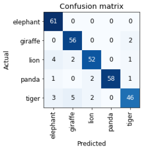
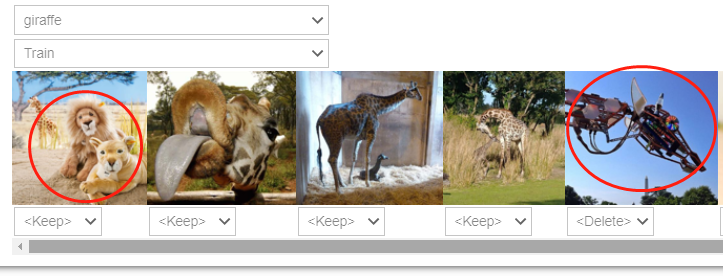

## FastAI 第2章学习笔记
[fastAI的入门课程](https://course.fast.ai/),这个课程很适合小白（虽然要学完对也是个巨大的工程…）,
也有[论坛](https://forums.fast.ai/c/part1-v4/46) 。
目前学到视频第三节，回过头来做[第二章](https://colab.research.google.com/github/fastai/fastbook/blob/master/02_production.ipynb)的笔记,算是复习,有些地方会复制书中英文原话。

首先安装和导入一些必要的模块
```
!pip install -Uqq fastbook
import fastbook
fastbook.setup_book()

from fastbook import *
from fastai.vision.widgets import *
```


### 使用duckduckGo搜索图片


书中介绍了使用bing搜索图片，作为数据集来源。但是必应注册API过程太麻烦，尤其是需要信用卡,于是使用书中介绍的[第二种方法](https://course.fast.ai/images),
duckduckGo.

不过fastAI 中search_images_ddg() 这个API似乎有bug，没办法只能再次迂回。在论坛中找到[一种解决方案](https://forums.fast.ai/t/creating-image-datasets-for-vision-learning/77673/2)，使用jmd_imagescraper包中的的duckduckgo_search()下载 _（2023年注: duckduckgo_search似乎已失效，而search_images_ddg的bug已修复。）_

先安装依赖包
```
### 文中代码时以Jupyter 写的，以!开头代表直接在jupyter页面执行shell命令
Path().cwd()
!rm gdrive/MyDrive/images -rf
!pip install -q jmd_imagescraper
```

使用jmd_imagescraper下载图片,书中是以熊为例子，我这里以不同动物：老虎，狮子，大象，长颈鹿和熊猫为例子。
```
from jmd_imagescraper.core import *
root = Path().cwd()/"gdrive/MyDrive/images"

animal_types = ('tiger', 'lion', 'elephant', 'giraffe', 'panda')

for o in animal_types:
  duckduckgo_search(root, o, o, max_results=300)
```
这里duckduckgo_search()第一个参数是下载图片的主路径；第二个参数是主路径下图片存放的目录，我是以搜索关键字作为目录名，没有的话会被自动创建，第三个参数是搜索关键字，第四个参数是下载搜索结果的最大个数。如果此方法失效可以尝试书上介绍的API：
```
root = Path("animal_image")
animal_types = ('tiger', 'lion', 'elephant', 'giraffe', 'panda')

if not path.exist(root):
    root.mkdir()
    for o in animal_types:
      dest = (root/o)
      dest.mkdir(exist_ok=True)
      results = search_images_ddg(o)
      download_images(dest, urls=results)

#      如果是bing搜索的，结果是以整个网页内容，下载时应该是
#      download_images(dest, urls=results.attrgot('contentUrl'))
```

通过get_image_files()可以获取到目录下所有的图片文件
```
fns = get_image_files(root)
fns
```
验证图片文件中是否有损坏的（失败的）
```
failed = verify_images(fns)
failed
```

通过map方法传入unlink回调可以实现删除失败的图片
```
failed.map(Path.unlink)
```

### 把数据装到DataLoaders

fastAI 有很多内置的dataLoader如第一章中的ImageDataLoaders，TextDataLoaders等，
这里我需要初始化自己的dataLoader

首先获取一个DataBlock，DataBlock 类似一个模板
```
animals = DataBlock(
    blocks=(ImageBlock, CategoryBlock),
    get_items=get_image_files,
    splitter=RandomSplitter(valid_pct=0.2, seed=41),
    get_y=parent_label,
    item_tfms=Resize(128))
)
```
blocks=(ImageBlock, CategoryBlock),
第一个参数传入的是一个元组，第一个ImageBlock是一个 **独立变量**，第二个CategoryBlock 是一个 **从变量**：
The independent variable is the thing we are using to make predictions from, and the dependent variable is our target. In this case, our independent variables are images, and our dependent variables are the categories (动物的种类) for each image.

`get_items=get_image_files `,
表示以图片文件目录的形式获取项目。这里我们猜测，其他的方式还可以是从内测读取数据，读取csv表格。

`splitter=RandomSplitter(valid_pct=0.2, seed=42)`,
分割出验证集，从函数名都能知道是随机分割验证集的，验证集的比例为20%，随机种子值是42. 固定种子值决定下次运行时，获取的验证集还是那部分数据。
这里提一下之前章节介绍的，在分割连续一段时间内的数据变化时，验证集不能随机抽取，而应该在尾部截取。原因是随机抽取的值，在预测某一点时，根据前后的值很容易预测到到合理的值，这样验证的意义不大。具体介绍在[第一章](https://colab.research.google.com/github/fastai/fastbook/blob/master/01_intro.ipynb#scrollTo=Ce6UUo-a_WP1): Use Judgment in Defining Test Sets

`get_y=parent_label`,
get_y 表示怎样去获取 **从变量**，这里使用parent_label 表示以文件的父目录名来命名从变量:tiger, lion, elephant, giraffe, panda

`item_tfms=Resize(128)`，
表示设置默认对不同尺寸和比例的图片进行转换，这里为默认的从中心截取并压缩成128 * 128 pixel 大小，当然在创建DataLoaders之后也可以指定其他图片转换形式:

```
#bears = DataBlock(
#    blocks=(ImageBlock, CategoryBlock), # what kind of date we want to working with - image
#    get_items=get_image_files, #how to get the items - by files
#    splitter=RandomSplitter(valid_pct=0.2, seed=42), #how to create validation set
#    get_y=parent_label, # how to label these items
#    item_tfms=Resize(128))

animals = animals.new(item_tfms=Resize(128, ResizeMethod.Squish))
```
其他转换形式有拉伸/压缩，边缘填充，随机截取(可以多个部位)。转换时还可以对图片进行翻转，明暗变化，局部拉伸等等。

从root目录装载数据，这一步才是真正把图片装载(转换)成数据
```
dls = animals.dataloaders(root)

#显示验证集(valid)中8个图片，2分两行显示.
#We used unique=True to have the same image repeated with different versions of this RandomResizedCrop transform.
#This is a specific example of a more general technique, called data augmentation.
dls.valid.show_batch(max_n=8, nrows=2, unique=True)
```

### 训练模型

我认为最重要的部分:
```
learn = cnn_learner(dls, resnet18, metrics=error_rate)
learn.fine_tune(4)
```
cnn表示Convolutional Neural Networks - 卷积神经网络的缩写。
根据第一章的介绍：resnet是一种标准架构，18代表18层。
A metric is a function that measures the quality of the model's predictions using the validation set, and will be printed at the end of each epoch. In this case, we're using error_rate, which is a function provided by fastai that does just what it says: tells you what percentage of images in the validation set are being classified incorrectly
fine_tune是微调，理解不是很多，下次在第一章(先学的第一章再学的第二章)笔记时再说。

训练完后可以以图表的形式打印识别的准确率，这个图表叫confusion matrix
```
interp = ClassificationInterpretation.from_learner(learn)
interp.plot_confusion_matrix()
```


也可以显示出损失最大的前几个图片
```
interp.plot_top_losses(5, nrows=1)
```
这里损失"loss" 是一个术语，用自己话简单理解,就是误判.后面还有"损失函数"等概念.

### 数据清洗
FastAI 有个函数ImageClassifierCleaner可以以图形界面的方式让我们手动清理数据，把训练集或验证集中错误无效的数据或错误的数据剔除或重新放到正确的位置。

```
cleaner = ImageClassifierCleaner(learn)
cleaner
```


然后把无效图片(如上图中中的机械长颈鹿)删除,这里又出现了unlink() 这个方法，unlink 实际是个删除函数.
猜测：当我们在上图中图片下拉框选择delete是，实际就是把该图片路径或索引放到了cleaner的"delete"容器中(可能是个列表之类的).
下面的代码就是遍历这个delete容器，然后用unlink这个方法把这个索引对应的图片删掉.

```
for idx in cleaner.delete(): cleaner.fns[idx].unlink()
```
当然图片下拉框还有move到其他分类，如把第一个图片在cleaner中移到狮子的分类,然后用一下代码实现文件的移动.
```
for idx,cat in cleaner.change(): shutil.move(str(cleaner.fns[idx]), path/cat)
```

 ***这里对书中原文有个疑问，从函数来看，需要在训练之后再做数据清洗，因为learn是作为参数传给数据清洗函数ImageClassifierCleaner().
这个是否意味着clean之后，训练过的模型也跟着有所变化呢？如果不是，那做了数据清洗后是不是得重新执行训练才能提高模型的准确度？***

### 模型的使用
书中介绍到了从代码一直到网页应用的过程. 我暂时对网页应用不感兴趣，后面有这样的需求再回过头来学，但是这里预测模型的使用还是比较有用。
导出.pkl文件，这也就是训练好的模型。它应该包含两部分：Remember that a model consists of two parts: the architecture and the trained parameters.

```
learn.export()

path = Path()
path.ls(file_exts='.pkl')
```
>(#1) [Path('export.pkl')] 可以看到生成了pkl 文件

是用模型预测本地图片文件
```
learn_inf = load_learner(path/'export.pkl')
learn_inf.predict('images/测试大象.jpg')
```
也可以预测上传的图片，执行以下代码会出现上传按钮进行交互
```
btn_upload = widgets.FileUpload()
btn_upload
```
使用上传的数据生成img对象
```python
img = PILImage.create(btn_upload.data[-1])
#可以用img.show()显示一下上传的图片
learn_inf.predict(img)
```
显示结果
```shell
('elephant',
 tensor(0),
 tensor([8.3877e-01, 5.6876e-04, 1.5991e-01, 2.5078e-07, 7.5152e-04]))
```

[Back to contents page](index.md)
