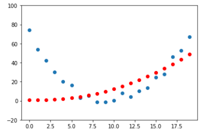

## fastAI第四章学习笔记-第二部分：导数和梯度

### PyTorch 计算导数

PyTorch提供非常简单的计算某一点导数的方法
```
def f(x): return 2*(x**3) + 3*(x**2) + 4*x + 1
```
假设要对```(1.5, f(1.5))```这个点求导.定义一个张量,并使用```requires_grad_()```标记它需要求导,注意带下划线表示是一个原位操作,即计算结果会覆盖原有值.
```
xt = tensor(1.5).requires_grad_()
```
将xt代入函数,计算出函数值,yt
```
yt = f(xt)
```
然后求```yt```的导数值,```backward()```就是求导的函数,这个命名是取自 _backpropagation_ 术语反向传播
```
yt.backward()
xt.grad
#这里会打印tensor(26.5000)
```

还可以将一组向量作为参数传给函数,在函数内对向量进行运算,这里求和.
```
def f_sum(x) : return f(x).sum()

xt = tensor([3.,4.,10.]).requires_grad_()

yt = f_sum(xt)
yt
#这里会打印tensor(2628., grad_fn=<SumBackward0>)

yt.backward()
xt.grad
#这里会打印 tensor([ 76., 124., 664.]) , 即向量的导数值.
```

### SGD应用举例
想象过山车爬坡又下来的情形：
上坡速度越来越慢,到顶后下坡速度又越来越快。20秒,每秒测一次速度.
```
time = torch.arange(0,20).float();

speed = torch.randn(20)*3 + 0.75*(time-9.5)**2 + 1  #这里加了一个随机速度.

plt.scatter(time,speed); #绘制时间/速度坐标图像.
```
我们**猜想**这个函数曲线是一个二次函数```a*(time**2)+(b*time)+c```

为了区分**输入 - input**和**参数 - parameter**, 将**输入**和**参数**分开传进一个函数：
```
def f(t, params):
    a,b,c = params
    return a*(t**2) + (b*t) + c
```
为了找到**最佳**二次函数,只需要找到最合适的参数```a,b,c```. 用均方差来衡量是否**最佳**
```
def mse(preds, targets): return ((preds-targets)**2).mean().sqrt()
```
这里```preds```将会传入预测的值,也就是函数```f(t, params)```的返回值. ```targets```将会传入实际测量的速度.

现在用7步：
#### 第一步：初始化参数
最佳初始一组参数就可以,用```requires_grad_```告诉PyTorch需要跟踪他们的梯度.
```
params = torch.randn(3).requires_grad_()

orig_params = params.clone()
```
#### 第二步：计算预测值：
```
preds = f(time, params)
# 这里time就是前面定义的0-19秒,每秒的时刻.
```
这个定义一个函数画出图形：
```
def show_preds(preds, ax=None):
    if ax is None: ax=plt.subplots()[1]
    ax.scatter(time, speed)
    ax.scatter(time, to_np(preds), color='red')
    ax.set_ylim(-20,100)

show_preds(preds)
```

#### 第三步：计算loss：
```
# mse() 为 ((preds-targets)**2).mean().sqrt()
# preds是传入不同的时刻t, a*(t**2) + (b*t) + c的计算的speed值, 
# targes,在不同的t测量出来的speed. 

loss = mse(preds, speed)
loss
#这里打印 tensor(25.2016, grad_fn=<SqrtBackward>)
```
我们目标是减小均方差,**所以需要计算梯度**
#### 第四步：计算梯度
计算梯度, 也就是说计算一组一个近似值,指导**参数**如何变化.
```
loss.backward()
params.grad
tensor([-0.0052,  0.1076, -0.3424])
```
需要注意的是这里是对params求梯度,而不是对t求梯度,也就是对下面的```a,b,c```求梯度.
 ```
 (a*t**2 + b*t + c - speed)**2).mean().sqrt()
 ```
#### 第五步：调整权重
```
lr = 1e-5
params.data -= lr * params.grad.data
params.grad = None
```

下面看 loss 是否会下降
```
preds = f(time,params)
mse(preds, speed)

#这里会打印比之前的值tensor(25.2016, grad_fn=<SqrtBackward>)更小的值
```
调用```show_preds(preds)```画出的曲线图,红点和蓝点也会更接近.

定义把上面的过程定义在一个函数,这个函数将会在第6步中重复
```
def apply_step(params, prn=True):
    preds = f(time, params)
    loss = mse(preds, speed)
    loss.backward()
    params.data -= lr * params.grad.data
    params.grad = None
    if prn: print(loss.item())
    return preds
```

第六步：重复上面的过程
```
for i in range(10): apply_step(params)
```
上面的输出在第二次更新笔记时丢失,这里贴一段书中的输出数据：
```
5435.53662109375
1577.4495849609375
847.3780517578125
709.22265625
683.0757446289062
678.12451171875
677.1839599609375
677.0025024414062
676.96435546875
676.9537353515625
```
可以看到数字-均方差的值在下降
```
params = orig_params.detach().requires_grad_()
```
通过下面的代码绘出图像,红点和蓝点的曲线会越来越接近.
```
_,axs = plt.subplots(1,4,figsize=(12,3))
for ax in axs: show_preds(apply_step(params, False), ax)
plt.tight_layout()
```

#### 第七步骤: 停止
在上面第六步中执行了10次循环，也就是说在10个epoch后觉得达到了训练的效果并决定停止了.

#### 总结
开始，我们的模型的权重-也就是上面的三个参数```a,b,c```可以是随机的,也可以是预先训练好的(使用预先训练好的模型叫迁移学习)。不管在第一种还是第二种,最初的参数可能完全不能或不能很好的匹配到目标内容,无法完成特定的任务。因此这个模型需要学习来获得更好的权重。  
先用损失函数来比较模型的输出和目标(这个目标也就是标记数据,即上面测量的一组速度),这个函数返回一个数字衡量输出与目标的差距值。这个差距值反应了我们"猜想的函数"与实际有多大的偏差。我们需要通过调整模型参数尽可能减小这个差距。   
为了找到调整参数的方向,我们使用了梯度。梯度是一组向量如```tensor([-53195.8594,  -3419.7146,   -253.8908])```,它反应的是函数变化的方向。光有方向还不够,还得知道一次移动多大的距离,所以还要乘以一个学习率learn rate(lr)。然后按照这几个步进行迭代,知道到达最低点,我们就可以停止了。   
上面除了损失函数,我们看到的所有内容都可以直接用在MNIST数据上。
