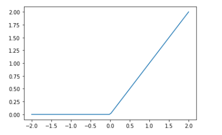

## fastAI第四章学习笔记-3
### Creating an Optimizer

首先我们可以用PyTorch中的nn.Linear模块(module)代替[前文](fastAI学习笔记-04-mnist-basics-3.md)中的linear1. _module_ 是一个从```nn.Module```类继承的子类的对象. 此类的对象的行为与标准Python函数相同，因为你可以使用括号来调用它们，并且它们将返回模型的激活值。  
```nn.Linear```的作用和我们前面自己实现的```init_params```和```linear```两个函数一起一样.它一个类里同时包含了_weihts_ 和 _bias_ . 看看是怎样替代前文的部分：
```
linear_model = nn.Linear(28*28, 1)
```
每个PyTorch 模块都知道可以训练哪些参数。 它们可通过```parameters```方法获得：
```
w,b = linear_model.parameters()
w.shape,b.shape
```
>(torch.Size([1, 784]), torch.Size([1]))  

我们可以使用此信息来创建优化器
```
class BasicOptim:
    def __init__(self,params,lr): self.params,self.lr = list(params),lr

    def step(self, *args, **kwargs):
        for p in self.params: p.data -= p.grad.data * self.lr

    def zero_grad(self, *args, **kwargs):
        for p in self.params: p.grad = None
```
我们可以通过传入模型的参数来创建优化器
```
opt = BasicOptim(linear_model.parameters(), lr)
```
我们的训练循环现在可以简化为:
```
def train_epoch(model):
    for xb,yb in dl:
        calc_grad(xb, yb, model)
        opt.step()
        opt.zero_grad()
```
我们的验证函数完全不需要改变：
```
validate_epoch(linear_model)
```
>0.4608

让我们将小的训练循环放入一个函数中，以使事情变得更简单：
```
def train_model(model, epochs):
    for i in range(epochs):
        train_epoch(model)
        print(validate_epoch(model), end=' ')
```
结果与上一节相同：
```
train_model(linear_model, 20)
```
>0.4932 0.7686 0.8555 0.9136 0.9346 0.9482 0.957 0.9634 0.9658 0.9678 0.9697 0.9717 0.9736 0.9746 0.9761 0.977 0.9775 0.9775 0.978 0.9785  

fastai提供一个```SGD```类，默认情况下，该类与```BasicOptim```起相同的作用：
```
linear_model = nn.Linear(28*28,1)
opt = SGD(linear_model.parameters(), lr)
train_model(linear_model, 20)
```
>0.4932 0.8179 0.8496 0.9141 0.9346 0.9482 0.957 0.9619 0.9658 0.9673 0.9692 0.9712 0.9741 0.9751 0.9761 0.9775 0.9775 0.978 0.9785 0.979 

fastai还提供了```Learner.fit```，我们可以使用它代替```train_model```。 要创建一个```Learner```，我们首先需要通过传递我们的训练```DataLoader```和验证```DataLoader``` 来创建一个```DataLoaders```：
```
dls = DataLoaders(dl, valid_dl)
```
要不适用一个应用(例如cnn_learner)创建一个```Learner```, 我们就需要传入所有这一章创建的元素：```DataLoaders```， 模型，优化器函数(会传入参数给它),损失函数,以及(可选的)任意用来打印指标.
```
learn = Learner(dls, nn.Linear(28*28,1), opt_func=SGD,
                loss_func=mnist_loss, metrics=batch_accuracy)
```
现在我们调用```fit```
```
learn.fit(10, lr=lr)
```
|epoch|	train_loss|	valid_loss|	batch_accuracy|	time|
|----|----|----|----|----|
|0|	0.636709|	0.503144|	0.495584|	00:00|  
|1|	0.429828|	0.248517|	0.777233|	00:00|
|2|	0.161680|	0.155361|	0.861629|	00:00|  
|3|	0.072948|	0.097722|	0.917566|	00:00|  
|4|	0.040128|	0.073205|	0.936212|	00:00| 
|5|	0.027210|	0.059466|	0.950442|	00:00|  
|6|	0.021837|	0.050799|	0.957802|	00:00|  
|7|	0.019398|	0.044980|	0.964181|	00:00|  
|8|	0.018122|	0.040853|	0.966143|	00:00|  
|9|	0.017330|	0.037788|	0.968106|	00:00|  


如你所见，PyTorch和fastai类没有什么神奇之处。 它们只是方便的预包装件，让你更轻松！ （它们还提供了很多额外的功能，我们将在以后的章节中使用。）
通过这些类，我们现在可以将神经网络替换为线性模型。

### Adding a Nonlinearity
到目前为止，我们已经有了用于优化函数参数的通用过程，并且已经在一个非常无聊的函数上进行了尝试：一个简单的线性分类器。 线性分类器在其功能方面受到很大限制。 为了使其更加复杂（并能够处理更多任务），我们需要在两个线性分类器之间添加一些非线性的东西，这就是给我们提供神经网络的原因。

这是基本神经网络的完整定义：
```
def simple_net(xb): 
    res = xb@w1 + b1
    res = res.max(tensor(0.0))
    res = res@w2 + b2
    return res
```
仅此而已！ ```simple_net```中只有两个线性分类器，它们之间有个```max```函数。
这里，```w1```和```w2```是权重张量，```b1```和```b2```是偏置张量； 也就是说，最初是随机初始化的参数，就像我们在上一节中所做的那样：
```
w1 = init_params((28*28,30))
b1 = init_params(30)
w2 = init_params((30,1))
b2 = init_params(1)
```

关键在于```w1```具有30个输出激活（这意味着```w2```必须具有30个输入激活，因此它们匹配）。 这意味着第一层可以构造30个不同的特征，每个特征代表一些不同的像素混合。 您可以将其更改为```30```，以使模型更加复杂。

这个小的函数```res.max(tensor(0.0))```称为整流线性单位，也称为ReLU。 我们认为我们都可以同意，整流线性单位听起来很花哨而且很复杂...但是，实际上，除了```res.max(tensor(0.0))```之外，没有什么比这更多的了，也就是说，将每个负数都替换为零。 在PyTorch中也可以使用```F.relu```这个小功能：
```
plot_function(F.relu)
```

基本思想是，通过使用更多的线性层，我们可以使模型进行更多的计算，从而对更复杂的函数进行建模。 但是没有必要将一个线性层直接放在另一个线性层上，因为当我们将事物相乘然后再相加多次时，可以通过将不同的事物相乘并相加一次来代替！ 也就是说，可以用具有不同参数集的单个线性层替换连续的一系列任意数量的线性层。

但是，如果我们在它们之间放置一个非线性函数（例如```max```），则不再适用。 现在，每个线性层实际上都已与其他线性层解耦，并且可以做自己有用的工作。 ```max```函数特别有趣，因为它作为简单的```if```语句运行。
