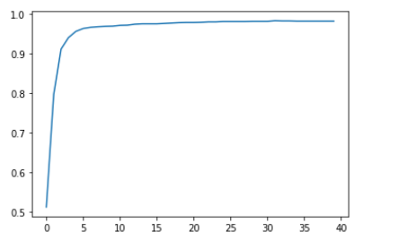

## fastAI第四章学习笔记

安装和导入一些必要的模块
```
!pip install -Uqq fastbook
import fastbook
fastbook.setup_book()

from fastai.vision.all import *
from fastbook import *

matplotlib.rc('image', cmap='Greys')
```

### python 相关一些语法

从下载MNIST的sample并查看内容：
```
path = untar_data(URLs.MNIST_SAMPLE)
Path.BASE_PATH = path
path.ls()
```
> (#3) [Path('labels.csv'),Path('train'),Path('valid')]

```
(path/'train').ls()
```
>(#2) [Path('train/3'),Path('train/7')]

```
threes = (path/'train'/'3').ls().sorted()
sevens = (path/'train'/'7').ls().sorted()
threes
```
上面会显示图片"3"的路径, sorted()方法是为了确保图片文件的路径的顺序相同
```
im3_path = threes[1]
im3 = Image.open(im3_path)
im3
```
执行到上面会显示一个"3"的图片，Image类来自Python Imaging Library(PIL)库,它在python中广泛用来打开,查看,操作图片
因为jupyter移植PIL图像，所有在执行img时会直接自动显示图片到网页上.

要查看像素点显示的数字,可以用NumPy的array或者PyTorch中的tensor：
```
array(im3)[4:10,4:10]
```
前面4:10表示(从0开始)第4(包含)到第10(不包含)行，后面4:10表示第4(包含)到第10(不包含)列像素点的值,这是显示结果
```
array([[  0,   0,   0,   0,   0,   0],
       [  0,   0,   0,   0,   0,  29],
       [  0,   0,   0,  48, 166, 224],
       [  0,  93, 244, 249, 253, 187],
       [  0, 107, 253, 253, 230,  48],
       [  0,   3,  20,  20,  15,   0]], dtype=uint8)
```
可以先看整个im3的像素值打印
```
array([[  0,   0,   0,   0,   0,   0,   0,   0,   0,   0,   0,   0,   0,   0,   0,   0,   0,   0,   0,   0,   0,   0,   0,   0,   0,   0,   0,   0],
       [  0,   0,   0,   0,   0,   0,   0,   0,   0,   0,   0,   0,   0,   0,   0,   0,   0,   0,   0,   0,   0,   0,   0,   0,   0,   0,   0,   0],
       [  0,   0,   0,   0,   0,   0,   0,   0,   0,   0,   0,   0,   0,   0,   0,   0,   0,   0,   0,   0,   0,   0,   0,   0,   0,   0,   0,   0],
       [  0,   0,   0,   0,   0,   0,   0,   0,   0,   0,   0,   0,   0,   0,   0,   0,   0,   0,   0,   0,   0,   0,   0,   0,   0,   0,   0,   0],
       [  0,   0,   0,   0,   0,   0,   0,   0,   0,   0,   0,   0,   0,   0,   0,   0,   0,   0,   0,   0,   0,   0,   0,   0,   0,   0,   0,   0],
       [  0,   0,   0,   0,   0,   0,   0,   0,   0,  29, 150, 195, 254, 255, 254, 176, 193, 150,  96,   0,   0,   0,   0,   0,   0,   0,   0,   0],
       [  0,   0,   0,   0,   0,   0,   0,  48, 166, 224, 253, 253, 234, 196, 253, 253, 253, 253, 233,   0,   0,   0,   0,   0,   0,   0,   0,   0],
       [  0,   0,   0,   0,   0,  93, 244, 249, 253, 187,  46,  10,   8,   4,  10, 194, 253, 253, 233,   0,   0,   0,   0,   0,   0,   0,   0,   0],
       [  0,   0,   0,   0,   0, 107, 253, 253, 230,  48,   0,   0,   0,   0,   0, 192, 253, 253, 156,   0,   0,   0,   0,   0,   0,   0,   0,   0],
       [  0,   0,   0,   0,   0,   3,  20,  20,  15,   0,   0,   0,   0,   0,  43, 224, 253, 245,  74,   0,   0,   0,   0,   0,   0,   0,   0,   0],
       [  0,   0,   0,   0,   0,   0,   0,   0,   0,   0,   0,   0,   0,   0, 249, 253, 245, 126,   0,   0,   0,   0,   0,   0,   0,   0,   0,   0],
       [  0,   0,   0,   0,   0,   0,   0,   0,   0,   0,   0,  14, 101, 223, 253, 248, 124,   0,   0,   0,   0,   0,   0,   0,   0,   0,   0,   0],
       [  0,   0,   0,   0,   0,   0,   0,   0,   0,  11, 166, 239, 253, 253, 253, 187,  30,   0,   0,   0,   0,   0,   0,   0,   0,   0,   0,   0],
       [  0,   0,   0,   0,   0,   0,   0,   0,   0,  16, 248, 250, 253, 253, 253, 253, 232, 213, 111,   2,   0,   0,   0,   0,   0,   0,   0,   0],
       [  0,   0,   0,   0,   0,   0,   0,   0,   0,   0,   0,  43,  98,  98, 208, 253, 253, 253, 253, 187,  22,   0,   0,   0,   0,   0,   0,   0],
       [  0,   0,   0,   0,   0,   0,   0,   0,   0,   0,   0,   0,   0,   0,   9,  51, 119, 253, 253, 253,  76,   0,   0,   0,   0,   0,   0,   0],
       [  0,   0,   0,   0,   0,   0,   0,   0,   0,   0,   0,   0,   0,   0,   0,   0,   1, 183, 253, 253, 139,   0,   0,   0,   0,   0,   0,   0],
       [  0,   0,   0,   0,   0,   0,   0,   0,   0,   0,   0,   0,   0,   0,   0,   0,   0, 182, 253, 253, 104,   0,   0,   0,   0,   0,   0,   0],
       [  0,   0,   0,   0,   0,   0,   0,   0,   0,   0,   0,   0,   0,   0,   0,   0,  85, 249, 253, 253,  36,   0,   0,   0,   0,   0,   0,   0],
       [  0,   0,   0,   0,   0,   0,   0,   0,   0,   0,   0,   0,   0,   0,   0,  60, 214, 253, 253, 173,  11,   0,   0,   0,   0,   0,   0,   0],
       [  0,   0,   0,   0,   0,   0,   0,   0,   0,   0,   0,   0,   0,   0,  98, 247, 253, 253, 226,   9,   0,   0,   0,   0,   0,   0,   0,   0],
       [  0,   0,   0,   0,   0,   0,   0,   0,   0,   0,   0,   0,  42, 150, 252, 253, 253, 233,  53,   0,   0,   0,   0,   0,   0,   0,   0,   0],
       [  0,   0,   0,   0,   0,   0,  42, 115,  42,  60, 115, 159, 240, 253, 253, 250, 175,  25,   0,   0,   0,   0,   0,   0,   0,   0,   0,   0],
       [  0,   0,   0,   0,   0,   0, 187, 253, 253, 253, 253, 253, 253, 253, 197,  86,   0,   0,   0,   0,   0,   0,   0,   0,   0,   0,   0,   0],
       [  0,   0,   0,   0,   0,   0, 103, 253, 253, 253, 253, 253, 232,  67,   1,   0,   0,   0,   0,   0,   0,   0,   0,   0,   0,   0,   0,   0],
       [  0,   0,   0,   0,   0,   0,   0,   0,   0,   0,   0,   0,   0,   0,   0,   0,   0,   0,   0,   0,   0,   0,   0,   0,   0,   0,   0,   0],
       [  0,   0,   0,   0,   0,   0,   0,   0,   0,   0,   0,   0,   0,   0,   0,   0,   0,   0,   0,   0,   0,   0,   0,   0,   0,   0,   0,   0],
       [  0,   0,   0,   0,   0,   0,   0,   0,   0,   0,   0,   0,   0,   0,   0,   0,   0,   0,   0,   0,   0,   0,   0,   0,   0,   0,   0,   0]], dtype=uint8)
```
tensor和arrary几乎表示得一模一样,不过使用tensor计算时会调用到GPU而不是CPU,这会大大加快并行计算速度,按原文的说法，另外tensor也包含更丰富的功能
```
tensor(im3)[4:10,4:10]
```
显示结果：
```
tensor([[  0,   0,   0,   0,   0,   0],
        [  0,   0,   0,   0,   0,  29],
        [  0,   0,   0,  48, 166, 224],
        [  0,  93, 244, 249, 253, 187],
        [  0, 107, 253, 253, 230,  48],
        [  0,   3,  20,  20,  15,   0]], dtype=torch.uint8)
```

### 像素相似度
书原文让我们先自己思考如何实现数字识别,我还是在以传统的思维在思考：
自己找数字的特征：例如“7”,从横到下面的撇，只有一个转折过程，3：有两次弧,并且第一个弧到第二个弧之间有一次回折的过程。
接下来思考检查像素判断是否有这样的规律。但是思考过程中会发现，实现方式实在太难了。再来看书中介绍的做法。

>So, here is a first idea: how about we find the average pixel value for every pixel of the 3s, then do the same for the 7s. This will give us two group averages, defining what we might call the "ideal" 3 and 7. Then, to classify an image as one digit or the other, we see which of these two ideal digits the image is most similar to. This certainly seems like it should be better than nothing, so it will make a good baseline.
Step one for our simple model is to get the average of pixel values for each of our two groups. In the process of doing this, we will learn a lot of neat Python numeric programming tricks!  
Let's create a tensor containing all of our 3s stacked together. We already know how to create a tensor containing a single image. To create a tensor containing all the images in a directory, we will first use a Python list comprehension to create a plain list of the single image tensors.

```
seven_tensors = [tensor(Image.open(o)) for o in sevens]
three_tensors = [tensor(Image.open(o)) for o in threes]
len(three_tensors),len(seven_tensors)
 
```
>(6131, 6265)

这里用到了列表生成式,这是python一个非常有用的高级语法，可以对原有的列表的元素进行批量操作,生成新列表,也可以过滤列表中的元素,例如:
```new_list = [f(o) for o in a_list if o>0]``` 对a_list 中大于0的元素过滤出来,然后将过滤出来的每个元素执行传入f()函数,将每个返回的结果生成一个新的列表new_list,
相对于使用循环来说,这个语法不仅简洁,而且速度快.

接下来,使用torch.stack()把列表中的所有二维(阶)tensor进行堆叠,生成一个三维(阶)的tensor,
```
stacked_sevens = torch.stack(seven_tensors).float()/255
stacked_threes = torch.stack(three_tensors).float()/255
stacked_threes.shape
```
这里会输出打印 ```torch.Size([6131, 28, 28])```  
下面是计算tensor的阶数,就是shape的长度
```
len(stacked_threes.shape)
```
显然stacked_threes是三阶张量,另外也可以用```stacked_threes.ndim```计算阶数

对堆叠的每个像素计算平均值,(想象二维图片列是长,行是宽,堆叠的数量是高)也就是计算"高"上所有数字的平均值.
```
mean3 = stacked_threes.mean(0)
show_image(mean3);
```
从上面的代码可以看出,传入mean()的参数是0,所以高应该是“第0阶”,也就是沿着Rank0 轴,每个格子取一次平均值,得到一个二阶的张量mean3,
mean3 就是一个"平均图像"3

     
下面代码看堆叠在第2层的图像,由此可以猜出 tensor的阶数排列为tensor_3rank[第一阶][第二阶][第三阶]
```
a_3 = stacked_threes[1]
show_image(a_3);
```

得到3和7的"平均图像"后,再拿要判断的图像与平均图像对比,看有多大的差距.书里介绍了两种量化这个“差距”的方法：
1. 对“平均图像”和待测图像每个像素取差值(绝对值),再对所有像素差值取平均值。例如  
```dist_3_abs = (a_3 - mean3).abs().mean()```
2. 对“平均图像”和待测图像每个像素取差值(绝对值),在对所差值的平方和取平均值,然后再开方.例如  
```dist_3_sqr = ((a_3 - mean3)**2).mean().sqrt()```

PyTorch 对上述两种计算提供了 _损失函数_,这些函数在```torch.nn.functional```,PyTorch 推荐```F```的方式导入：```import torch.nn.functional as F```
```
F.l1_loss(a_3.float().mean7), F.mse_loss(a_3,mean7).sqrt()
# 这里会显示(tensor(0.1586), tensor(0.3021))
```
这里提到了L1损失函数和均方差损失函数,L1范数的概念,简单理解起来就是的对所有差值取平均值,虽然描述简单粗暴不准确,但更容易理解。MSE损失-均方差，就是差值的平方取平均值。

### NumPy Arrays 和 PyTorch Tensors
```
data = [[1,2,3],[4,5,6]]
arr = array (data)
tns = tensor(data)
```
```
arr  # numpy
```
>array([[1, 2, 3],
       [4, 5, 6]])

```
tns  # pytorch
```
>tensor([[1, 2, 3],
        [4, 5, 6]])

用起来几乎一模一样

```
tns[1]
```
表示第取一行```tensor([4, 5, 6])```

```
tns[:,1]
```
表示取第1列，冒号表示取这一轴上的所有元素，```tensor([2, 5])```

tensor可以和python切片的语法结合：```[start:end]```包含```start```,不包含```end```
```
tns[1, 1:3]
```
>tensor([5, 6])


也可以和数字进行加减乘除运算:
```
tns+1
```
>tensor([[2, 3, 4],
        [5, 6, 7]])


tensor的类型:
```
tns.type()
```
>torch.LongTensor

可以对类型进行自动转换：
```
tns*1.5
```
>tensor([[1.5000, 3.0000, 4.5000],
        [6.0000, 7.5000, 9.0000]])

### 使用广播计算指标

模型建立了,我们需要一些数据验证训练的效果,也就是前几章说的用验证集评估训练效果。
有个valid目录,这就是提供的验证集的目录。
```
valid_3_tens = torch.stack([tensor(Image.open(o)) 
                            for o in (path/'valid'/'3').ls()])
valid_3_tens = valid_3_tens.float()/255
valid_7_tens = torch.stack([tensor(Image.open(o)) 
                            for o in (path/'valid'/'7').ls()])
valid_7_tens = valid_7_tens.float()/255
valid_3_tens.shape,valid_7_tens.shape
```
>(torch.Size([1010, 28, 28]), torch.Size([1028, 28, 28]))

再定义一个函数：
```
def mnist_distance(a,b): return (a-b).abs().mean((-1,-2))
mnist_distance(a_3, mean3)
```
>这里会打印 tensor(0.1114)

这里还不是很清楚```((-1,-2))```参数的含义,先往下看,
书中试着把两个不同阶的张量传进这个函数
```
valid_3_dist = mnist_distance(valid_3_tens, mean3)
valid_3_dist, valid_3_dist.shape
```
>(tensor([0.1474, 0.1071, 0.1349,  ..., 0.1343, 0.1370, 0.1305]),
 torch.Size([1010]))

神奇的是,valid_3_tens是一个三阶张量,而mean3是一个二阶张量,书中说的是
>it tries to perform a simple subtraction operation between two tensors of different ranks, will use broadcasting.
两个不同阶数的张量之间计算会使用到"广播"的机制,这让我联想到了python的map()函数
```
def f(x): return x * x
r = map(f, [1, 2, 3, 4, 5, 6, 7, 8, 9])
list(r)
```
>这里会显示[1, 4, 9, 16, 25, 36, 49, 64, 81]

但注意不同阶数的向量之间可以通过广播机制运算,但是同一阶不同大小的张量不能运算,例如

相同阶,并且每一阶大小相同(都是3)可以运算
```
tensor([1,2,3]) + tensor([1,1,1])
```
会得到
```
tensor([2, 3, 4])
```

阶数不同,但是低阶张量所有阶和高阶的张量某(几)阶大小一样,可以通过广播机制运算
```
tensor([1,2,3]) + tensor([[1,1,1],[2,3,4]])
```
第一个张量被扩充成2阶,会得到
```
tensor([[2, 3, 4],
        [3, 5, 7]])
```

但是我尝试```tensor([1,2,3]) + tensor([1,1])```会报错：
```
---------------------------------------------------------------------------
RuntimeError                              Traceback (most recent call last)
<ipython-input-163-7239f80c13bb> in <module>()
----> 1 tensor([1,2,3]) + tensor([1,1])

RuntimeError: The size of tensor a (3) must match the size of tensor b (2) at non-singleton dimension 0
```

看看形状
```
(valid_3_tens-mean3).shape
```
显示,第0阶大小1010,第1,2阶大小是28 - 每张图片是28\*28的大小
```
torch.Size([1010, 28, 28])
```
我们的函数调用了mean((-1,-2))。 元组(-1,-2)代表一系列轴。 在Python中,-1表示最后一个元素，-2表示倒数第二个元素。 因此，在这种情况下，这告诉PyTorch我们想要取均值，该均值的范围为张量的最后两个轴所索引的值。 最后两个轴是图像的水平和垂直尺寸。 在最后两个轴上取平均值后，我们只剩下第一个张量轴，该轴在我们的图像上进行索引，这就是我们最终大小为(1010)的原因。 换句话说，对于每张图像,我们均对该图像中所有像素的强度进行平均。

书中提到,
>Pytorch 实际并没有把 ```mean3```copy 1010次,It pretends it were a tensor of that shape, but doesn't actually allocate any additional memory
>It does the whole calculation in C (or, if you're using a GPU, in CUDA, the equivalent of C on the GPU), tens of thousands of times faster than pure Python (up to millions of times faster on a GPU!).

```
def is_3(x): return mnist_distance(x,mean3) < mnist_distance(x,mean7)

is_3(a_3), is_3(a_3).float()
```
> (tensor(True), tensor(1.))
 
```
is_3(valid_3_tens)
```
>tensor([ True,  True,  True,  ..., False,  True,  True])

```
accuracy_3s =      is_3(valid_3_tens).float() .mean()
accuracy_7s = (1 - is_3(valid_7_tens).float()).mean()
accuracy_3s,accuracy_7s,(accuracy_3s+accuracy_7s)/2
```
>(tensor(0.9168), tensor(0.9854), tensor(0.9511))

本以为这就是机器学习,然而
>To do better, perhaps it is time to try a system that does some real learning—that is, that can automatically modify itself to improve its performance. In other words, it's time to talk about the training process, and SGD.


### PyTorch 计算导数

PyTorch提供非常简单的计算某一点导数的方法
```
def f(x): return 2*(x**3) + 3*(x**2) + 4*x + 1
```
假设要对```(1.5, f(1.5))```这个点求导.定义一个张量,并使用```requires_grad_()```标记它需要求导,注意带下划线表示是一个原位操作,即计算结果会覆盖原有值.
```
xt = tensor(1.5).requires_grad_()
```
将xt代入函数,计算出函数值,yt
```
yt = f(xt)
```
然后求```yt```的导数值,```backward()```就是求导的函数,这个命名是取自 _backpropagation_ 术语反向传播
```
yt.backward()
xt.grad
#这里会打印tensor(26.5000)
```

还可以将一组向量作为参数传给函数,在函数内对向量进行运算,这里求和.
```
def f_sum(x) : return f(x).sum()

xt = tensor([3.,4.,10.]).requires_grad_()

yt = f_sum(xt)
yt
#这里会打印tensor(2628., grad_fn=<SumBackward0>)

yt.backward()
xt.grad
#这里会打印 tensor([ 76., 124., 664.]) , 即向量的导数值.
```

### SGD应用举例
想象过山车爬坡又下来的情形：
上坡速度越来越慢,到顶后下坡速度又越来越快。20秒,每秒测一次速度.
```
time = torch.arange(0,20).float();

speed = torch.randn(20)*3 + 0.75*(time-9.5)**2 + 1  #这里加了一个随机速度.

plt.scatter(time,speed); #绘制时间/速度坐标图像.
```
我们**猜想**这个函数曲线是一个二次函数```a*(time**2)+(b*time)+c```

为了区分**输入 - input**和**参数 - parameter**, 将**输入**和**参数**分开传进一个函数：
```
def f(t, params):
    a,b,c = params
    return a*(t**2) + (b*t) + c
```
为了找到**最佳**二次函数,只需要找到最合适的参数```a,b,c```. 用均方差来衡量是否**最佳**
```
def mse(preds, targets): return ((preds-targets)**2).mean().sqrt()
```
这里```preds```将会传入预测的值,也就是函数```f(t, params)```的返回值. ```targets```将会传入实际测量的速度.

现在用7步：
#### 第一步：初始化参数
最佳初始一组参数就可以,用```requires_grad_```告诉PyTorch需要跟踪他们的梯度.
```
params = torch.randn(3).requires_grad_()

orig_params = params.clone()
```
#### 第二步：计算预测值：
```
preds = f(time, params)
# 这里time就是前面定义的0-19秒,每秒的时刻.
```
这个定义一个函数画出图形：
```
def show_preds(preds, ax=None):
    if ax is None: ax=plt.subplots()[1]
    ax.scatter(time, speed)
    ax.scatter(time, to_np(preds), color='red')
    ax.set_ylim(-20,100)

show_preds(preds)
```

#### 第三步：计算loss：
```
# mse() 为 ((preds-targets)**2).mean().sqrt()
# preds是传入不同的时刻t, a*(t**2) + (b*t) + c的计算的speed值, 
# targes,在不同的t测量出来的speed. 

loss = mse(preds, speed)
loss
#这里打印 tensor(25.2016, grad_fn=<SqrtBackward>)
```
我们目标是减小均方差,**所以需要计算梯度**
#### 第四步：计算梯度
计算梯度, 也就是说计算一组一个近似值,指导**参数**如何变化.
```
loss.backward()
params.grad
tensor([-0.0052,  0.1076, -0.3424])
```
需要注意的是这里是对params求梯度,而不是对t求梯度,也就是对下面的```a,b,c```求梯度.
 ```
 (a*t**2 + b*t + c - speed)**2).mean().sqrt()
 ```
#### 第五步：调整权重
```
lr = 1e-5
params.data -= lr * params.grad.data
params.grad = None
```

下面看 loss 是否会下降
```
preds = f(time,params)
mse(preds, speed)

#这里会打印比之前的值tensor(25.2016, grad_fn=<SqrtBackward>)更小的值
```
调用```show_preds(preds)```画出的曲线图,红点和蓝点也会更接近.

定义把上面的过程定义在一个函数,这个函数将会在第6步中重复
```
def apply_step(params, prn=True):
    preds = f(time, params)
    loss = mse(preds, speed)
    loss.backward()
    params.data -= lr * params.grad.data
    params.grad = None
    if prn: print(loss.item())
    return preds
```

第六步：重复上面的过程
```
for i in range(10): apply_step(params)
```
上面的输出在第二次更新笔记时丢失,这里贴一段书中的输出数据：
```
5435.53662109375
1577.4495849609375
847.3780517578125
709.22265625
683.0757446289062
678.12451171875
677.1839599609375
677.0025024414062
676.96435546875
676.9537353515625
```
可以看到数字-均方差的值在下降
```
params = orig_params.detach().requires_grad_()
```
通过下面的代码绘出图像,红点和蓝点的曲线会越来越接近.
```
_,axs = plt.subplots(1,4,figsize=(12,3))
for ax in axs: show_preds(apply_step(params, False), ax)
plt.tight_layout()
```

#### 第七步骤: 停止
在上面第六步中执行了10次循环，也就是说在10个epoch后觉得达到了训练的效果并决定停止了.

#### 总结
开始，我们的模型的权重-也就是上面的三个参数```a,b,c```可以是随机的,也可以是预先训练好的(使用预先训练好的模型叫迁移学习)。不管在第一种还是第二种,最初的参数可能完全不能或不能很好的匹配到目标内容,无法完成特定的任务。因此这个模型需要学习来获得更好的权重。  
先用损失函数来比较模型的输出和目标(这个目标也就是标记数据,即上面测量的一组速度),这个函数返回一个数字衡量输出与目标的差距值。这个差距值反应了我们"猜想的函数"与实际有多大的偏差。我们需要通过调整模型参数尽可能减小这个差距。   
为了找到调整参数的方向,我们使用了梯度。梯度是一组向量如```tensor([-53195.8594,  -3419.7146,   -253.8908])```,它反应的是函数变化的方向。光有方向还不够,还得知道一次移动多大的距离,所以还要乘以一个学习率learn rate(lr)。然后按照这几个步进行迭代,知道到达最低点,我们就可以停止了。   
上面除了损失函数,我们看到的所有内容都可以直接用在MNIST数据上。


#### The MNIST Loss Function
原文
>We already have our independent variables x—these are the images themselves. We'll concatenate them all into a single tensor, and also change them from a list of matrices (a rank-3 tensor) to a list of vectors (a rank-2 tensor). We can do this using view, which is a PyTorch method that changes the shape of a tensor without changing its contents. -1 is a special parameter to view that means "make this axis as big as necessary to fit all the data":

```
train_x = torch.cat([stacked_threes, stacked_sevens]).view(-1, 28*28)
```
```train_x``` 也就是[笔记2](fastAI学习笔记-02-production.md)中提到的**独立变量(因变量)** ,我们是将所有3和7连起来,并将每张28\*28的矩阵转成一个28\*28的向量(列表) - 联想一下C语音二维数组转成一维数组.也就是原文说的把一个矩阵(为元素)的列表(三阶)转成了一个以向量为元素的列表.下面输出```stacked_sevens```, ```stacked_threes```和```train_x```的形状可以看出,三阶转成了2阶.
```
stacked_sevens.shape
```
>torch.Size([6265, 28, 28])

```
stacked_threes.shape
```
>torch.Size([6131, 28, 28])

```
train_x.shape
```
>torch.Size([12396, 784])

需要标记每张图片, 用```1```来标记3的所有图片, ```0```来标记图片7的所有图片：
```
train_y = tensor([1]*len(threes) + [0]*len(sevens)).unsqueeze(1)
train_x.shape,train_y.shape
```
>(torch.Size([12396, 784]), torch.Size([12396, 1]))

A Dataset in PyTorch is required to return a tuple of (x,y) when indexed. Python provides a zip function which, when combined with list, provides a simple way to get this functionality:
```
dset = list(zip(train_x,train_y))
x,y = dset[0]
x.shape,y
```
>(torch.Size([784]), tensor([1]))

上面准备好了训练集,现在同样的方法准备验证集：
```
valid_x = torch.cat([valid_3_tens, valid_7_tens]).view(-1, 28*28)
valid_y = tensor([1]*len(valid_3_tens) + [0]*len(valid_7_tens)).unsqueeze(1)
valid_dset = list(zip(valid_x,valid_y))
```

现在要为每个像素初始化一个weight(权重)这也是七步中的initialize步：

```
def init_params(size, std=1.0): return (torch.randn(size)*std).requires_grad_()
weights = init_params((28*28,1))

weights.shape
```
>torch.Size([784, 1])  

也就是说生成了一个长度为784的向量weight，稍后会用这个向量(列数为1的矩阵)做乘法.


线性函数,只有这一个参数还不够```y=wx+b```这样的一次函数还有一个偏移量```b```所以还需要初始化一个随机数
```
bias = init_params(1)
```
在神经网络中,式子```y=wx+b```里的```w```叫 _wights(权重)_, ```b```叫 _bias(偏移)_  
试一下计算第一张图片的预测：
```
(train_x[0]*weights.T).sum() + bias
```
tensor([25.2817], grad_fn=<AddBackward0>)

***疑问，为什么不是每个像素都有一个```bias```，而是一个图片的像素都是一个bias***  
>在[fastAI 论坛发帖](https://forums.fast.ai/t/in-04-mnist-basics-why-bias-is-not-for-every-independent-pixel/84769),[jimmiemunyi](https://forums.fast.ai/u/jimmiemunyi) 拿了一个神经元的图解释,确实是对sum加bias, 但似乎没有解释为什么bias加在这个地方.

现在要计算所有图片的预测值,在python中,用矩阵的乘法比循环会快很多,操作符```@```表示矩阵相乘.
```
def linear1(xb): return xb@weights + bias
preds = linear1(train_x)
preds
```
>tensor([[ 25.2817],  
        [ 22.5130],  
        [ 23.5370],  
        ...,  
        [-20.4941],  
        [-22.4730],  
        [-18.8594]], grad_fn=<AddBackward0>)

可以看出第一元素的计算结果和前面的计算一样.

现在检查下准确性。由于我们已经用train_y标记了一张图片是3还是7,所以用train_y做判断
```
train_y.T
```
>tensor([[1, 1, 1,  ..., 0, 0, 0]])

在定义train_y时,前几个标记的是1，后面标记的是0, .T 是转置矩阵


```
corrects = (preds>0.5).float() == train_y
correct
```
>tensor([[ True],  
        [ True],  
        [ True],  
        ...,  
        [ True],  
        [False],  
        [False]])  
        
```
corrects.float().mean().itern()
```
>0.4912068545818329

把weights 做微小调整：
```
weights[0] *= 1.0001
preds = linear1(train_x)
((preds>0.5).float() == train_y).float().mean().item()
```
>0.4912068545818329

可以看到调整了weights后,输出结果没有任何变化.因为函数的梯度是它的斜率或陡度,即函数值变化的幅度除以输入值改变的幅度：
```(y_new - y_old)/(x_new - x_old)```. 当x_new和x_old非常接近时,就可以很好的渐变.但是从输出来看,只有预测值从3变为7或由7变为3时,预测精度才会有变化。但因为weights 从x_old到x_new的变化太小,不足以导致y的变化.所以```(y_new - y_old)```几乎始终为0.换句话说,几乎所有地方的梯度都为0.
但是我们需要使用SGD改进模型,梯度都0的话就不能改进这个模型了.  
为了解决这个问题,我们要用一个损失函数,当我们的权重得出更好的预测时,它会返回更好的loss .更好的预测，即：
判断为3的可能性越大,分数越高,判断为7的可能性越大(即意味着判断为3的可能性越小)则分数越低.  

损失函数输入的不是图像本身,而是来自模型的预测值.用一个参数prds表示介于0和1之间的值,每个值表示预测为3的可能性.
损失函数的目的是衡量预测值和真实值(即target也称为label),他表明图像的实际情况是否真的为3.   
原文:
> So, for instance, suppose we had three images which we knew were a 3, a 7, and a 3. And suppose our model predicted with high confidence (0.9) that the first was a 3, with slight confidence (0.4) that the second was a 7, and with fair confidence (0.2), but incorrectly, that the last was a 7.   

~~假设我们有三个图像,分别是3,7,3 并且假设我们模型预测第一为3,可信度是0.9;第二个为7,可信度为0.4;第三个为不为,可信度为0.2 。其中前两个判断真实值一致,而第三个判断错了~~  
这个confidence理解成“可信度”可能不准确。

```
trgts = tensor([1, 0, 1])
prds  = tensor([0.9, 0.4, 0.2])
```
先尝试一个损失函数loss function衡量预测值和真实值之间的差距
```
def mnist_loss(predictions, targets):
    return torch.where(targets==1, 1-predictions, predictions).mean()
```
其中``` torch.where(targets==1, 1-predictions, predictions).mean()```类似于C语言语句```targets == 1 ? 1-predictions : predictions```
也就是说如果预测为3(即trgts为1)，则取1-predictions表示"错误度". 如果预测不为3，则直接取predictions表示"错误度"，然后取"错误度"的平均值表示损失loss.
```
torch.where(trgts==1, 1-prds, prds)
```
>tensor([0.1000, 0.4000, 0.8000])

从上面的输出值可以看出这个值小,"预测的正确性"越大.然后对这一组取平均值,就可以很好的反应“预测好不好”
```
mnist_loss(prds,trgts)
```
>tensor(0.4333)

如果我们把prds中的0.2变为0.8,loss 会变小,这也就意味着得到更好的预测.
```
mnist_loss(tensor([0.9, 0.4, 0.8]),trgts)
```
>tensor(0.2333)


### Sigmoid
前面提到“用一个参数prds表示介于0和1之间的值”,怎样是prds在0和1直接？Sigmoid函数可以做到这一点.
定义如下
```
def sigmoid(x): return 1/(1+torch.exp(-x))
```
画出图形如下
```
plot_function(torch.sigmoid, title='Sigmoid', min=-4, max=4)
```
  
可以看到Sigmoid是一条在0到1之间光滑且单调上升的曲线,这就很容易满足SGD中寻找梯度.
现在重新定义loss函数：
```
def mnist_loss(predictions, targets):
    predictions = predictions.sigmoid()
    return torch.where(targets==1, 1-predictions, predictions).mean()
```

我们既然有了一个总体准确性(即前面的```corrects.float().mean().itern()```或```((preds>0.0).float() == train_y).float().mean().item()```),那为什么还要定义损失函数呢？那是因为总体准确性是让人更容易判断模型好坏,而损失函数是为了机器学习.损失函数必须是具有有意义的导数的函数,不能有较大的平坦部分和较大的跳动,而且必须平滑. 这就是为什么我们要设计一个损失函数对置信度的微小变化做出响应。但这也就意味着他不能真正反映我们要实现的目标,而实际是我们实际目标和可使用梯度进行优化的功能之间的折中.损失函数会在数据集的每个项目中计算用到,然后在一个周期结束时,对所有损失值
进行平均,然后报告这个周期的总体平均值.  
另一方面,总体准确性指标是我们真正关心的数字.这在每个周期结束时会打印,这些值告诉我们模型的实际运行情况.**在判断模型性能时,我们更关心这个指标而不是损失值**.

### SGD and Mini-Batches
在有了合适的损失函数后,会根据梯度来更新weights,这个叫做优化步骤(_optinization step_)
我们可以每次针对一项数据进行计算,这样一个一个迭代计算,但是这样会很慢.也可以将所有的数据放一个巨大的矩阵中进行计算(在矩阵计算可以很好利用GPU,从而快速计算),但这样内存不够.
所以折中地,一次计算其中几项数据的平均损失.这个叫 _Mini-Batches_. 一小批中数据的个数叫做 _batch size_
PyTorch和fastAi提供一个类,可以对数据集进行随机化,并分批.
```
coll = range(15)
dl = DataLoader(coll, batch_size=5, shuffle=True)
list(dl)
```
上面```shuffle=True```表示随机化
>[tensor([ 0,  7,  4,  5, 11]),
 tensor([ 9,  3,  8, 14,  6]),
 tensor([12,  2,  1, 10, 13])]
 
 为了训练模型,我们不只是需要数据的集合,这个集合还需要包含独立变量和标记(input 和targets),这两个构成一个元组,这些元组的集合子PyTorch中叫做Dataset,举个非常简单的例子：
```
ds = L(enumerate(string.ascii_lowercase))
ds
```
>(#26) [(0, 'a'),(1, 'b'),(2, 'c'),(3, 'd'),(4, 'e'),(5, 'f'),(6, 'g'),(7, 'h'),(8, 'i'),(9, 'j')...]

把Dataset传给DataLoader会获得很多个批batches:
```
dl = DataLoader(ds, batch_size=6, shuffle=True)
list(dl)
```
>[(tensor([ 6, 14, 12, 15, 24, 11]), ('g', 'o', 'm', 'p', 'y', 'l')),   
 (tensor([ 0, 16,  2, 18, 25, 21]), ('a', 'q', 'c', 's', 'z', 'v')),  
 (tensor([ 8,  7, 19, 23,  1,  9]), ('i', 'h', 't', 'x', 'b', 'j')),  
 (tensor([ 4, 13, 10,  5,  3, 17]), ('e', 'n', 'k', 'f', 'd', 'r')),  
 (tensor([22, 20]), ('w', 'u'))] 


### Putting It All Together
有了前面的基础,我们需要实现一个像这样的函数进行每个epoch的计算.
```
for x,y in dl:
    pred = model(x)
    loss = loss_func(pred, y)
    loss.backward()
    parameters -= parameters.grad * lr
```

首先初始化参数：weights和bias
```
weights = init_params((28*28,1))
bias = init_params(1)
```
基于```Dataset```创建一个```DataLoader```
```
dl = DataLoader(dset, batch_size=256)
xb,yb = first(dl)
xb.shape,yb.shape
```
>(torch.Size([256, 784]), torch.Size([256, 1]))

对验证集做同样的操作：
```
valid_dl = DataLoader(valid_dset, batch_size=256)
```
创建一个长度为4的mini-batch,用于测试:
```
batch = train_x[:4]
batch.shape
```
>torch.Size([4, 784])

```
preds = linear1(batch)
preds
```
>tensor([[16.4576],  
        [ 9.1995],  
        [ 5.2920],  
        [-6.3847]], grad_fn=<AddBackward0>)  

```
loss = mnist_loss(preds, train_y[:4])
loss
```
>tensor(0.2509, grad_fn=<MeanBackward0>)  

计算梯度:
```
loss.backward()
weights.grad.shape,weights.grad.mean(),bias.grad
```
>(torch.Size([784, 1]), tensor(-0.0003), tensor([-0.0017]))

把上面这些放到一个函数中：
```
def calc_grad(xb, yb, model):
    preds = model(xb)
    loss = mnist_loss(preds, yb)
    loss.backward()
```
然后测试：
```
calc_grad(batch, train_y[:4], linear1)
weights.grad.mean(),bias.grad
```
>(tensor(-0.0005), tensor([-0.0034]))  

如果上面代码执行两次：
```
calc_grad(batch, train_y[:4], linear1)
weights.grad.mean(),bias.grad
```
>(tensor(-0.0008), tensor([-0.0051]))  

看到计算的梯度值不一样了。这是因为```loss.backward```这个操作会把```loss```的梯度值累加到当前存储的任何梯度值中.
>这里应该这样理解:在第一次执行calc_grad()时,调用了loss.backward(),它计算了一次梯度,并存在weights.grad和bais.grad中,在第二次计算时,会把新的结果累加到上一次的weights.grad和bias.grad中.  

所以在下一次backward时,应该先把梯度置零:
```
weights.grad.zero_()
bias.grad.zero_();
```
>这应该和上[一篇笔记第五步调整权重](fastAI学习笔记-04-mnist-basics-2.md#第五步调整权重)中的```params.grad = None```是等效的
>另外需要注意的是```zero_```这样以下划线结尾的方法是**原位操作**,即操作后会覆盖本身的值

现在只剩下一步,根据梯度(gradient)和学习率(learning rate)对weights和bias进行更新.
>**这句话不是很理解**：When we do so, we have to tell PyTorch not to take the gradient of this step too—otherwise things will get very confusing when we try to compute the derivative at the next batch! If we assign to the data attribute of a tensor then PyTorch will not take the gradient of that step.   

```
def train_epoch(model, lr, params):
    for xb,yb in dl:
        calc_grad(xb, yb, model)
        for p in params:
            p.data -= p.grad*lr
            p.grad.zero_()
```
上面的```params```将会包含weights和bias,也就是说第二层的for循环会分别对weights和bias进行调整然后将它们的梯度置零.  
我们还要观察对验证集预测的准确度(accuracy),判断模型好不好,如
```
(preds>0.0).float() == train_y[:4]
```
>tensor([[ True],  
        [ True],  
        [ True],  
        [False]])  

用这个函数计算验证集预测的准确度.(注意这个准确度也就是上文提到的**总体准确性metrics**)
```        
def batch_accuracy(xb, yb):
    preds = xb.sigmoid()
    correct = (preds>0.5) == yb
    return correct.float().mean()
```
验证下,
```
batch_accuracy(linear1(batch), train_y[:4])
```
>tensor(0.7500)

把所有的批搞在一起,看下:
```
def validate_epoch(model):
    accs = [batch_accuracy(model(xb), yb) for xb,yb in valid_dl]
    return round(torch.stack(accs).mean().item(), 4)
    
validate_epoch(linear1)
```
>0.465

试着训练一个周期,看看准确度是否有提高：
```
lr = 1.
params = weights,bias
train_epoch(linear1, lr, params)
validate_epoch(linear1)
```
>0.7092  

再多试一些：
```
for i in range(20):
    train_epoch(linear1, lr, params)
    print(validate_epoch(linear1), end=' ')
```
>0.7895 0.893 0.9331 0.9467 0.9565 0.9589 0.9604 0.9663 0.9687 0.9702 0.9697 0.9716 0.9721 0.9726 0.9736 0.9741 0.9746 0.9746 0.9746 0.9751

准确度越来越高了下面需要创建一个对象来处理SGD的步骤. 这个在PyTorch中被称为 _optimizer_

### Creating an Optimizer

首先我们可以用PyTorch中的nn.Linear模块(module)代替前文中的linear1. _module_ 是一个从```nn.Module```类继承的子类的对象. 此类的对象的行为与标准Python函数相同，因为你可以使用括号来调用它们，并且它们将返回模型的激活值。  
```nn.Linear```的作用和我们前面自己实现的```init_params```和```linear```两个函数一起一样.它一个类里同时包含了_weihts_ 和 _bias_ . 看看是怎样替代前文的部分：
```
linear_model = nn.Linear(28*28, 1)
```
每个PyTorch 模块都知道可以训练哪些参数。 它们可通过```parameters```方法获得：
```
w,b = linear_model.parameters()
w.shape,b.shape
```
>(torch.Size([1, 784]), torch.Size([1]))  

我们可以使用此信息来创建优化器
```
class BasicOptim:
    def __init__(self,params,lr): self.params,self.lr = list(params),lr

    def step(self, *args, **kwargs):
        for p in self.params: p.data -= p.grad.data * self.lr

    def zero_grad(self, *args, **kwargs):
        for p in self.params: p.grad = None
```
我们可以通过传入模型的参数来创建优化器
```
opt = BasicOptim(linear_model.parameters(), lr)
```
我们的训练循环现在可以简化为:
```
def train_epoch(model):
    for xb,yb in dl:
        calc_grad(xb, yb, model)
        opt.step()
        opt.zero_grad()
```
我们的验证函数完全不需要改变：
```
validate_epoch(linear_model)
```
>0.4608

让我们将小的训练循环放入一个函数中，以使事情变得更简单：
```
def train_model(model, epochs):
    for i in range(epochs):
        train_epoch(model)
        print(validate_epoch(model), end=' ')
```
结果与上一节相同：
```
train_model(linear_model, 20)
```
>0.4932 0.7686 0.8555 0.9136 0.9346 0.9482 0.957 0.9634 0.9658 0.9678 0.9697 0.9717 0.9736 0.9746 0.9761 0.977 0.9775 0.9775 0.978 0.9785  

fastai提供一个```SGD```类，默认情况下，该类与```BasicOptim```起相同的作用：
```
linear_model = nn.Linear(28*28,1)
opt = SGD(linear_model.parameters(), lr)
train_model(linear_model, 20)
```
>0.4932 0.8179 0.8496 0.9141 0.9346 0.9482 0.957 0.9619 0.9658 0.9673 0.9692 0.9712 0.9741 0.9751 0.9761 0.9775 0.9775 0.978 0.9785 0.979 

fastai还提供了```Learner.fit```，我们可以使用它代替```train_model```。 要创建一个```Learner```，我们首先需要通过传递我们的训练```DataLoader```和验证```DataLoader``` 来创建一个```DataLoaders```：
```
dls = DataLoaders(dl, valid_dl)
```
要不适用一个应用(例如cnn_learner)创建一个```Learner```, 我们就需要传入所有这一章创建的元素：```DataLoaders```， 模型，优化器函数(会传入参数给它),损失函数,以及(可选的)任意用来打印指标.
```
learn = Learner(dls, nn.Linear(28*28,1), opt_func=SGD,
                loss_func=mnist_loss, metrics=batch_accuracy)
```
现在我们调用```fit```
```
learn.fit(10, lr=lr)
```

|epoch|	train_loss|	valid_loss|	batch_accuracy|	time|
|----|----|----|----|----|
|0|	0.636709|	0.503144|	0.495584|	00:00|  
|1|	0.429828|	0.248517|	0.777233|	00:00|
|2|	0.161680|	0.155361|	0.861629|	00:00|  
|3|	0.072948|	0.097722|	0.917566|	00:00|  
|4|	0.040128|	0.073205|	0.936212|	00:00| 
|5|	0.027210|	0.059466|	0.950442|	00:00|  
|6|	0.021837|	0.050799|	0.957802|	00:00|  
|7|	0.019398|	0.044980|	0.964181|	00:00|  
|8|	0.018122|	0.040853|	0.966143|	00:00|  
|9|	0.017330|	0.037788|	0.968106|	00:00|  


如你所见，PyTorch和fastai类没有什么神奇之处。 它们只是方便的预包装件，让你更轻松！ （它们还提供了很多额外的功能，我们将在以后的章节中使用。）
通过这些类，我们现在可以将神经网络替换为线性模型。

### Adding a Nonlinearity
到目前为止，我们已经有了用于优化函数参数的通用过程，并且已经在一个非常无聊的函数上进行了尝试：一个简单的线性分类器。 线性分类器在其功能方面受到很大限制。 为了使其更加复杂（并能够处理更多任务），我们需要在两个线性分类器之间添加一些非线性的东西，这就是给我们提供神经网络的原因。

这是基本神经网络的完整定义：
```
def simple_net(xb): 
    res = xb@w1 + b1
    res = res.max(tensor(0.0))
    res = res@w2 + b2
    return res
```
仅此而已！ ```simple_net```中只有两个线性分类器，它们之间有个```max```函数。
这里，```w1```和```w2```是权重张量，```b1```和```b2```是偏置张量； 也就是说，最初是随机初始化的参数，就像我们在上一节中所做的那样：
```
w1 = init_params((28*28,30))
b1 = init_params(30)
w2 = init_params((30,1))
b2 = init_params(1)
```

关键在于```w1```具有30个输出激活（这意味着```w2```必须具有30个输入激活，因此它们匹配）。 这意味着第一层可以构造30个不同的特征，每个特征代表一些不同的像素混合。 您可以将其更改为```30```，以使模型更加复杂。

这个小的函数```res.max(tensor(0.0))```称为整流线性单元(rectified linear unit)，也称为ReLU。 整流线性单位听起来很花哨而且很复杂...但是，实际上，```res.max(tensor(0.0))```除了将每个负数都替换为零之外，没别的。 在PyTorch中也可以使用```F.relu```这个小功能：
```
plot_function(F.relu)
```
  
基本思想是，通过使用更多的线性层，我们可以使模型进行更多的计算，从而对更复杂的函数进行建模。 但是将一个线性层直接放在另一个线性层上没有意义，因为当我们将事物相乘然后再相加多次时，可以通过将不同的事物相乘并相加一次来代替！也就是说，可以将一行中任意数量的线性层中的一系列序列替换为具有不同参数集的单个线性层.

但是，如果我们在它们之间放置一个非线性函数(例如```max```)，就不一样了。 现在，每个线性层实际上都已与其他线性层解耦，并且可以做自己有用的工作。 ```max```函数特别有趣，因为它作为简单的```if```语句运行。

>在数学上，我们说两个线性函数的组合是另一个线性函数。 因此，我们可以在彼此之上堆叠任意数量的线性分类器，并且它们之间没有非线性函数，它将与一个线性分类器相同。

足够令人惊讶的是，如果可以找到```w1```和```w2```的正确参数，并且使这些矩阵足够大，则可以用数学方式证明此小函数可以以任意较高的精度解决任何可计算的问题。 对于任何任意摆动的函数，我们可以将其近似为一束连接在一起的线。 为了使其更接近摆动功能，我们只需要使用较短的行即可。 这被称为通用逼近定理。 我们在这里拥有的三行代码称为层。 第一和第三层被称为线性层，第二行代码被不同地称为非线性特征或激活函数。

就像在上一节中一样，我们可以利用PyTorch将代码替换为更简单的代码：
```
simple_net = nn.Sequential(
    nn.Linear(28*28,30),
    nn.ReLU(),
    nn.Linear(30,1)
)
```  


第一行```nn.Sequential```创建一个模块，该模块将依次调用每个列出的层或函数。  
第三行```nn.ReLU```是一个PyTorch模块，其功能与```F.relu```函数完全相同。 可以出现在模型中的大多数功能也具有与模块相同的形式。 通常，这只是用nn替换F并更改大小写的情况。 当使用```nn.Sequential```时，PyTorch要求我们使用模块版本。 由于模块是类，因此我们必须实例化它们，这就是为什么在此示例中看到```nn.ReLU()```的原因。  
因为```nn.Sequential```是一个模块，所以我们可以获得它的参数，这将返回它包含的所有模块的所有参数的列表。 让我们尝试一下！ 由于这是一个更深层次的模型，因此我们将使用较低的学习率和更多的时期。

```
learn = Learner(dls, simple_net, opt_func=SGD,
                loss_func=mnist_loss, metrics=batch_accuracy)
learn.fit(40, 0.1)
```

|epoch|	train_loss|	valid_loss|	batch_accuracy|	time|
|----|----|----|----|----|
0|	0.333021|	0.396112|	0.512267|	00:00
1|	0.152461|	0.235238|	0.797350|	00:00
2|	0.083573|	0.117471|	0.911678|	00:00
3|	0.054309|	0.078720|	0.940628|	00:00
4|	0.040829|	0.061228|	0.956330|	00:00
5|	0.034006|	0.051490|	0.963690|	00:00
6|	0.030123|	0.045381|	0.966634|	00:00
7|	0.027619|	0.041218|	0.968106|	00:00
8|	0.025825|	0.038200|	0.969087|	00:00
9|	0.024441|	0.035901|	0.969578|	00:00
10|	0.023321|	0.034082|	0.971541|	00:00
11|	0.022387|	0.032598|	0.972031|	00:00
12|	0.021592|	0.031353|	0.974485|	00:00
13|	0.020904|	0.030284|	0.975466|	00:00
14|	0.020300|	0.029352|	0.975466|	00:00
15|	0.019766|	0.028526|	0.975466|	00:00
16|	0.019288|	0.027788|	0.976448|	00:00
17|	0.018857|	0.027124|	0.977429|	00:00
18|	0.018465|	0.026523|	0.978410|	00:00
19|	0.018107|	0.025977|	0.978901|	00:00
20|	0.017777|	0.025479|	0.978901|	00:00
22|	0.017191|	0.024601|	0.980373|	00:00
23|	0.016927|	0.024213|	0.980373|	00:00
24|	0.016680|	0.023855|	0.981354|	00:00
25|	0.016449|	0.023521|	0.981354|	00:00
26|	0.016230|	0.023211|	0.981354|	00:00
27|	0.016023|	0.022922|	0.981354|	00:00
28|	0.015827|	0.022653|	0.981845|	00:00
29|	0.015641|	0.022401|	0.981845|	00:00
30|	0.015463|	0.022165|	0.981845|	00:00
31|	0.015294|	0.021944|	0.983317|	00:00
32|	0.015132|	0.021736|	0.982826|	00:00
33|	0.014977|	0.021541|	0.982826|	00:00
34|	0.014828|	0.021357|	0.982336|	00:00
35|	0.014686|	0.021184|	0.982336|	00:00
36|	0.014549|	0.021019|	0.982336|	00:00
37|	0.014417|	0.020864|	0.982336|	00:00
38|	0.014290|	0.020716|	0.982336|	00:00
39|	0.014168|	0.020576|	0.982336|	00:00

为了节省空间，此处未显示40行输出。 训练过程记录在learn.recorder中，输出表存储在values属性中，因此我们可以将训练的准确性绘制为：
```
plt.plot(L(learn.recorder.values).itemgot(2));
```


我们可以查看最终精度：
```
learn.recorder.values[-1][2]
```
>0.98233562707901

在这一点上，我们有一些相当神奇的东西：
1. 给定正确的参数集，可以以任何精度（神经网络）解决任何问题的函数
2. 一种为任何函数找到最佳参数集的方法（随机梯度下降）

这就是为什么深度学习可以完成看似神奇的事情，如奇妙的事情。 相信简单技术的这种组合可以真正解决任何问题，是我们发现许多学生必须采取的最大步骤之一。 这似乎太不可思议了—当然，事情应该比这更困难和复杂吗？ 我们的建议：尝试一下！ 我们只是在MNIST数据集上进行了尝试，您已经看到了结果。 而且由于我们从头开始做所有事情（计算梯度除外），所以您知道幕后没有隐藏任何特殊的魔术。

### Going Deeper
无需仅停留在两个线性层。 只要我们在每对线性层之间添加非线性，就可以根据需要添加任意数量。 但是，您将学到，模型越深入，在实践中优化参数就越困难。 在本书的后面，您将学到一些简单而有效的技巧，它们可以用来训练更深的模型。

我们已经知道，具有两个线性层的单个非线性足以逼近任何函数。 那么为什么我们要使用更深层次的模型呢？ 原因是性能。 对于更深层次的模型（即一个具有更多层的模型），我们不需要使用太多参数。 事实证明，与使用较大矩阵和较少层的矩阵相比，可以使用较小的矩阵和更多的层，并获得更好的结果。

这意味着我们可以更快地训练模型，并且它将占用更少的内存。 在1990年代，研究人员非常关注普遍逼近定理，以至于很少有人尝试一种以上的非线性。 这一理论但不切实际的基础阻碍了该领域多年。 但是，一些研究人员对深度模型进行了实验，最终证明这些模型在实践中可以表现得更好。 最终，获得了理论结果，说明了为什么会发生这种情况。 如今，找到使用非线性神经网络的人是非常不寻常的。

在这里，当我们使用与我们看到的相同方法训练18层模型时会发生什么
```
dls = ImageDataLoaders.from_folder(path)
learn = cnn_learner(dls, resnet18, pretrained=False,
                    loss_func=F.cross_entropy, metrics=accuracy)
learn.fit_one_cycle(1, 0.1)
```

epoch|	train_loss|	valid_loss|	accuracy|	time
|----|----|----|----|----|
0|	0.065800|	0.017196|	0.994112|	00:16

准确性接近100％！ 与我们的简单神经网络相比，这是一个很大的差异。 但是，正如您将在本书的其余部分中了解到的那样，您只需使用一些小技巧就可以从头开始获得如此出色的结果。 您已经知道关键的基础部分。 (当然，即使您知道所有技巧，您几乎总是要使用PyTorch和fastai提供的预构建类，因为它们使您不必自己考虑所有小细节。)


## Jargon Recap and Questionnaire

### 术语
神经网络包含很多数字，但它们只有两类：
- 激活值(Activations):: 计算出来的值(包括线性和非线性层)
- 参数(parameters):: 那些随机初始化和优化过的数字(也就是,定义模型的那些数字)  
它们不是抽象概念,而是你的模型中具体的数字. 成为一名优秀的深度学习实践者的一部分,是习惯了实际查看激活和参数,绘制它们并测试它们是否行为正确的想法。
所有的激活值和参数都是由 _tensors_ 表示的。有些只是规则形状的数组,例如矩阵。 矩阵有行和列; 我们称这些为axes或dimensions。
这是一些特别的tensors:

- Rank zero(0阶): 标量
- Rank one(1阶): 矢量
- Rank two(2阶): 矩阵

一个神经网络可以有很多层,每一层要么是线性的,要么是非线性的. 我们一般交替地把它们放在一个神经网络里。有时人们将线性层及其随后的非线性都称为单个层. 嗯, 这令人困惑.
有时，非线性被称为 _激活函数(activation function)_ .

| Term | Meaning|
|----|---|
|ReLU | Function that returns 0 for negative numbers and doesn't change positive numbers.
|Mini-batch | A small group of inputs and labels gathered together in two arrays. A gradient descent step is updated on this batch (rather than a whole epoch).
|Forward pass | Applying the model to some input and computing the predictions.
|Loss | A value that represents how well (or badly) our model is doing.
|Gradient | The derivative of the loss with respect to some parameter of the model.
|Backward pass | Computing the gradients of the loss with respect to all model parameters.
|Gradient descent | Taking a step in the directions opposite to the gradients to make the model parameters a little bit better.
|Learning rate | The size of the step we take when applying SGD to update the parameters of the model.

### 问题
1. How is a grayscale image represented on a computer? How about a color image?  
  以0-255为范围,从白(0)到黑(255)之间的数字灰度显示一幅黑白(灰度)像素.彩色图像是RGB三种颜色按一定比例混合产生一个颜色像素.
1. How are the files and folders in the `MNIST_SAMPLE` dataset structured? Why?  
  它将训练集,验证集文件按目录分开,并在下一级目录中,按数字名来存放对应的数字如"train/7"是训练集下数字7的目录.这样以目录的形式可以很方便地区分验证集,测试集.
1. Explain how the "pixel similarity" approach to classifying digits works.  
  将验证集中的数字图像堆叠并将堆叠在同一位置的像素取平均值，得到“理想”的数字图像,将待检测的数字图像与“理想”图像比较检测其差距大小.
1. What is a list comprehension? Create one now that selects odd numbers from a list and doubles them.  
  列表推导式, ```[x*2 for x in range(1,11) if x%2 != 0]```
1. What is a "rank-3 tensor"?  
  rank-3 tensor 是一系列rank-2 tensor,也就一系列矩阵.
1. What is the difference between tensor rank and shape? How do you get the rank from the shape?  
  shape描述了每个轴的长度,也就是每个阶的大小; rank指shape的长度, 也就说tensor有几阶.
1. What are RMSE and L1 norm?  
  RMSE指root mean squared error，也就是差的平方取平均值再开放; L1 范式指对差的绝对值取平均值
1. How can you apply a calculation on thousands of numbers at once, many thousands of times faster than a Python loop?  
  利用并行计算能力,使用广播(broadcasting)进行计算.
1. Create a 3×3 tensor or array containing the numbers from 1 to 9. Double it. Select the bottom-right four numbers.  
  代码如下```T = tensor(range(1,10)).view(-1,3)
  T1 = T*2
  Tbr4 = T1[:2, :2]```
1. What is broadcasting?  
  在张量和数字间进行运算时,把数字假设为相同形状的张量,再在两个张量间进行并行计算,它不会耗费更多额外内存.
1. Are metrics generally calculated using the training set, or the validation set? Why?  
  metrics一般是用验证集计算的,因为这样可以避免无意间过拟合,因为模型可能已经记住训练集的数据,使用训练集的话会导致预测不准.
  metrics只是作为人为判断模型好坏的量化标准. 但它可能不具有平滑,无跳变的特征,无法求导来反应微小变化,所以无法对参数进行优化,不宜作为
1. What is SGD?  
  SGD(stochastic gradient descent)随机梯度递减,
1. Why does SGD use mini-batches?  
  Calculating it for the whole dataset would take a very long time. Calculating it for a single item would not use much information, so it would result in a very imprecise and unstable gradient. That is, you'd be going to the trouble of updating the weights, but taking into account only how that would improve the model's performance on that single item. So instead we take a compromise between the two: we calculate the average loss for a few data items at a time. Another good reason for using mini-batches rather than calculating the gradient on individual data items is that, in practice, we nearly always do our training on an accelerator such as a GPU. These accelerators only perform well if they have lots of work to do at a time, so it's helpful if we can give them lots of data items to work on. Using mini-batches is one of the best ways to do this. However, if you give them too much data to work on at once, they run out of memory—making GPUs happy is also tricky!
1. What are the seven steps in SGD for machine learning?   
   1.Initialize the parameters;  
   2.Calculate the predictions;  
   3.Calculate the loss;  
   4.Calculate the gradients;  
   5.Step the weights - update the parameters based on the gradients we just calculated;  
   6.Repeat the process from Step 2 to Step 4;  
   7.Stop if we think the model is good enough;  
1. How do we initialize the weights in a model?   
   we initialize the parameters to random values, and tell PyTorch that we want to track their gradients, using requires_grad_:   
1. What is "loss"?   
   We need some function that will return a number that is small if the performance of the model is good (the standard approach is to treat a small loss as good, and a large loss as bad, although this is just a convention).
1. Why can't we always use a high learning rate?   
   If the learning rate is too high, it may also "bounce" around, rather than actually diverging
1. What is a "gradient"?
   The derivative of the loss with respect to some parameter of the model. In deep learning, "gradients" usually means the value of a function's derivative at a particular argument value
1. Do you need to know how to calculate gradients yourself?  
   No,```requires_grad_``` will tell Pytorch we want to calculate gradients with respect to that variable at that value. It is essentially tagging the variable, so PyTorch will remember to keep track of how to compute gradients of the other, direct calculations on it that you will ask for.
1. Why can't we use accuracy as a loss function?  
   A very small change in the value of a weight will often not actually change the accuracy at all. This means it is not useful to use accuracy as a loss function-if we do, most of the time our gradients will actually be 0, and the model will not be able to learn from that number.
1. Draw the sigmoid function. What is special about its shape?  
  
它的函数值总介于0和1之间,x越小,y越趋近于0；x越大,y越趋近于1. 并且图像关于(0,0.5)呈中心对称.
1. What is the difference between a loss function and a metric?
   The key difference is that the metric is to drive human understanding and the loss is to drive automated learning. To drive automated learning, the loss must be a function that has a meaningful derivative. It can't have big flat sections and large jumps, but instead must be reasonably smooth. 
1. What is the function to calculate new weights using a learning rate?
    Optimizer step
1. What does the `DataLoader` class do?
    A DataLoader can take any Python collection and turn it into an iterator over many batches, like so:  
    ```
    coll = range(15)
    dl = DataLoader(coll, batch_size=5, shuffle=True)
    list(dl)
    ```
 
    >[tensor([ 3, 12,  8, 10,  2]),  
      tensor([ 9,  4,  7, 14,  5]),  
      tensor([ 1, 13,  0,  6, 11])]  
1. Write pseudocode showing the basic steps taken in each epoch for SGD.
   ```
   for x,y in dl:
       preds = model(x)
       loss = loss_func(pred, y)
       loss.backward()
       parameters -= parameters.grad * lr
   ```
   
1. Create a function that, if passed two arguments `[1,2,3,4]` and `'abcd'`, returns `[(1, 'a'), (2, 'b'), (3, 'c'), (4, 'd')]`. What is special about that output data structure?
   ```
   def func(a,b):
       return list(zip(a,b))
   ```
1. What does `view` do in PyTorch?
   It changes the shape of a Tensor without changing its contents.
1. What are the "bias" parameters in a neural network? Why do we need them?
   Without the bias parameters, if the input is zero, the output will always be zero. Therefore, using bias parameters adds additional flexibility to the model.
1. What does the `@` operator do in Python?
   Multiplication of matrixes
1. What does the `backward` method do?
   Calculate the gradient.
1. Why do we have to zero the gradients?
   Because PyTorch will stored the previous gradients, and added with current one. If the training loop function is called multiple times, without zeroing the gradients, the gradient of current loss would be added to the previously stored gradient value.
1. What information do we have to pass to `Learner`?
   The ```DataLoaders```, the model, the optimization function, loss function, and optionally any metrics to print.
1. Show Python or pseudocode for the basic steps of a training loop.
   ```
   params = init_paramters()
 
   def train_epoch(model, lr, params):
       for xb, yb in dl:
          calc_gradient(xb, yb, model)
          for p in params:
             p -= p.gradient * lr
             p.gradient.zer_()
   
    
   for i in range(20):
      train_epoch(model, lr, params)
   ```
  
1. What is "ReLU"? Draw a plot of it for values from `-2` to `+2`.
   ReLU 是一个将负数变为0，正式保持原有值的函数.  
   
   
1. What is an "activation function"?
   激活函数是线性层之间的非线性函数,多个线性层直接组合等效为一个线性层,失去了多层的意义达不到不到提高模型效果的要求, 加入非线性层为了消除这种特性. In fact, it can be mathematically proven that such a model can solve any computable problem to an arbitrarily high accuracy, if the model is large enough with the correct weights. This is known as the universal approximation theorem.
   
1. What's the difference between `F.relu` and `nn.ReLU`?
1. The universal approximation theorem shows that any function can be approximated as closely as needed using just one nonlinearity. So why do we normally use more?


[Back to contents page](index.md)
