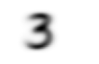

## fastAI第四章学习笔记

### python 相关一些语法

从下载MNIST的sample并查看内容：
```
path = untar_data(URLs.MNIST_SAMPLE)
Path.BASE_PATH = path
path.ls()
```
上面会显示： (#3) [Path('labels.csv'),Path('train'),Path('valid')]

```
(path/'train()').ls()
#上面会显示： (#2) [Path('train/3'),Path('train/7')]

threes = (path/'train'/'3').ls().sorted()
sevens = (path/'train'/'7').ls().sorted()
threes
```
上面会显示图片"3"的路径, sorted()方法是为了确保图片文件的路径的顺序相同
```
im3_path = threes[1]
im3 = Image.open(im3_path)
img
```
执行到上面会显示一个"3"的图片，Image类来自Python Imaging Library(PIL)库,它在python中广泛用来打开,查看,操作图片
因为jupyter移植PIL图像，所有在执行img时会直接自动显示图片到网页上.

要查看像素点显示的数字,可以用NumPy的array或者PyTorch中的tensor：
```
array(im3)[4:10,4:10]
```
前面4:10表示(从0开始)第4(包含)到第10(不包含)行，后面4:10表示第4(包含)到第10(不包含)列像素点的值,这是显示结果
```
array([[  0,   0,   0,   0,   0,   0],
       [  0,   0,   0,   0,   0,  29],
       [  0,   0,   0,  48, 166, 224],
       [  0,  93, 244, 249, 253, 187],
       [  0, 107, 253, 253, 230,  48],
       [  0,   3,  20,  20,  15,   0]], dtype=uint8)
```
可以先看整个im3的像素值打印
```
array([[  0,   0,   0,   0,   0,   0,   0,   0,   0,   0,   0,   0,   0,   0,   0,   0,   0,   0,   0,   0,   0,   0,   0,   0,   0,   0,   0,   0],
       [  0,   0,   0,   0,   0,   0,   0,   0,   0,   0,   0,   0,   0,   0,   0,   0,   0,   0,   0,   0,   0,   0,   0,   0,   0,   0,   0,   0],
       [  0,   0,   0,   0,   0,   0,   0,   0,   0,   0,   0,   0,   0,   0,   0,   0,   0,   0,   0,   0,   0,   0,   0,   0,   0,   0,   0,   0],
       [  0,   0,   0,   0,   0,   0,   0,   0,   0,   0,   0,   0,   0,   0,   0,   0,   0,   0,   0,   0,   0,   0,   0,   0,   0,   0,   0,   0],
       [  0,   0,   0,   0,   0,   0,   0,   0,   0,   0,   0,   0,   0,   0,   0,   0,   0,   0,   0,   0,   0,   0,   0,   0,   0,   0,   0,   0],
       [  0,   0,   0,   0,   0,   0,   0,   0,   0,  29, 150, 195, 254, 255, 254, 176, 193, 150,  96,   0,   0,   0,   0,   0,   0,   0,   0,   0],
       [  0,   0,   0,   0,   0,   0,   0,  48, 166, 224, 253, 253, 234, 196, 253, 253, 253, 253, 233,   0,   0,   0,   0,   0,   0,   0,   0,   0],
       [  0,   0,   0,   0,   0,  93, 244, 249, 253, 187,  46,  10,   8,   4,  10, 194, 253, 253, 233,   0,   0,   0,   0,   0,   0,   0,   0,   0],
       [  0,   0,   0,   0,   0, 107, 253, 253, 230,  48,   0,   0,   0,   0,   0, 192, 253, 253, 156,   0,   0,   0,   0,   0,   0,   0,   0,   0],
       [  0,   0,   0,   0,   0,   3,  20,  20,  15,   0,   0,   0,   0,   0,  43, 224, 253, 245,  74,   0,   0,   0,   0,   0,   0,   0,   0,   0],
       [  0,   0,   0,   0,   0,   0,   0,   0,   0,   0,   0,   0,   0,   0, 249, 253, 245, 126,   0,   0,   0,   0,   0,   0,   0,   0,   0,   0],
       [  0,   0,   0,   0,   0,   0,   0,   0,   0,   0,   0,  14, 101, 223, 253, 248, 124,   0,   0,   0,   0,   0,   0,   0,   0,   0,   0,   0],
       [  0,   0,   0,   0,   0,   0,   0,   0,   0,  11, 166, 239, 253, 253, 253, 187,  30,   0,   0,   0,   0,   0,   0,   0,   0,   0,   0,   0],
       [  0,   0,   0,   0,   0,   0,   0,   0,   0,  16, 248, 250, 253, 253, 253, 253, 232, 213, 111,   2,   0,   0,   0,   0,   0,   0,   0,   0],
       [  0,   0,   0,   0,   0,   0,   0,   0,   0,   0,   0,  43,  98,  98, 208, 253, 253, 253, 253, 187,  22,   0,   0,   0,   0,   0,   0,   0],
       [  0,   0,   0,   0,   0,   0,   0,   0,   0,   0,   0,   0,   0,   0,   9,  51, 119, 253, 253, 253,  76,   0,   0,   0,   0,   0,   0,   0],
       [  0,   0,   0,   0,   0,   0,   0,   0,   0,   0,   0,   0,   0,   0,   0,   0,   1, 183, 253, 253, 139,   0,   0,   0,   0,   0,   0,   0],
       [  0,   0,   0,   0,   0,   0,   0,   0,   0,   0,   0,   0,   0,   0,   0,   0,   0, 182, 253, 253, 104,   0,   0,   0,   0,   0,   0,   0],
       [  0,   0,   0,   0,   0,   0,   0,   0,   0,   0,   0,   0,   0,   0,   0,   0,  85, 249, 253, 253,  36,   0,   0,   0,   0,   0,   0,   0],
       [  0,   0,   0,   0,   0,   0,   0,   0,   0,   0,   0,   0,   0,   0,   0,  60, 214, 253, 253, 173,  11,   0,   0,   0,   0,   0,   0,   0],
       [  0,   0,   0,   0,   0,   0,   0,   0,   0,   0,   0,   0,   0,   0,  98, 247, 253, 253, 226,   9,   0,   0,   0,   0,   0,   0,   0,   0],
       [  0,   0,   0,   0,   0,   0,   0,   0,   0,   0,   0,   0,  42, 150, 252, 253, 253, 233,  53,   0,   0,   0,   0,   0,   0,   0,   0,   0],
       [  0,   0,   0,   0,   0,   0,  42, 115,  42,  60, 115, 159, 240, 253, 253, 250, 175,  25,   0,   0,   0,   0,   0,   0,   0,   0,   0,   0],
       [  0,   0,   0,   0,   0,   0, 187, 253, 253, 253, 253, 253, 253, 253, 197,  86,   0,   0,   0,   0,   0,   0,   0,   0,   0,   0,   0,   0],
       [  0,   0,   0,   0,   0,   0, 103, 253, 253, 253, 253, 253, 232,  67,   1,   0,   0,   0,   0,   0,   0,   0,   0,   0,   0,   0,   0,   0],
       [  0,   0,   0,   0,   0,   0,   0,   0,   0,   0,   0,   0,   0,   0,   0,   0,   0,   0,   0,   0,   0,   0,   0,   0,   0,   0,   0,   0],
       [  0,   0,   0,   0,   0,   0,   0,   0,   0,   0,   0,   0,   0,   0,   0,   0,   0,   0,   0,   0,   0,   0,   0,   0,   0,   0,   0,   0],
       [  0,   0,   0,   0,   0,   0,   0,   0,   0,   0,   0,   0,   0,   0,   0,   0,   0,   0,   0,   0,   0,   0,   0,   0,   0,   0,   0,   0]], dtype=uint8)
```
tensor和arrary几乎表示得一模一样,不过使用tensor计算时会调用到GPU而不是CPU,这会大大加快并行计算速度,按原文的说法，另外tensor也包含更丰富的功能
```
tensor(im3)[4:10,4:10]
```
显示结果：
```
tensor([[  0,   0,   0,   0,   0,   0],
        [  0,   0,   0,   0,   0,  29],
        [  0,   0,   0,  48, 166, 224],
        [  0,  93, 244, 249, 253, 187],
        [  0, 107, 253, 253, 230,  48],
        [  0,   3,  20,  20,  15,   0]], dtype=torch.uint8)
```

### 像素相似度
书原文让我们先自己思考如何实现数字识别,我还是在以传统的思维在思考：
自己找数字的特征：例如“7”,从横到下面的撇，只有一个转折过程，3：有两次弧,并且第一个弧到第二个弧之间有一次回折的过程。
接下来思考检查像素判断是否有这样的规律。但是思考过程中会发现，实现方式实在太难了。再来看书中介绍的做法。

>So, here is a first idea: how about we find the average pixel value for every pixel of the 3s, then do the same for the 7s. This will give us two group averages, defining what we might call the "ideal" 3 and 7. Then, to classify an image as one digit or the other, we see which of these two ideal digits the image is most similar to. This certainly seems like it should be better than nothing, so it will make a good baseline.
Step one for our simple model is to get the average of pixel values for each of our two groups. In the process of doing this, we will learn a lot of neat Python numeric programming tricks!  
Let's create a tensor containing all of our 3s stacked together. We already know how to create a tensor containing a single image. To create a tensor containing all the images in a directory, we will first use a Python list comprehension to create a plain list of the single image tensors.

```
seven_tensors = [tensor(Image.open(o)) for o in sevens]
three_tensors = [tensor(Image.open(o)) for o in threes]
len(three_tensors),len(seven_tensors)
# 这里会显示: (6131, 6265)
```
这里用到了列表生成式,这是python一个非常有用的高级语法，可以对原有的列表的元素进行批量操作,生成新列表,也可以过滤列表中的元素,例如:
```new_list = [f(o) for o in a_list if o>0]``` 对a_list 中大于0的元素过滤出来,然后将过滤出来的每个元素执行传入f()函数,将每个返回的结果生成一个新的列表new_list,
相对于使用循环来说,这个语法不仅简洁,而且速度快.

接下来,使用torch.stack()把列表中的所有二维(阶)tensor进行堆叠,生成一个三维(阶)的tensor,
```
stacked_sevens = torch.stack(seven_tensors).float()/255
stacked_threes = torch.stack(three_tensors).float()/255
stacked_threes.shape
```
这里会输出打印 ```torch.Size([6131, 28, 28])```  
下面是计算tensor的阶数,就是shape的长度
```
len(stacked_threes.shape)
```
显然stacked_threes是三阶张量,另外也可以用```stacked_threes.ndim```计算阶数

对堆叠的每个像素计算平均值,(想象二维图片列是长,行是宽,堆叠的数量是高)也就是计算"高"上所有数字的平均值.
```
mean3 = stacked_threes.mean(0)
show_image(mean3);
```
从上面的代码可以看出,传入mean()的参数是0,所以高应该是“第0阶”,也就是沿着Rank0 轴,每个格子取一次平均值,得到一个二阶的张量mean3,
mean3 就是一个"平均图像"3

   
下面代码看堆叠在第2层的图像,由此可以猜出 tensor的阶数排列为tensor_3rank[第一阶][第二阶][第三阶]
```
a_3 = stacked_threes[1]
show_image(a_3);
```

得到3和7的"平均图像"后,再拿要判断的图像与平均图像对比,看有多大的差距.书里介绍了两种量化这个“差距”的方法：
1. 对“平均图像”和待测图像每个像素取差值(绝对值),再对所有像素差值取平均值。例如  
```dist_3_abs = (a_3 - mean3).abs().mean()```
2. 对“平均图像”和待测图像每个像素取差值(绝对值),在对所差值的平方和取平均值,然后再开方.例如  
```dist_3_sqr = ((a_3 - mean3)**2).mean().sqrt()```

PyTorch 对上述两种计算提供了 _损失函数_,这些函数在```torch.nn.functional```,PyTorch 推荐```F```的方式导入：```import torch.nn.functional as F```
```
F.l1_loss(a_3.float().mean7), F.mse_loss(a_3,mean7).sqrt()
# 这里会显示(tensor(0.1586), tensor(0.3021))
```
这里提到了L1损失函数和均方差损失函数,L1范数的概念,简单理解起来就是的对所有差值取平均值,虽然描述简单粗暴不准确,但更容易理解。MSE损失-均方差，就是差值的平方取平均值。

### NumPy Arrays 和 PyTorch Tensors
```
data = [[1,2,3],[4,5,6]]
arr = array (data)
tns = tensor(data)
```
```
arr  # numpy
#会打印：
array([[1, 2, 3],
       [4, 5, 6]])
```
```
tns  # pytorch
#会打印：
tensor([[1, 2, 3],
        [4, 5, 6]])
```
用起来几乎一模一样

```
tns[1]
```
表示第取一行```tensor([4, 5, 6])```

```
tns[:,1]
```
表示取第1列，冒号表示取这一轴上的所有元素，```tensor([2, 5])```

tensor可以和python切片的语法结合：```[start:end]```包含```start```,不包含```end```
```
tns[1, 1:3]
#会打印
tensor([5, 6])
```

也可以和数字进行加减乘除运算:
```
tns+1
#会打印
tensor([[2, 3, 4],
        [5, 6, 7]])
```

tensor的类型:
```
tns.type()
#会打印
torch.LongTensor
```

可以对类型进行自动转换：
```
tns*1.5
#会打印
tensor([[1.5000, 3.0000, 4.5000],
        [6.0000, 7.5000, 9.0000]])
```

### 使用广播计算指标

模型建立了,我们需要一些数据验证训练的效果,也就是前几章说的用验证集评估训练效果。
有个valid目录,这就是提供的验证集的目录。
```
valid_3_tens = torch.stack([tensor(Image.open(o)) 
                            for o in (path/'valid'/'3').ls()])
valid_3_tens = valid_3_tens.float()/255
valid_7_tens = torch.stack([tensor(Image.open(o)) 
                            for o in (path/'valid'/'7').ls()])
valid_7_tens = valid_7_tens.float()/255
valid_3_tens.shape,valid_7_tens.shape
#这里会打印
(torch.Size([1010, 28, 28]), torch.Size([1028, 28, 28]))
```

在定义一个函数：
```
def mnist_distance(a,b): return (a-b).abs().mean((-1,-2))
mnist_distance(a_3, mean3)
#这里会打印 tensor(0.1114)
```
这里还不是很清楚```((-1,-2))```参数的含义,先往下看,
书中试着把两个不同阶的张量传进这个函数
```
valid_3_dist = mnist_distance(valid_3_tens, mean3)
valid_3_dist, valid_3_dist.shape
#这里打印了
(tensor([0.1474, 0.1071, 0.1349,  ..., 0.1343, 0.1370, 0.1305]),
 torch.Size([1010]))
```
神奇的是,valid_3_tens是一个三阶张量,而mean3是一个二阶张量,书中说的是
>it tries to perform a simple subtraction operation between two tensors of different ranks, will use broadcasting.
两个不同阶数的张量之间计算会使用到"广播"的机制,这让我联想到了python的map()函数
```
def f(x): return x * x
r = map(f, [1, 2, 3, 4, 5, 6, 7, 8, 9])
list(r)
#这里会显示[1, 4, 9, 16, 25, 36, 49, 64, 81]
```
但注意不同阶数的向量之间可以通过广播机制运算,但是同一阶不同大小的张量不能运算,例如

相同阶,并且每一阶大小相同(都是3)可以运算
```
tensor([1,2,3]) + tensor([1,1,1])
```
会得到
```
tensor([2, 3, 4])
```

阶数不同,但是低阶张量所有阶和高阶的张量某(几)阶大小一样,可以通过广播机制运算
```
tensor([1,2,3]) + tensor([[1,1,1],[2,3,4]])```
```
第一个张量被扩充成2阶,会得到
```
tensor([[2, 3, 4],
        [3, 5, 7]])
```

但是我尝试```tensor([1,2,3]) + tensor([1,1])```会报错：
```
---------------------------------------------------------------------------
RuntimeError                              Traceback (most recent call last)
<ipython-input-163-7239f80c13bb> in <module>()
----> 1 tensor([1,2,3]) + tensor([1,1])

RuntimeError: The size of tensor a (3) must match the size of tensor b (2) at non-singleton dimension 0
```

看看形状
```
(valid_3_tens-mean3).shape
```
显示,第0阶大小1010,第1,2阶大小是28 - 每张图片是28\*28的大小
```
torch.Size([1010, 28, 28])
```
我们的函数调用了mean((-1,-2))。 元组(-1,-2)代表一系列轴。 在Python中,-1表示最后一个元素，-2表示倒数第二个元素。 因此，在这种情况下，这告诉PyTorch我们想要取均值，该均值的范围为张量的最后两个轴所索引的值。 最后两个轴是图像的水平和垂直尺寸。 在最后两个轴上取平均值后，我们只剩下第一个张量轴，该轴在我们的图像上进行索引，这就是我们最终大小为(1010)的原因。 换句话说，对于每张图像,我们均对该图像中所有像素的强度进行平均。

书中提到,
>Pytorch 实际并没有把 ```mean3```copy 1010次,It pretends it were a tensor of that shape, but doesn't actually allocate any additional memory
>It does the whole calculation in C (or, if you're using a GPU, in CUDA, the equivalent of C on the GPU), tens of thousands of times faster than pure Python (up to millions of times faster on a GPU!).

```
def is_3(x): return mnist_distance(x,mean3) < mnist_distance(x,mean7)

is_3(a_3), is_3(a_3).float()
# 会显示
# (tensor(True), tensor(1.))

is_3(valid_3_tens)
# 会显示
# tensor([ True,  True,  True,  ..., False,  True,  True])

accuracy_3s =      is_3(valid_3_tens).float() .mean()
accuracy_7s = (1 - is_3(valid_7_tens).float()).mean()

accuracy_3s,accuracy_7s,(accuracy_3s+accuracy_7s)/2
#会显示(tensor(0.9168), tensor(0.9854), tensor(0.9511))
```

本以为这就是机器学习,然而
>To do better, perhaps it is time to try a system that does some real learning—that is, that can automatically modify itself to improve its performance. In other words, it's time to talk about the training process, and SGD.
