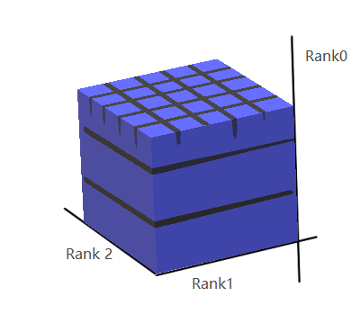

## fastAI第四章学习笔记

### python 相关一些语法

从下载MNIST的sample并查看内容：
```
path = untar_data(URLs.MNIST_SAMPLE)
Path.BASE_PATH = path
path.ls()
```
上面会显示： (#3) [Path('labels.csv'),Path('train'),Path('valid')]

```
(path/'train()').ls()
#上面会显示： (#2) [Path('train/3'),Path('train/7')]

threes = (path/'train'/'3').ls().sorted()
sevens = (path/'train'/'7').ls().sorted()
threes
```
上面会显示图片"3"的路径, sorted()方法是为了确保图片文件的路径的顺序相同
```
im3_path = threes[1]
im3 = Image.open(im3_path)
img
```
执行到上面会显示一个"3"的图片，Image类来自Python Imaging Library(PIL)库,它在python中广泛用来打开,查看,操作图片
因为jupyter移植PIL图像，所有在执行img时会直接自动显示图片到网页上.

要查看像素点显示的数字,可以用NumPy的array或者PyTorch中的tensor：
```
array(im3)[4:10,4:10]
```
前面4:10表示(从0开始)第4(包含)到第10(不包含)行，后面4:10表示第4(包含)到第10(不包含)列像素点的值,这是显示结果
```
array([[  0,   0,   0,   0,   0,   0],
       [  0,   0,   0,   0,   0,  29],
       [  0,   0,   0,  48, 166, 224],
       [  0,  93, 244, 249, 253, 187],
       [  0, 107, 253, 253, 230,  48],
       [  0,   3,  20,  20,  15,   0]], dtype=uint8)
```
可以先看整个im3的像素值打印
```
array([[  0,   0,   0,   0,   0,   0,   0,   0,   0,   0,   0,   0,   0,   0,   0,   0,   0,   0,   0,   0,   0,   0,   0,   0,   0,   0,   0,   0],
       [  0,   0,   0,   0,   0,   0,   0,   0,   0,   0,   0,   0,   0,   0,   0,   0,   0,   0,   0,   0,   0,   0,   0,   0,   0,   0,   0,   0],
       [  0,   0,   0,   0,   0,   0,   0,   0,   0,   0,   0,   0,   0,   0,   0,   0,   0,   0,   0,   0,   0,   0,   0,   0,   0,   0,   0,   0],
       [  0,   0,   0,   0,   0,   0,   0,   0,   0,   0,   0,   0,   0,   0,   0,   0,   0,   0,   0,   0,   0,   0,   0,   0,   0,   0,   0,   0],
       [  0,   0,   0,   0,   0,   0,   0,   0,   0,   0,   0,   0,   0,   0,   0,   0,   0,   0,   0,   0,   0,   0,   0,   0,   0,   0,   0,   0],
       [  0,   0,   0,   0,   0,   0,   0,   0,   0,  29, 150, 195, 254, 255, 254, 176, 193, 150,  96,   0,   0,   0,   0,   0,   0,   0,   0,   0],
       [  0,   0,   0,   0,   0,   0,   0,  48, 166, 224, 253, 253, 234, 196, 253, 253, 253, 253, 233,   0,   0,   0,   0,   0,   0,   0,   0,   0],
       [  0,   0,   0,   0,   0,  93, 244, 249, 253, 187,  46,  10,   8,   4,  10, 194, 253, 253, 233,   0,   0,   0,   0,   0,   0,   0,   0,   0],
       [  0,   0,   0,   0,   0, 107, 253, 253, 230,  48,   0,   0,   0,   0,   0, 192, 253, 253, 156,   0,   0,   0,   0,   0,   0,   0,   0,   0],
       [  0,   0,   0,   0,   0,   3,  20,  20,  15,   0,   0,   0,   0,   0,  43, 224, 253, 245,  74,   0,   0,   0,   0,   0,   0,   0,   0,   0],
       [  0,   0,   0,   0,   0,   0,   0,   0,   0,   0,   0,   0,   0,   0, 249, 253, 245, 126,   0,   0,   0,   0,   0,   0,   0,   0,   0,   0],
       [  0,   0,   0,   0,   0,   0,   0,   0,   0,   0,   0,  14, 101, 223, 253, 248, 124,   0,   0,   0,   0,   0,   0,   0,   0,   0,   0,   0],
       [  0,   0,   0,   0,   0,   0,   0,   0,   0,  11, 166, 239, 253, 253, 253, 187,  30,   0,   0,   0,   0,   0,   0,   0,   0,   0,   0,   0],
       [  0,   0,   0,   0,   0,   0,   0,   0,   0,  16, 248, 250, 253, 253, 253, 253, 232, 213, 111,   2,   0,   0,   0,   0,   0,   0,   0,   0],
       [  0,   0,   0,   0,   0,   0,   0,   0,   0,   0,   0,  43,  98,  98, 208, 253, 253, 253, 253, 187,  22,   0,   0,   0,   0,   0,   0,   0],
       [  0,   0,   0,   0,   0,   0,   0,   0,   0,   0,   0,   0,   0,   0,   9,  51, 119, 253, 253, 253,  76,   0,   0,   0,   0,   0,   0,   0],
       [  0,   0,   0,   0,   0,   0,   0,   0,   0,   0,   0,   0,   0,   0,   0,   0,   1, 183, 253, 253, 139,   0,   0,   0,   0,   0,   0,   0],
       [  0,   0,   0,   0,   0,   0,   0,   0,   0,   0,   0,   0,   0,   0,   0,   0,   0, 182, 253, 253, 104,   0,   0,   0,   0,   0,   0,   0],
       [  0,   0,   0,   0,   0,   0,   0,   0,   0,   0,   0,   0,   0,   0,   0,   0,  85, 249, 253, 253,  36,   0,   0,   0,   0,   0,   0,   0],
       [  0,   0,   0,   0,   0,   0,   0,   0,   0,   0,   0,   0,   0,   0,   0,  60, 214, 253, 253, 173,  11,   0,   0,   0,   0,   0,   0,   0],
       [  0,   0,   0,   0,   0,   0,   0,   0,   0,   0,   0,   0,   0,   0,  98, 247, 253, 253, 226,   9,   0,   0,   0,   0,   0,   0,   0,   0],
       [  0,   0,   0,   0,   0,   0,   0,   0,   0,   0,   0,   0,  42, 150, 252, 253, 253, 233,  53,   0,   0,   0,   0,   0,   0,   0,   0,   0],
       [  0,   0,   0,   0,   0,   0,  42, 115,  42,  60, 115, 159, 240, 253, 253, 250, 175,  25,   0,   0,   0,   0,   0,   0,   0,   0,   0,   0],
       [  0,   0,   0,   0,   0,   0, 187, 253, 253, 253, 253, 253, 253, 253, 197,  86,   0,   0,   0,   0,   0,   0,   0,   0,   0,   0,   0,   0],
       [  0,   0,   0,   0,   0,   0, 103, 253, 253, 253, 253, 253, 232,  67,   1,   0,   0,   0,   0,   0,   0,   0,   0,   0,   0,   0,   0,   0],
       [  0,   0,   0,   0,   0,   0,   0,   0,   0,   0,   0,   0,   0,   0,   0,   0,   0,   0,   0,   0,   0,   0,   0,   0,   0,   0,   0,   0],
       [  0,   0,   0,   0,   0,   0,   0,   0,   0,   0,   0,   0,   0,   0,   0,   0,   0,   0,   0,   0,   0,   0,   0,   0,   0,   0,   0,   0],
       [  0,   0,   0,   0,   0,   0,   0,   0,   0,   0,   0,   0,   0,   0,   0,   0,   0,   0,   0,   0,   0,   0,   0,   0,   0,   0,   0,   0]], dtype=uint8)
```
tensor和arrary几乎表示得一模一样,不过使用tensor计算时会调用到GPU而不是CPU,这会大大加快并行计算速度,按原文的说法，另外tensor也包含更丰富的功能
```
tensor(im3)[4:10,4:10]
```
显示结果：
```
tensor([[  0,   0,   0,   0,   0,   0],
        [  0,   0,   0,   0,   0,  29],
        [  0,   0,   0,  48, 166, 224],
        [  0,  93, 244, 249, 253, 187],
        [  0, 107, 253, 253, 230,  48],
        [  0,   3,  20,  20,  15,   0]], dtype=torch.uint8)
```

### 像素相似度
书原文让我们先自己思考如何实现数字识别,我还是在以传统的思维在思考：
自己找数字的特征：例如“7”,从横到下面的撇，只有一个转折过程，3：有两次弧,并且第一个弧到第二个弧之间有一次回折的过程。
接下来思考检查像素判断是否有这样的规律。但是思考过程中会发现，实现方式实在太难了。再来看书中介绍的做法。

>So, here is a first idea: how about we find the average pixel value for every pixel of the 3s, then do the same for the 7s. This will give us two group averages, defining what we might call the "ideal" 3 and 7. Then, to classify an image as one digit or the other, we see which of these two ideal digits the image is most similar to. This certainly seems like it should be better than nothing, so it will make a good baseline.
Step one for our simple model is to get the average of pixel values for each of our two groups. In the process of doing this, we will learn a lot of neat Python numeric programming tricks!  
Let's create a tensor containing all of our 3s stacked together. We already know how to create a tensor containing a single image. To create a tensor containing all the images in a directory, we will first use a Python list comprehension to create a plain list of the single image tensors.

```
seven_tensors = [tensor(Image.open(o)) for o in sevens]
three_tensors = [tensor(Image.open(o)) for o in threes]
len(three_tensors),len(seven_tensors)
# 这里会显示: (6131, 6265)
```
这里用到了列表生成式,这是python一个非常有用的高级语法，可以对原有的列表的元素进行批量操作,生成新列表,也可以过滤列表中的元素,例如:
```new_list = [f(o) for o in a_list if o>0]``` 对a_list 中大于0的元素过滤出来,然后将过滤出来的每个元素执行传入f()函数,将每个返回的结果生成一个新的列表new_list,
相对于使用循环来说,这个语法不仅简洁,而且速度快.

接下来,使用torch.stack()把列表中的所有二维(阶)tensor进行堆叠,生成一个三维(阶)的tensor,
```
stacked_sevens = torch.stack(seven_tensors).float()/255
stacked_threes = torch.stack(three_tensors).float()/255
stacked_threes.shape
```
这里会输出打印 ```torch.Size([6131, 28, 28])```  
下面是计算tensor的阶数,就是shape的长度
```
len(stacked_threes.shape)
```
显然stacked_threes是三阶张量,另外也可以用```stacked_threes.ndim```计算阶数

对堆叠的每个像素计算平均值,(想象二维图片列是长,行是宽,堆叠的数量是高)也就是计算"高"上所有数字的平均值.
```
mean3 = stacked_threes.mean(0)
show_image(mean3);
```
从上面的代码可以看出,传入mean()的参数是0,所以高应该是“第0阶”,


