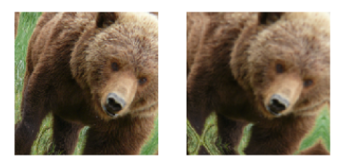
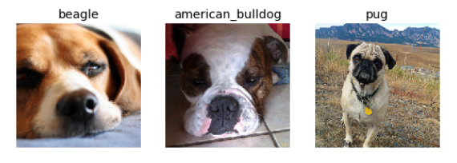
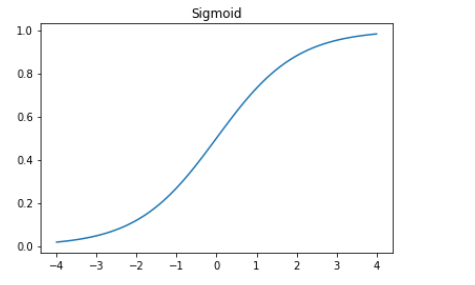
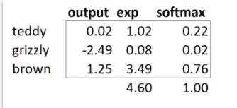
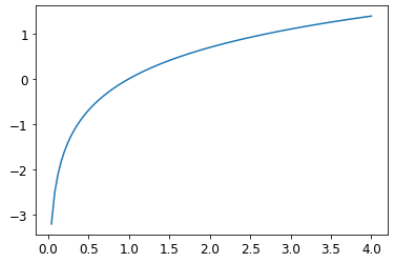
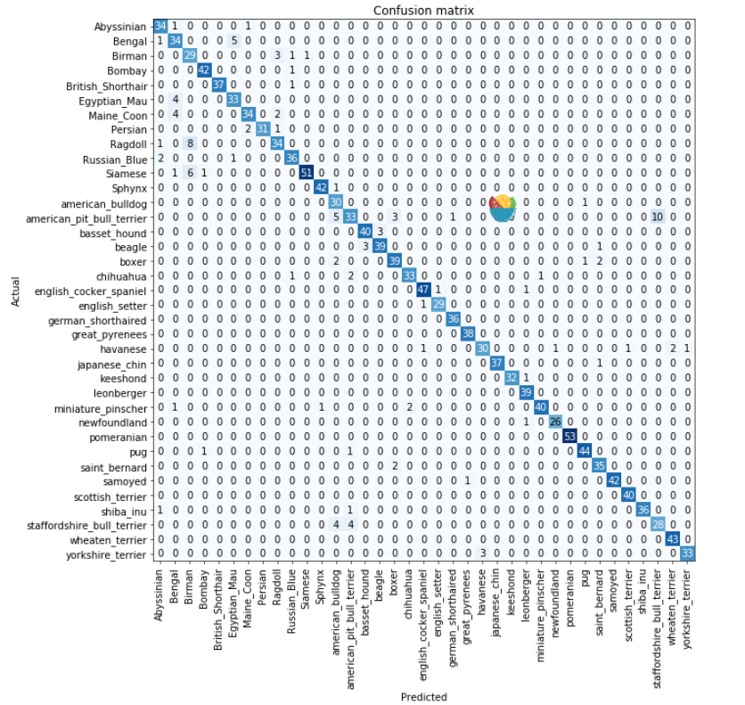
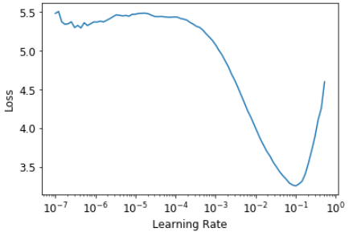

## FastAI 第5章学习笔记

### Image Classification
现在深入一点，什么是计算机视觉模型(computer vision model), NLP模型, tabular模型等等？怎样构建一个符合你特定领域需求的框架？
怎样从训练过程中得到尽可能最好的结果？怎样处理更快?当数据集发生变化时，我们应该做怎样的修改？现在在第一章例子的基础上做两件事：  
- 优化
- 使其在更多种类的数据上得到应用

为此,我们需要学会：各种layers(层),正则化方法,优化器,怎样把各层放到一个架构中,标记方法技巧等等.

### From Dogs and Cats to Pet Breeds

第一个模型演示了怎样区分狗子和猫子. 就在几年前,这是一个很大的挑战,但现在so easy！而且事实证明,同样的数据集允许我们解决一些更有
挑战性的问题：指出途中宠物的品种.  
网站上已经下载了“宠物”的数据集.
```
from fastai.vision.all import *
path = untar_data(URLs.PETS)
```
通过python的```untar```函数解压到本地,可以看看```URLs.PETS```的链接和```path```这个本地路径
```
URLs.PETS
```
> 'https://s3.amazonaws.com/fast-ai-imageclas/oxford-iiit-pet.tgz'

```
path
```
> Path('/root/.fastai/data/oxford-iiit-pet')

数据布局是深度学习难题的重要组成部分,数据一般以这两种方式提供：  
- 每个文件表示一项数据,例如文本文件,图像,可能是以目录归类或者文件名的形式表示这些项目的信息.
- 一个数据表,例如以CSV的形式,里面每行是一项数据,可能包含文件名,与其他形式如图片文档相关联.

在特定领域,也有一些例外,如在基因学中,可以是二进制的数据库甚至可以是网络流.但绝大多数领域还是上面那两种,或两种的结合.
用```ls```方法看下数据集里面有什么
```
Path.BASE_PATH = path
path.ls()
```
> (#2) [Path('annotations'),Path('images')]

可以看到有annotations 和 images 两个目录. 数据集的[官网](https://www.robots.ox.ac.uk/~vgg/data/pets/)说annotations目录包含宠物的分部地区而不是宠物是什么.我们现在要辨认的是宠物品种,而不是地区分部,所以不必关心这个目录.所以看看images里有什么：
```
(path/"images").ls()
```
>(#7393) [Path('images/japanese_chin_131.jpg'),Path('images/Bombay_4.jpg'),Path('images/Birman_43.jpg'),Path('images/Maine_Coon_57.jpg'),Path('images/pug_80.jpg'),Path('images/english_cocker_spaniel_140.jpg'),Path('images/american_bulldog_175.jpg'),Path('images/boxer_154.jpg'),Path('images/saint_bernard_104.jpg'),Path('images/wheaten_terrier_59.jpg')...]

FastAI中很多函数和方法返回集合时会使用```L```类,```L```可以看做一个加强版的python```list```类型,相比```list```，它会提供一些加强功能,例如在列表的前面会加```#```号加数字来表示列表中元素的个数,当列表太长时,会在后面用省略号.  

检查文件名我们发现文件名是以品种名加下划线加一个数字后缀构成的，但是要注意有的品种明会包含几个单词,中间也是用下划线分隔的.
提取单个对象：
```
fname = (path/"images").ls()[0]
fname
```
>Path('images/boxer_41.jpg')

我们会需要从文件名提取品种名,这个可以用正则表达式(regex),关于正则表达式的学习也是一个很大的话题,这里放一个[python3.9.2的正则表达式官方文档](https://docs.python.org/zh-cn/3.9/library/re.html)和一篇[廖雪峰的简单教材](https://www.liaoxuefeng.com/wiki/1016959663602400/1017639890281664)
```
re.findall(r'(.+)_\d+.jpg$', fname.name)
```
>['great_pyrenees']
>
这里```findall```是python的re标准库中查找一个字符串的方法.这里查找的是下划线,点,"jpg"之前所有的字符.正则表达式在fastai中可以用来标记数据-这就是```RegexLabeller```类
```
pets = DataBlock(blocks = (ImageBlock, CategoryBlock),
                          get_items=get_image_files,
                          splitter=RandomSplitter(seed=42),
                          get_y=using_attr(RegexLabeller(r'(.+)_\d+.jpg$'), 'name'),
                          item_tfms=Resize(460),
                          batch_tfms=aug_transforms(size=224, min_scale=0.75)
dls = pets.dataloaders(path/"images")
```

上面```DataBlock```各参数含义在[第二章学习笔记](fastAI学习笔记-02-production.md)中有记录,不同的是会多两行参数：
```
item_tfms=Resize(460)
batch_tfms=aug_transforms(size=224, min_scale=0.75)
```
这两行实现了一直fastai的扩充策略,叫做 _presizing_(预设尺寸).

### Presizing

我们需要将图片对齐成相同的尺寸,这样才能整理到tensor然后传到GPU. 根据性能要求,我们应该尽可能用较少的变换实现扩充,并将图像变换为统一大小.这里有个难题,如果缩小图片来扩充的大小,各种常见的扩充会引入空白区域,降低数据质量,或同时出现这两种情况.例如将图片选择45度，会用空白填充新的边界的角区域,这不会对模型产生任何影响.为了规避这些问题,presizing时会采取这两步策略：
1. 将图片重设为相对更大的尺寸,明显大于目标训练尺寸.
2. 将所有常见的增强操作（包括调整为最终目标大小）组合为一个，并在处理结束时仅在GPU上执行一次组合操作，而不是单独执行该操作并多次插值。

调整大小的第一步是创建足够大的图像,使它们具有余量,允许在内部区域进行进一步增强变换,而不是创建空白区域.这个转换会选择图像长度或宽度中较长者为边长,并随机裁剪成一个正方形.  
第二步，将GPU用于所有数据扩充，并且所有可能破坏性的操作都一起完成，最后进行一次插值  
  
图中两步：
1. 按长度或宽度裁剪：```item_tfms```实现的就是这一步,这是在将图片copy到GPU之前执行的,只是为了保证所有图片是一样的大小.训练集中,是随机裁剪的,但在验证集中,裁剪选择的总是正中心的方形.
2. 随机裁剪并扩充,```batch_tfms```实现的这一步,从"batch"可以看出,这是在GPU上将一整批一次性处理的,也就是说,速度会很快.在验证集上，仅在此处将尺寸调整为模型所需的最终尺寸。 在训练集上，首先进行随机裁剪和任何其他扩充。

下面代码，中
右图：一张图片放大,插值,旋转然后再插值(这是所有其他深度学习库使用的方法),
左图：放大和旋转作为一步操作,然后一次性插值(这是fastAI的实现)，
```
#hide_input
#id interpolations
#caption A comparison of fastai's data augmentation strategy (left) and the traditional approach (right).
dblock1 = DataBlock(blocks=(ImageBlock(), CategoryBlock()),
                   get_y=parent_label,
                   item_tfms=Resize(460))
# Place an image in the 'images/grizzly.jpg' subfolder where this notebook is located before running this
dls1 = dblock1.dataloaders([(Path.cwd()/'images'/'grizzly.jpg')]*100, bs=8)
dls1.train.get_idxs = lambda: Inf.ones
x,y = dls1.valid.one_batch()
_,axs = subplots(1, 2)

x1 = TensorImage(x.clone())
x1 = x1.affine_coord(sz=224)
x1 = x1.rotate(draw=30, p=1.)
x1 = x1.zoom(draw=1.2, p=1.)
x1 = x1.warp(draw_x=-0.2, draw_y=0.2, p=1.)

tfms = setup_aug_tfms([Rotate(draw=30, p=1, size=224), Zoom(draw=1.2, p=1., size=224),
                       Warp(draw_x=-0.2, draw_y=0.2, p=1., size=224)])
x = Pipeline(tfms)(x)
#x.affine_coord(coord_tfm=coord_tfm, sz=size, mode=mode, pad_mode=pad_mode)
TensorImage(x[0]).show(ctx=axs[0])
TensorImage(x1[0]).show(ctx=axs[1]);
```
  
您会看到右侧的图像清晰度较差，并且在左下角具有反射填充伪影； 同样，左上方的草完全消失了。 我们发现，在实践中，使用预先确定大小可以显着提高模型的准确性，并且通常还会加快速度。

#### Checking and Debugging a DataBlock

在训练前，应该检查下数据.检查数据可以用```show_batch```方法.
```
dls.show_batch(nrows=1, ncols=3)
```
  
数据科学家很可能并不熟悉数据本身,例如不知道上图中每个狗子的品种,这就需要google查对应的品种了.  
如果再构建```DataBlock```时出错(注意不一定失败),可能看不出来错误,要调试可以用```summary```方法.它尝试从提供的源创建批处理,会包含许多信息.另外如果失败,会看到错误的时间,并提供帮助信息. 例如一个常见的错误,忘记使用```Resize```变换,最终会得到不同大小的图片,并且无法处理他们,这种情况：
```
#hide_output
pets1 = DataBlock(blocks = (ImageBlock, CategoryBlock),
                 get_items=get_image_files, 
                 splitter=RandomSplitter(seed=42),
                 get_y=using_attr(RegexLabeller(r'(.+)_\d+.jpg$'), 'name'))
pets1.summary(path/"images")
```

```
Setting-up type transforms pipelines
Collecting items from /home/jhoward/.fastai/data/oxford-iiit-pet/images
Found 7390 items
2 datasets of sizes 5912,1478
Setting up Pipeline: PILBase.create
Setting up Pipeline: partial -> Categorize

Building one sample
  Pipeline: PILBase.create
    starting from
      /home/jhoward/.fastai/data/oxford-iiit-pet/images/american_pit_bull_terrier_31.jpg
    applying PILBase.create gives
      PILImage mode=RGB size=500x414
  Pipeline: partial -> Categorize
    starting from
      /home/jhoward/.fastai/data/oxford-iiit-pet/images/american_pit_bull_terrier_31.jpg
    applying partial gives
      american_pit_bull_terrier
    applying Categorize gives
      TensorCategory(13)

Final sample: (PILImage mode=RGB size=500x414, TensorCategory(13))


Setting up after_item: Pipeline: ToTensor
Setting up before_batch: Pipeline: 
Setting up after_batch: Pipeline: IntToFloatTensor

Building one batch
Applying item_tfms to the first sample:
  Pipeline: ToTensor
    starting from
      (PILImage mode=RGB size=500x414, TensorCategory(13))
    applying ToTensor gives
      (TensorImage of size 3x414x500, TensorCategory(13))

Adding the next 3 samples

No before_batch transform to apply

Collating items in a batch
Error! It's not possible to collate your items in a batch
Could not collate the 0-th members of your tuples because got the following shapes
torch.Size([3, 414, 500]),torch.Size([3, 375, 500]),torch.Size([3, 500, 281]),torch.Size([3, 203, 300])
---------------------------------------------------------------------------
RuntimeError                              Traceback (most recent call last)
<ipython-input-11-8c0a3d421ca2> in <module>
      4                  splitter=RandomSplitter(seed=42),
      5                  get_y=using_attr(RegexLabeller(r'(.+)_\d+.jpg$'), 'name'))
----> 6 pets1.summary(path/"images")

~/git/fastai/fastai/data/block.py in summary(self, source, bs, show_batch, **kwargs)
    182         why = _find_fail_collate(s)
    183         print("Make sure all parts of your samples are tensors of the same size" if why is None else why)
--> 184         raise e
    185 
    186     if len([f for f in dls.train.after_batch.fs if f.name != 'noop'])!=0:

~/git/fastai/fastai/data/block.py in summary(self, source, bs, show_batch, **kwargs)
    176     print("\nCollating items in a batch")
    177     try:
--> 178         b = dls.train.create_batch(s)
    179         b = retain_types(b, s[0] if is_listy(s) else s)
    180     except Exception as e:

~/git/fastai/fastai/data/load.py in create_batch(self, b)
    125     def retain(self, res, b):  return retain_types(res, b[0] if is_listy(b) else b)
    126     def create_item(self, s):  return next(self.it) if s is None else self.dataset[s]
--> 127     def create_batch(self, b): return (fa_collate,fa_convert)[self.prebatched](b)
    128     def do_batch(self, b): return self.retain(self.create_batch(self.before_batch(b)), b)
    129     def to(self, device): self.device = device

~/git/fastai/fastai/data/load.py in fa_collate(t)
     44     b = t[0]
     45     return (default_collate(t) if isinstance(b, _collate_types)
---> 46             else type(t[0])([fa_collate(s) for s in zip(*t)]) if isinstance(b, Sequence)
     47             else default_collate(t))
     48 

~/git/fastai/fastai/data/load.py in <listcomp>(.0)
     44     b = t[0]
     45     return (default_collate(t) if isinstance(b, _collate_types)
---> 46             else type(t[0])([fa_collate(s) for s in zip(*t)]) if isinstance(b, Sequence)
     47             else default_collate(t))
     48 

~/git/fastai/fastai/data/load.py in fa_collate(t)
     43 def fa_collate(t):
     44     b = t[0]
---> 45     return (default_collate(t) if isinstance(b, _collate_types)
     46             else type(t[0])([fa_collate(s) for s in zip(*t)]) if isinstance(b, Sequence)
     47             else default_collate(t))

~/anaconda3/lib/python3.7/site-packages/torch/utils/data/_utils/collate.py in default_collate(batch)
     53             storage = elem.storage()._new_shared(numel)
     54             out = elem.new(storage)
---> 55         return torch.stack(batch, 0, out=out)
     56     elif elem_type.__module__ == 'numpy' and elem_type.__name__ != 'str_' \
     57             and elem_type.__name__ != 'string_':

RuntimeError: invalid argument 0: Sizes of tensors must match except in dimension 0. Got 414 and 375 in dimension 2 at /opt/conda/conda-bld/pytorch_1579022060824/work/aten/src/TH/generic/THTensor.cpp:612
```

```
Setting-up type transforms pipelines
Collecting items from /home/sgugger/.fastai/data/oxford-iiit-pet/images
Found 7390 items
2 datasets of sizes 5912,1478
Setting up Pipeline: PILBase.create
Setting up Pipeline: partial -> Categorize
 
Building one sample
  Pipeline: PILBase.create
    starting from
      /home/sgugger/.fastai/data/oxford-iiit-pet/images/american_bulldog_83.jpg
    applying PILBase.create gives
      PILImage mode=RGB size=375x500
  Pipeline: partial -> Categorize
    starting from
      /home/sgugger/.fastai/data/oxford-iiit-pet/images/american_bulldog_83.jpg
    applying partial gives
      american_bulldog
    applying Categorize gives
      TensorCategory(12)
 
Final sample: (PILImage mode=RGB size=375x500, TensorCategory(12))
 
Setting up after_item: Pipeline: ToTensor
Setting up before_batch: Pipeline: 
Setting up after_batch: Pipeline: IntToFloatTensor
 
Building one batch
Applying item_tfms to the first sample:
  Pipeline: ToTensor
    starting from
      (PILImage mode=RGB size=375x500, TensorCategory(12))
    applying ToTensor gives
      (TensorImage of size 3x500x375, TensorCategory(12))
 
Adding the next 3 samples
 
No before_batch transform to apply
 
Collating items in a batch
Error! It's not possible to collate your items in a batch
Could not collate the 0-th members of your tuples because got the following 
shapes:
torch.Size([3, 500, 375]),torch.Size([3, 375, 500]),torch.Size([3, 333, 500]),
torch.Size([3, 375, 500])
```
我们可以确切看到如何收集数据(get_items)并将其拆分(spitter),如何从文件名转到样本(元组(image, category)),然后应用了那些转换项(item_tfms, batch_tfms)啊，为何在收集样本到一个batch时会失败(因为图片形状不同)  
一旦觉得数据看起来没问题,建议用这些数据去训练一个简单的模型.很多人会推迟训练一个实际模型太久了,这样他们会很难看到一个基线结果的样子.很可能你的问题压根就不需要很多很复杂的特定领域的工程.或者也许看起来完全没有训练到模型.有很多东西,我们需要越早知道越好. 作为作为初始测试,我们会用一个常用的简单模型：
```
learn = cnn_learner(dls, resnet34, mertrics=error_rate)
learn.fine_tune(2)
```

epoch|	train_loss|	valid_loss|	error_rate|	time
--|--|--|--|--
0|	1.551305|	0.322132|	0.106225|	00:19
epoch|	train_loss|	valid_loss|	error_rate|	time
0|	0.529473|	0.312148|	0.095399|	00:23
1|	0.330207|	0.245883|	0.080514|	00:24

拟合(fit)模型时会显示每个训练周期(epoch)的的结果.一个周期(epoch)是完成了一次*所有图片数据*的传入. _Loss(损失函数)_ 可以是任何我们决定用来优化模型参数的函数.但是这里我们没有指定,fastai一般会尝试基于数据和模型的种类选一个合适的损失函数.这里我们有图像数据和分类结果，因此fastai将默认使用cross-entropy(交叉熵)损失函数.

### Cross-Entropy Loss

交叉熵损失函数和之前用的很像,但有两个优势：
- 当我们从变量不止两个种类时也可以使用
- 更快更可靠

我们必须先理解损失函数看到的实际数据和激活值长什么样,才能理解cross-entropy是如何对两个以上种类的从变量生效的.

### Viewing Activations and Labels

看下模型的激活值.用one_batch方法可以从```DataLoaders```获取一批实际数据的.
```
x,y = dls.one_batch()
```
mini-batch是返回的因变量和从变量.看看从变量实际是什么:
```
y
```
>TensorCategory([ 0,  5, 23, 36,  5, 20, 29, 34, 33, 32, 31, 24, 12, 36,  8, 26, 30,  2, 12, 17,  7, 23, 12, 29, 21,  4, 35, 33,  0, 20, 26, 30,  3,  6, 36,  2, 17, 32, 11,  6,  3, 30,  5, 26, 26, 29,  7, 36,31, 26, 26,  8, 13, 30, 11, 12, 36, 31, 34, 20, 15,  8,  8, 23], device='cuda:5')

Batch size 是64,所以tensor中有64列.每列是一个0到36之间的一个整数,代表有37种可能的宠物品种.可以用```Learner.get_preds```看看预测值(也就是神经网络最后一层的激活值).这个函数既带有数据集的索引(0代表训练集,1代表验证集),也带有批的迭代.因此,我们可以只传入一个简单的batch的列表来获取预测值.它默认返回预测值和目标值,由于已经知道目标值targets,可以只用特殊变量```_```接收并忽略目标值.
```
preds,_ = learn.get_preds(dl=[(x,y)])
preds[0]
```
>tensor([9.9911e-01, 5.0433e-05, 3.7515e-07, 8.8590e-07, 8.1794e-05, 1.8991e-05, 9.9280e-06, 5.4656e-07, 6.7920e-06, 2.3486e-04, 3.7872e-04, 2.0796e-05, 4.0443e-07, 1.6933e-07, 2.0502e-07, 3.1354e-08,
        9.4115e-08, 2.9782e-06, 2.0243e-07, 8.5262e-08, 1.0900e-07, 1.0175e-07, 4.4780e-09, 1.4285e-07, 1.0718e-07, 8.1411e-07, 3.6618e-07, 4.0950e-07, 3.8525e-08, 2.3660e-07, 5.3747e-08, 2.5448e-07,
        6.5860e-08, 8.0937e-05, 2.7464e-07, 5.6760e-07, 1.5462e-08])

实际预测值有37中可能,它们在0到1之间,和为1.
```
len(preds[0]),preds[0].sum()
```
>(37, tensor(1.0000))

为了将模型的激活值,转换为这样的预测值,我们用到了叫做 _softmax_ 的激活函数.

#### Softmax

在分类模型中,我们在最后一层用到了softmax 激活函数,确保所有激活值介于0到1之间,并且总和为1.  
softmax有点类似于sigmoid 函数：
```
plot_function(torch.sigmoid, min=-4,max=4)
```
> 

我们可以将该函数应用于来自神经网络的单个激活列，并返回一列介于0和1之间的数字，因此对于我们的最后一层来说，这是一个非常有用的激活函数。  
现在考虑target中有更多种类(如37种宠物品种).那意味着,我们需要更多激活值,而不止一种:每个每个种类一个激活值.在预测3和7的例子中,我们可以返回两个激活值,每种数字一个激活值,这样就能很好地扩展到更一般情况.用一组标准差为2的随机数字举个例(随机数需要乘以2),假设有6张图片,两个种类(第一列表示3,第二列表示7)
```
torch.random.manual_seed(42)
acts = torch.randn((6,2))*2
acts
```
>tensor([[ 0.6734,  0.2576],
        [ 0.4689,  0.4607],
        [-2.2457, -0.3727],
        [ 4.4164, -1.2760],
        [ 0.9233,  0.5347],
        [ 1.0698,  1.6187]])
        
直接取sigmoid是不对的,因为没有获取到每一行加起来为1(我们希望3的概率和7的概率加起来为1)

```
#这是不对的
acts.sigmoid()
```
>tensor([[0.6623, 0.5641],
        [0.6151, 0.6132],
        [0.0957, 0.4079],
        [0.9881, 0.2182],
        [0.7157, 0.6306],
        [0.7446, 0.8346]])
>上面这是不对的
 
在第四章中,我们的神经网络对每个图像创建了一个激活值,我们将将它传进sigmoid函数.这单个激活值表示模型认为输入为3的置信度.二分类问题是分类问题中一种特殊情况,因为目标可以认为是单个布尔值,正如mnist_loss中那样做的一样.不过二分类问题也可以看做一般的分类问题,只是这种情况下正好是两个种类.像熊的分类器例子一样,神经网络会为每个种类返回一个激活值.

在二分类的问题中,一对激活值仅表示相对的置信度:3和7. 所有值,不论是都很高还是都很低不重要,重要的是哪个更高,高多少.

实际这只是表述相同问题的不同方式,我们可以在二激活值的版本上直接使用```sigmoid```.只需取神经网络激活值的差值传,因为这反应的是我们这反应的是我们确信是3而不是7的程度, 然后将差值传进sigmoid：
```
(acts[:,0]-acts[:,1]).sigmoid()
```
>tensor([0.6025, 0.5021, 0.1332, 0.9966, 0.5959, 0.3661])

然后用1减去这个值就可以得到第二列(7的可能性).现在我们将这个问题扩展到多列.这就用到```softmax```函数了它实际上是：
```
def softmax(x): return exp(x) / exp(x).sum(dim=1, keepdim=True)
```
>这里需要解释两个地方,第一个是exp(x), 表示```e**x```也就是自然常数e的x次方
>第二是个```sum(dim=1, keepdim=True)```书中没有介绍,``dim=1```表示“横向压缩求和”,dim表示"维度".
>
```
a = tensor([[1,2, 3],
           [4,5,6]])
a.sum(dim=0, keepdim=True)
```

>tensor([[5, 7, 9]])  

这里```dim=0```也就是这个a[][]的序号为0的(首个)下标压缩求和成为一个值,行数压缩为1行，列数不变.

```
a.sum(dim=1, keepdim=True)
```
>tensor([[ 6],    
        [15]])  

这里```dim=1```表示序号为1(第二个)压缩成为一个值 - 列数压缩为1列,行数不变.
这里也有个很详细的解释：
https://blog.csdn.net/weixin_45281949/article/details/103282148

来看看softmax的返回值,第一列和sigmoid一模一样！第二列则是1减去第一列的值！
```
sm_acts = torch.softmax(acts, dim=1)
sm_acts
```
>tensor([[0.6025, 0.3975],  
        [0.5021, 0.4979],  
        [0.1332, 0.8668],  
        [0.9966, 0.0034],  
        [0.5959, 0.4041],  
        [0.3661, 0.6339]])  
        
我们也许可以创建其他有这样特性的函数,所有激活值在0和1之间.但是没有哪个函数像softmax一样,和sigmoid函数具有相同的关系,既光滑又对称.另外，我们很快就会看到softmax函数与损失函数紧密结合.  
如果有3个输出激活值,例如在熊的分类器中,对单个熊图像计算softmax会像这样：  


这个函数实际做了什么？使用指数保证了所有数字是正数,然后除以它们的和,可以保证我们可以得到一组和为1的数字.指数还有一个很好的特性:如果激活值中的一个数字```x```只比另外一个数大一点,取指数后,就会放大差异,这也就意味着,在softmax中,那个数字会更接近1.  

直观看来,softmax函数确实想挑出一个类别来,因此，当我们知道每张图片都有一个明确的标签时，它是训练分类器的理想选择.
>这句话不太理解：（请注意，在推理过程中它可能不太理想，因为您可能希望模型有时告诉您它无法识别训练中看到的任何课程，并且不选择一个课程，因为它的激活评分稍高。 在这种情况下，最好使用多个二进制输出列来训练模型，每个输出列都使用S型激活）  

softmax是交叉熵(cross-entropy)损失的第一部分,第二部分是log likelihood.

#### Log Likelihood

名词翻译
>log：对数 
>likelihood：似然
在MNIST例子中,计算loss时我们用到：
```
def mnist_loss(inputs, targets):
    inputs = inputs.sigmoid()
    return torch.where(targets==1, 1-inputs, inputs).mean()
```
就行从sigmoid迁移到softmax一样,我们也需要将损失函数从二分类扩展到多分类-这就需要能够区分任何数字的种类.在softmax后,我们的激活值会在0到1之间,并且每批量预测中一行的和为1.我们的targets在0到36之间.

在二分类的情况中,用```torch.where```选取```inputs```和```1-inputs```.如果把二分类问题当做多分类问题的一种的话,实际上会更容易,因为我们现在有两列,等效地包含的```inputs```和```1-inputs```.所以我们需要做的只是选取恰当的列.在手写3和7的例子中,假设这是我们的lables:
```
targ = tensor([0,1,0,1,1,0])
```
设置激活值:
```
sm_acts
```
>tensor([[0.6025, 0.3975],  
        [0.5021, 0.4979],  
        [0.1332, 0.8668],  
        [0.9966, 0.0034],  
        [0.5959, 0.4041],  
        [0.3661, 0.6339]])  
        
对```targ```的每一项,我们可以作为索引用来选取```sm_acts```中合适的列.这样:
```
idx = range(6)
sm_acts[idx, targ]
```
>tensor([0.6025, 0.4979, 0.1332, 0.0034, 0.4041, 0.3661])

通过下表来看看是怎样实现的：

3	|7|	targ|	idx|	loss|
--|--|--|--|--|
0.602469|	0.397531|	0|	0|	0.602469|
0.502065|	0.497935|	1|	1|	0.497935|
0.133188|	0.866811|	0|	2|	0.133188|
0.99664|	0.00336017|	1|	3|	0.00336017|
0.595949|	0.404051|	1|	4|	0.404051|
0.366118|	0.633882|	0|	5|	0.366118|

可以看出```sm_acts[idx,targ]```做了这样一件事,idx作为targ的索引,targ作为每一行(3的和7的)激活值的索引,筛选出了对应的激活值.  
更有意义的是,这个方法在多分类问题上同样适用.考虑下如果我们为0到9每个数字加个激活列,然后```targ```包含一个大小为0到9的数字,会怎样. 激活列加起来是1(因为用了softmax),然后我们会得到一个现实预测每个数字效果的损失函数.  
我们只需选取正确标签的损失值的列.不需要考虑其他列,因为按softmax定义,1减去正确标签对应的激活值就是其他的激活.因此尽可能提高正确标签的激活值,一定意味着减小其余列的激活值.  
PyTorch提供了一个实际和```sm_acts[range(n), targ]```相同的函数(除了会取负,因为后续后续用到对数(log)是会有负数),这个函数叫```nll_loss```， NLL表示负对数似然)
```
-sm_acts[idx, targ]
```
>tensor([-0.6025, -0.4979, -0.1332, -0.0034, -0.4041, -0.3661])

```
F.nll_loss(sm_acts, targ, reduction='none')
```
>tensor([-0.6025, -0.4979, -0.1332, -0.0034, -0.4041, -0.3661])

尽管叫这个名字,这个Pytorch函数实际没有取对数.后面会说明原因,不过先看看取对数有什么用.


#### Taking the Log

前面的损失函数有个缺点：我们用到概率,概率不能小于0或大于1.因此模型可能不太关心预测的是0.99还是0.999.实际差距确实很小,但是另外一个角度,0.999比0.99多10倍的可能性.因此我们想用负无穷到0的范围,而不是0到1.有一个数学函数就是对数.(```torch.log```), 曲线如下:
```
plot_function(torch.log, min=0,max=4)
```

 
 
对数的实现是这样：
```
y = b**a
a = log(y,b)
```
假设```log(y,b)``` 返回的是以b为底,y的对数.Pytorch实际没有定义这个```log```函数,而是固定以自然常数```e```为底数.(实际就是数学符号```f(X) = lnX```)有必要回顾下对数的一个重要性质:
```
log(a*b) = log(a)+log(b)
```
这意味着,当基础信号成指数或成倍增长时,对数是线性增长的.例如，在地震烈度的里氏标度和噪音水平的dB标度中使用此方法。 它也经常用在金融图表上，我们希望在其中更清晰地显示复合增长率。 计算机科学家喜欢使用对数,因为对数在对很大或很小的数字进行乘法运算时,可以用对数的加减法来代替,降低计算机处理的难度.(如不容易越界)  
取概率的正或负对数的平均值（取决于是正确的类别还是不正确的类别）会给我们带来负数对数似然损失.在Pytorch中,```nll_loss```假设你已经对softmax取了对数,所以它实际不会再做对数运算.
>注意,这个名字很有误导性,```nll_loss```中的nll表示"negative log liklihood",但是它根本没有取log.它只是假设你已经取了log(对数).Pytorch有个函数叫```log_softmax```,它是将```log```和```softmax```以一种准确并高效的方式结合起来了.```nll_loss```应该是在```log_softmax```之后调用的.

先用softmax,然后取其对数似然值(log likelihood),这种结合就叫交叉熵```cross-entropy```损失.在PyTorch中,```nn.CrossEntropyLoss```函数实现了这两部(实际上就是用了```log_softmax```,然后```nll_loss```).
```
loss_func = nn.CrossEntropyLoss()
loss_func(acts, targ)
```
>tensor(1.8045)

可以看出这个函数只是一个类,初始化会返回一个函数.  
实际所有PyTorch函数都提供了两种形式,一种是像上面这样初始化一个类,返回一个函数(像C语言里的函数指针),也可以是一个明文函数形式,不过要用到```F```名字空间：
```
F.cross_entropy(acts, targ)
```
>tensor(1.8045)

两种方式都可以,不过多数人倾向于第一章,使用类的方式,PyTorch的官方文档的例子也是用这种.
默认地,PyTorch损失函数会对所项目的损失值取平均值.我们可以使用```reduction='none' ```禁用这个功能.
```
nn.CrossEntropyLoss(reduction='none')(acts, targ)
```
>tensor([0.5067, 0.6973, 2.0160, 5.6958, 0.9062, 1.0048])

仅通过损失函数,还不能直观判断模型训练实际好坏.这就需要一些方法来说明(interpret)模型的预测.

### Model Interpretation

损失函数是让计算机区分并优化参数的,对人来说不直观,这就需要度量指标(metrics).它不是用于优化,而是帮助人们了解训练的效果怎么样.
在[第二章](02-production.html)用到过混淆矩阵(confusion matrix),看模型哪里好哪里不好.
```
#width 600
interp = ClassificationInterpretation.from_learner(learn)
interp.plot_confusion_matrix(figsize=(12,12), dpi=60)
```


这个图看着太费劲了.37个宠物品种,这就意味着37x37这么巨大一个矩阵. 我们可以用你另外一个方法```most_confused```,顾名思义,这个方法只显示预测偏离错误最大的几个.(这里指定最少5个)：
```
interp.most_confused(min_val=5)
```
>[('american_pit_bull_terrier', 'staffordshire_bull_terrier', 10),  
 ('Ragdoll', 'Birman', 8),  
 ('Siamese', 'Birman', 6),  
 ('Bengal', 'Egyptian_Mau', 5),  
 ('american_pit_bull_terrier', 'american_bulldog', 5)]  
 
 同样,我们也可以通过谷歌来看宠物是哪个品种. 接下来优化我们的模型.
 
### Improving Our Model
 
 先看一点迁移学习(transfer learning)的知识,以及如何在不破坏与训练权重的情况下,微调预训练好的模型到最好.训练模型首先要做的是设置学习率(learning rate).Fastai提供了一个工具.
 
#### The Learning Rate Finder
 
 设置合适的学习率是训练模型最重要的工作之一. 学习率设置太小可能需要花费太多的训练周期.这不仅良妃时间,也增加了过拟合的风险,因为每次完整传入一次数据,模型就有更多的机会记住数据.  
 当然把学习率设很大也不行：
```
learn = cnn_learner(dls, resnet34, metrics=error_rate)
learn.fine_tune(1, base_lr=0.1)
```

epoch|	train_loss|	valid_loss|	error_rate|	time|
--|--|--|--|--|
0|	2.778816|	5.150732|	0.504060|	00:20|

epoch|	train_loss|	valid_loss|	error_rate|	time|
--|--|--|--|--|
0|	4.354680|	3.003533|	0.834235|	00:24|

步子迈得太大了,直接越过了最小损失. 重复多次只会离得原来越远.2015年一个研究人员Leslie Smith提出了一个天才的办法,叫 _learning rate finder_ .
首先给出一个很小的学习率,小到不会认为会越过最小损失, 先用在一个小批量上,找出之后的损失值, 然后按一定的比例增加这个学习率,比如每次翻一倍.然后训练另一个小批量,跟踪这些损失值,然后再将学习率增加,直到发现损失值开始变差,这时我们发现就是走的太远了.选取一比这一点的值小一点的学习率.建议从下面的方式中选一点：
 - 从实际得到最小损失的那一点的学习率小一个数量级(如最小的那一点除以10)
 - 明显损失减小的最后一个点.

学习率查找器会算出这些点,并帮我们画出曲线.上面这两种方法取出的是同一点.前面的章节没有指定学习率,fastai会使用默认值10e-3
```
learn = cnn_learner(dls, resnet34, metrics=error_rate)
lr_min,lr_steep = learn.lr_find()
```
  
```
print(f"Minimum/10: {lr_min:.2e}, steepest point: {lr_steep:.2e}")
```
>Minimum/10: 1.00e-02, steepest point: 5.25e-03  

从上图可以看出1e-6到1e-3直接,损失值几乎没有变化. 之后损失值开始下降知道最低点,然后又开始上升.我们不希望学习率大于1e-1,因为它会导致训练不能收敛,但实际1e-1已经过大了, 在这一阶段，我们离开了损失稳步减少的时期.在此学习率图中，似乎3e-3左右的学习率是合适的,那我们就选这个值：
```
learn = cnn_learner(dls, resnet34, metrics=error_rate)
learn.fine_tune(2, base_lr=3e-3)
```

epoch|	train_loss|	valid_loss|	error_rate|	time|
--|--|--|--|--|
0|	1.328591|	0.344678|	0.114344|	00:20|

epoch|	train_loss|	valid_loss|	error_rate|	time|
--|--|--|--|--|
0|	0.540180|	0.420945|	0.127876|	00:24|
1|	0.329827|	0.248813|	0.083221|	00:24|

现在选取了一个合适的学习率,接下来看怎么对预训练好的模型权重进行微调.

#### Unfreezing and Transfer Learning

转移学习的基本思想就是,对可能数百万个数据点(例如ImageNet)上训练的预训练模型进行微调,以完成其他任务.  
我们知道卷积神经网络(convolutional neural network - CNN)包含很多线性层,之间用非线性激活函数连接,随后是一个或多个最终线性层，最后具有激活函数，例如softmax。最终的线性层使用具有足够列的矩阵，以使输出大小与模型中的类数相同。  
在迁移学习微调时,最后的线性层对我们来说没什么用,因为它是针对特定的,原始的数据分类设计的.所以迁移学习时应该删掉，并用一个新的线性层替换它，该线性层具有适合我们所需任务的输出数量（在这种情况下，将进行37次激活）.  
新加入的线性层的权重完全是随机的.因此在微调之前的模型的输出完全是随机的.但这并不代表模型是随机的.通常，对最后一层之前的所有层都进行了仔细的培训，以使其通常能够胜任图像分类任务.
