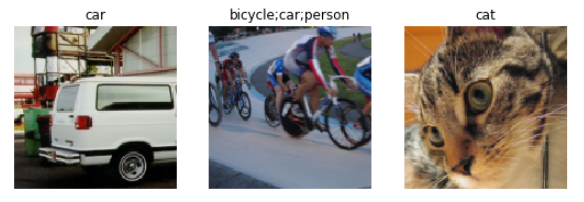

## FastAI 第6章学习笔记

>和之前一样, 先安装和加载必要的库  

```
!pip install -Uqq fastbook
import fastbook
fastbook.setup_book()

from fastbook import *
```

### Other Computer Vision Problems

这一章看看多分标签分类问题和回归问题. 前者是预测一张图片中可能出现不止一个标签或者一个都没有, 后者不是类别做标签, 而是一个或几个数字.

### Multi-Label Classification

在之前的熊的分类器中, 这个可能很有用. 比如在第二章中,一个图片里一个熊都没有,但模型还是预测到了grizzly, black或teddy熊中的之中- 它没法预测“根本没有熊”的情况(在我自己的例子中,是区分动物,老虎狮子大象,没法预测图片中没有动物的情况). 多标签分类器(Multi-Label Classification)可以解决这个问题.

实际应用中,多标签分类这种应用项目不多, 但这种问题却经常碰到. 实际问题中,碰到0个或者多个预测出现在一张图片中的例子更普遍,所以我们因更多地考虑多标签分类问题.

先看看多标签数据集是什么样的.然后解释怎样让它为模型做好准备.模型的结构和上一章的没什么变化.只是损失函数变量.

#### The Data

我们用PASCAL数据集作为例子. 下载解压数据集:

```
from fastai.vision.all import *
path = untar_data(URLs.PASCAL_2007)
```

和之前以目录或文件名构成不一样的是,这个数据集是以CSV文件制定每个图像用什么标签.我们可以将CSV文件读到Pandas DataFrame来查看.

```
df = df.read_csv(path/'train.csv')
df.head()
```

| fname |     labels |     is_valid |       |
| ----: | ---------: | -----------: | ----- |
|     0 | 000005.jpg |        chair | True  |
|     1 | 000007.jpg |          car | True  |
|     2 | 000009.jpg | horse person | True  |
|     3 | 000012.jpg |          car | False |
|     4 | 000016.jpg |      bicycle | True  |

> 我们可以用```iloc```属性获取DataFrame的一列:
>
> ```
> df.iloc[:,0]
> ```
> >0       000005.jpg  
> >1       000007.jpg  
> >2       000009.jpg  
> >3       000012.jpg  
> >4       000016.jpg  
> >       ...  
> >5006    009954.jpg  
> >5007    009955.jpg  
> >5008    009958.jpg  
> >5009    009959.jpg  
> >5010    009961.jpg  
> >Name: fname, Length: 5011, dtype: obj
>
> ```
> df.iloc[0,:]
> # Trailing :s are always optional (in numpy, pytorch, pandas, etc.),
> #   so this is equivalent:
> df.iloc[0]
> ```
> >fname       000005.jpg
> >labels           chair
> >is_valid          True
> >Name: 0, dtype: object
>
> 新建列
> ```
> tmp_df = pd.DataFrame({'a':[1,2], 'b':[3,4]})
> tmp_df
> ```
>
> |      |    a |    b |
> | -- | -- | -- |
> |    0 |    1 |    3 |
> |    1 |    2 |    4 |
>
> ```
> 
> tmp_df['c'] = tmp_df['a']+tmp_df['b']
> tmp_df
> ```
>
> |    a |    b |    c |      |
> | ---: | ---: | ---: | ---- |
> |    0 |    1 |    3 | 4    |
> |    1 |    2 |    4 | 6    |
> 
>Padas 是一个非常高效灵活的库,也是对数据科学家非常重要的一个工具.  [Python for Data Analysis](http://shop.oreilly.com/product/0636920023784.do) 这本书介绍了Padas，同时也包含```matplotlib```和```numpy```的介绍.

#### Constructing a DataBlock
怎样将一个DataFrame对象转换成DataLoaders 对象?  条件允许的话,一般建议用数据块API建立一个DataLoaders对象,因为它同时具备灵活性和易用性. 下面来介绍个这样的例子.
Pytoch和fastai有两个主要的类,用于表示和访问一个数据集或验证.

- `Dataset`::      一个集合,返回的是单个数据项 - 从因变量和从变量构成的一个元组.

- `DataLoader`::   一个提供小批量流的一个迭代器,每个小批量都是一对独立变量和一系列因变量的对

在这个基础上,fastai提供了两个类,将训练集和验证集联系到一起.

- `Datasets`:: 一个迭代器,包含一个训练集Dataset和一个验证集Dataset.
- `DataLoaders`::一个包含训练DataLoader和一个验证DataLoader的对象.

由于```DataLoader```是构建在```Dataset```基础上,并加入了一些额外功能(将多个项目整理到一个小批量),通常最简单的方法是先创建和测试Datasets，然后再查看DataLoaders.

从一个最简单的例子开始,不带参数,创建一个数据块.
```
dblock = DataBlock()
```
从这个数据块创建一个Datasets对象,只需要一个资源, DataFrame:
```
dsets = dblock.datasets(df)
```
这个Datasets包含一个训练和一个验证数据集:
```
len(dsets.train), len(dsets.valid)
```
>(4009, 1002)

```
x,y = dsets.train[0]
x,y
```
>(fname       008663.jpg  
 labels      car person  
 is_valid         False  
 Name: 4346, dtype: object,  
 fname       008663.jpg  
 labels      car person  
 is_valid         False  
 Name: 4346, dtype: object)  

简单地返回了两次DataFrame. 这是因为数据块默认假定我们有两项: input和target.这显然不合适. 下面我们通过传入```get_x```和```get_y```函数从DataFrame中提取适当的字段.
```
x['fname']
```
>'008663.jpg'

```
dblock = DataBlock(get_x = lambda r: r['fname'], get_y = lambda r: r['labels'])
dsets = dblock.datasets(df)
dsets.train[0]
```
>('005620.jpg', 'aeroplane')

上面用到了Python的lambda表达式, 是个匿名函数. 和下面代码完全等效：
```
def get_x(r): return r['fname']
def get_y(r): return r['labels']
dblock = DataBlock(get_x = get_x, get_y = get_y)
dsets = dblock.datasets(df)
dsets.train[0]
```
>('002549.jpg', 'tvmonitor')

Lambda函数对快速迭代很有用, 但是和序列化不兼容. 所以要在训练后导出Learner 的话,最好还是用显式的函数(只是试验的话,用lambda函数没问题).

独立变量需要转换成一个完整的路径,这样才能作为一个图像打开, 从变量需要以空格符分割(用Python中的split函数)成几个标签,从而形成一个列表:
```
def get_x(r): return path/'train'/r['fname']
def get_y(r): return r['labels'].split(' ')
dblock = DataBlock(get_x = get_x, get_y = get_y)
dsets = dblock.datasets(df)
dsets.train[0]
```
>(Path('/home/sgugger/.fastai/data/pascal_2007/train/008663.jpg'), ['car', 'person'])

要真正打开图像, 并转成张量, 还需要一系列转换; block 类型可以提供这些转换. 我们可以使用和之前一样的的block类型, 除了一个之外: ```ImageBlock``` 还是有用, 因为我们有一个指向有效图像的路径, 但是```CategoryBlock```用不了. 原因在于,这个block只返回单个整数, 而我们需要对每个数据项, 有多个标签. 为了解决这个问题，我们用到了```MultiCategoryBlock```. 这种block期望输入的是一系列string :
```
dblock = DataBlock(blocks=(ImageBlock, MultiCategoryBlock),
                   get_x = get_x, get_y = get_y)
dsets = dblock.datasets(df)
dsets.train[0]
```
>(PILImage mode=RGB size=500x375, TensorMultiCategory([0., 0., 0., 0., 0., 0., 0., 0., 0., 0., 0., 1., 0.,0., > 0., 0., 0., 0., 0., 0.]))

之前用```CategoryBlock```时, 一个整数表示一个种类, 这个整数基于这个种类词表的位置. 在这个例子中, 是一0的列表, 在表示种类的位置有个1. 举个例子, 如果在第二个位置和第4个位置是1, 就表示词表的第2项和第4项表示这个图像的标签.这种表示法叫做 *one-hot encoding* (中文叫独热编码). 使用独热编码是因为, 图像中的种类数不确定,但是PyTorch又需要用到张量, 张量又要求有统一的长度.

用```torch.where```函数看下,这个例子中表示了哪些种类.
```
idxs = torch.where(dsets.train[0][1]==1.)[0]
dsets.train.vocab[idxs]
```
>(#1) ['dog']

用NumPy的array,  PyTorch的tensor, 以及fastai的L类, 我们可以直接用列表或向量索引, 这使得很多代码简洁明了.

目前我们还忽略了```is_valid```这一列, 这意味着```DataBlock```以默认方式随机分割了数据集. 为了显式地选择验证集元素,我们需要定义一个函数(也可以使用fastai 自带的函数或类)然后将这个函数作为```DataBlock```的```splitter```参数传进去. 这个函数需要传入数据项(这里是整个```DataFrame```),并且需要返回两个(或多个)整数列表.
```
def splitter(df):
    train = df.index[~df['is_valid']].tolist()
    valid = df.index[df['is_valid']].tolist()
    return train, valid
    
dblock = DataBlock(blocks=(ImageBlock, MultiCategoryBlock),
                   splitter=splitter,
                   get_x = get_x,
                   get_y = get_y)
                   
dsets = dblock.datasets(df)
dsets.train[0]
```
>(PILImage mode=RGB size=500x333, TensorMultiCategory([0., 0., 0., 0., 0., 0., 1., 0., 0., 0., 0., 0., 0.,0., > 0., 0., 0., 0., 0., 0.]))

```DataLoaders```从```Dataset```中把数据手机到小批量中. 这是一组张量,每个张量只是将```Dateset```项中该位置的项目堆叠在一起

现已确认单个项目没问题, 还差一步, 我们需要确保可以创建```DataLoaders```, 这是为了保证每个项目的大小一样. 我们用```RandomResizedCrop```:
```
dblock = DataBlock(blocks=(ImageBlock, MultiCategoryBlock),
                   splitter=splitter,
                   get_x = get_x,
                   get_y = get_y,
                   item_tfms = RandomResizedCrop(128, min_scale=0.35))
dls = dblock.dataloaders(df)
```

看看数据中的样图：
```
dls.show_batch(nrow=1, ncols=3)
```



通过```DataBlock```创建```DataLoaders```时, 如果出错, 或者想看看实际细节过程时, 可以用```summary```方法.

### Binary Cross Entropy

现在创建```Learner```. 第四章中介绍过```Learner```对象包含四部分：模型, 一个```DataLoaders```对象, 一个```Optimizer```, 和一个损失函数. ```DataLoaders```已经有了, 模型可以直接用fastai中的```resnet```模型, Optimizer就用```SGD```优化器. 现在主要看怎么保证用的是一个合适的损失函数. 用```cnn_learner```创建一个```Learner```，看看激活函数:

```
learn = cnn_learner(dls, resnet18)
```
```Learner```中的模型通常是一个类的对象, 这个类继承自```nn.Module```, 我们可以使用括号的形式调用它, 它返回模型的激活值. 我们要把我们的独立变量作为一个小批量作为参数传进去. 我们从```DataLoader```抓取一个小批量然后穿进去试试：

```
x, y = dls.train.one_batch()
actives = learn.model(x)
actives.shape
```
>torch.Size([64, 20])

考虑下, 为什么激活有这样一个形状 - 因为我们的小批量大小是64, 另外我们需要计算的20个种类的可能性. 看看某一组激活长什么样：
```
actives[0]
```
>tensor([ 2.0258, -1.3543,  1.4640,  1.7754, -1.2820, -5.8053,  3.6130,0.7193, > -4.3683, -2.5001, -2.8373, -1.8037,  2.0122,  0.6189,  1.9729,0.8999, -2.6769, -0.3829,  1.2212,  1.6073],       device='cuda:0', grad_fn=<SelectBackward>)

这些值没有介于0和1之间, 可以用```sigmoid```方法使其介于0到1之间. 再在这个基础上取log取平均值:

```
def binary_cross_entropy(inputs, targets):
    inputs = inputs.sigmoid()
    return -torch.where(targets==1, inputs, 1-inputs).log().mean()
```

因为用到了独热编码的从变量, 所以不能直接使用```nll_loss```或```softmax```(进而不能使用```cross_entropy```):

- `softmax`, 需要所有的预测值和为1, 并放大激活值之间的差异(因为有```exp```-指数); 但是, 我们很有可能在图像中出现多个我们有把握的对象, 因此将激活的最大和限制为1不好.  另外出于类似的原因, 如果我们认为没有任何类别出现在图像中,我们可能希望总和 *小于* 1.
-`nll_loss`, 只返回一个激活值: 一个项目的单个标签对应的激活值. 这对多标签来说不合理.

另一方面, ```binary_cross_entropy```函数, 只是在```mnist_loss```的基础上取了```log```, 正好可以满足我们的需求, 这归功于PyTorch神奇的元素对元素操作. 每个激活值会可每列的每个目标对比, 所以不需要额外的工作就可以使这个函数对多列都有效.

PyTorch 已经提供了这个函数. 实际上它提供了很多个版本, 名字很有误导性.

```F.bainary_cross_entropy``` 和它的模型等效的```nn.BCELoss``` 可以计算独热编码目标的交叉熵, 但是没有取```sigmoid```.
一般对独热编码的目标, 我们会需要用到```F.binary_cross_entropy_with_logits```(或```nn.BCEWithLogitsLoss ```), 这个函数既取了sigmoid又计算了交叉熵.

对于单标签数据集(如MNIST或宠物数据集), 目标是编码成一个整数的, 它不带初始softmax的版本的等效损失函数是```F.nll_loss```(或```nn.NLLLoss```). 带初始softmax的版本的等效损失函数是```F.cross_entropy```(或```nn.CrossEntropyLoss```).

由于我们有独热编码的目标, 所以用```BCEWithLogitsLoss```:

```
loss_func = nn.BCEWithLogitsLoss()
loss = loss_func(actives, y)
loss
```
>tensor(1.0082, device='cuda:5', grad_fn=<BinaryCrossEntropyWithLogitsBackward>)


[Back to contents page](index.md)
