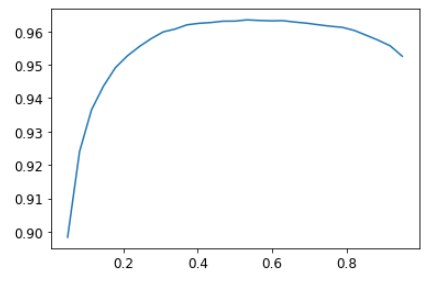
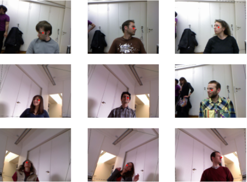
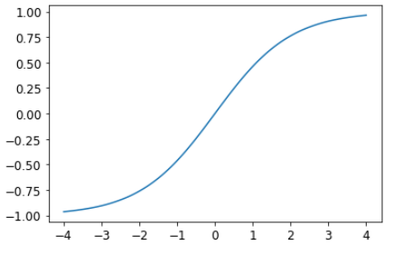
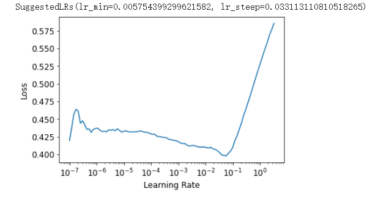
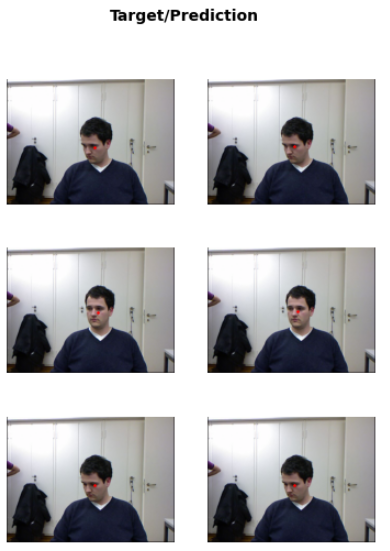

## FastAI 第6章学习笔记

>和之前一样, 先安装和加载必要的库  

```
!pip install -Uqq fastbook
import fastbook
fastbook.setup_book()

from fastbook import *
```

### Other Computer Vision Problems

这一章看看多分标签分类问题和回归问题. 前者是预测一张图片中可能出现不止一个标签或者一个都没有, 后者不是类别做标签, 而是一个或几个数字.

### Multi-Label Classification

在之前的熊的分类器中, 这个可能很有用. 比如在第二章中,一个图片里一个熊都没有,但模型还是预测到了grizzly, black或teddy熊中的之中- 它没法预测“根本没有熊”的情况(在我自己的例子中,是区分动物,老虎狮子大象,没法预测图片中没有动物的情况). 多标签分类器(Multi-Label Classification)可以解决这个问题.

实际应用中,多标签分类这种应用项目不多, 但这种问题却经常碰到. 实际问题中,碰到0个或者多个预测出现在一张图片中的例子更普遍,所以我们因更多地考虑多标签分类问题.

先看看多标签数据集是什么样的.然后解释怎样让它为模型做好准备.模型的结构和上一章的没什么变化.只是损失函数变量.

#### The Data

我们用PASCAL数据集作为例子. 下载解压数据集:

```
from fastai.vision.all import *
path = untar_data(URLs.PASCAL_2007)
```

和之前以目录或文件名构成不一样的是,这个数据集是以CSV文件制定每个图像用什么标签.我们可以将CSV文件读到Pandas DataFrame来查看.

```
df = df.read_csv(path/'train.csv')
df.head()
```

| fname |     labels |     is_valid |       |
| ----: | ---------: | -----------: | ----- |
|     0 | 000005.jpg |        chair | True  |
|     1 | 000007.jpg |          car | True  |
|     2 | 000009.jpg | horse person | True  |
|     3 | 000012.jpg |          car | False |
|     4 | 000016.jpg |      bicycle | True  |

> 我们可以用```iloc```属性获取DataFrame的一列:
>
> ```
> df.iloc[:,0]
> ```
> >0       000005.jpg  
> >1       000007.jpg  
> >2       000009.jpg  
> >3       000012.jpg  
> >4       000016.jpg  
> >       ...  
> >5006    009954.jpg  
> >5007    009955.jpg  
> >5008    009958.jpg  
> >5009    009959.jpg  
> >5010    009961.jpg  
> >Name: fname, Length: 5011, dtype: obj
>
> ```
> df.iloc[0,:]
> # Trailing :s are always optional (in numpy, pytorch, pandas, etc.),
> #   so this is equivalent:
> df.iloc[0]
> ```
> >fname       000005.jpg
> >labels           chair
> >is_valid          True
> >Name: 0, dtype: object
>
> 新建列
> ```
> tmp_df = pd.DataFrame({'a':[1,2], 'b':[3,4]})
> tmp_df
> ```
>
> |      |    a |    b |
> | -- | -- | -- |
> |    0 |    1 |    3 |
> |    1 |    2 |    4 |
>
> ```
> 
> tmp_df['c'] = tmp_df['a']+tmp_df['b']
> tmp_df
> ```
>
> |      |    a |    b |    c |
> | ---: | ---: | ---: | ---: |
> |    0 |    1 |    3 | 4    |
> |    1 |    2 |    4 | 6    |
> 
>Padas 是一个非常高效灵活的库,也是对数据科学家非常重要的一个工具.  [Python for Data Analysis](http://shop.oreilly.com/product/0636920023784.do) 这本书介绍了Padas，同时也包含```matplotlib```和```numpy```的介绍.

#### Constructing a DataBlock
怎样将一个DataFrame对象转换成DataLoaders 对象?  条件允许的话,一般建议用数据块API建立一个DataLoaders对象,因为它同时具备灵活性和易用性. 下面来介绍个这样的例子.
Pytoch和fastai有两个主要的类,用于表示和访问一个数据集或验证.

- `Dataset`::      一个集合,返回的是单个数据项 - 从因变量和从变量构成的一个元组.

- `DataLoader`::   一个提供小批量流的一个迭代器,每个小批量都是一对独立变量和一系列因变量的对

在这个基础上,fastai提供了两个类,将训练集和验证集联系到一起.

- `Datasets`:: 一个迭代器,包含一个训练集Dataset和一个验证集Dataset.
- `DataLoaders`::一个包含训练DataLoader和一个验证DataLoader的对象.

由于```DataLoader```是构建在```Dataset```基础上,并加入了一些额外功能(将多个项目整理到一个小批量),通常最简单的方法是先创建和测试Datasets，然后再查看DataLoaders.

从一个最简单的例子开始,不带参数,创建一个数据块.
```
dblock = DataBlock()
```
从这个数据块创建一个Datasets对象,只需要一个资源, DataFrame:
```
dsets = dblock.datasets(df)
```
这个Datasets包含一个训练和一个验证数据集:
```
len(dsets.train), len(dsets.valid)
```
>(4009, 1002)

```
x,y = dsets.train[0]
x,y
```
>(fname       008663.jpg  
 labels      car person  
 is_valid         False  
 Name: 4346, dtype: object,  
 fname       008663.jpg  
 labels      car person  
 is_valid         False  
 Name: 4346, dtype: object)  

简单地返回了两次DataFrame. 这是因为数据块默认假定我们有两项: input和target.这显然不合适. 下面我们通过传入```get_x```和```get_y```函数从DataFrame中提取适当的字段.
```
x['fname']
```
>'008663.jpg'

```
dblock = DataBlock(get_x = lambda r: r['fname'], get_y = lambda r: r['labels'])
dsets = dblock.datasets(df)
dsets.train[0]
```
>('005620.jpg', 'aeroplane')

上面用到了Python的lambda表达式, 是个匿名函数. 和下面代码完全等效：
```
def get_x(r): return r['fname']
def get_y(r): return r['labels']
dblock = DataBlock(get_x = get_x, get_y = get_y)
dsets = dblock.datasets(df)
dsets.train[0]
```
>('002549.jpg', 'tvmonitor')

Lambda函数对快速迭代很有用, 但是和序列化不兼容. 所以要在训练后导出Learner 的话,最好还是用显式的函数(只是试验的话,用lambda函数没问题).

独立变量需要转换成一个完整的路径,这样才能作为一个图像打开, 从变量需要以空格符分割(用Python中的split函数)成几个标签,从而形成一个列表:
```
def get_x(r): return path/'train'/r['fname']
def get_y(r): return r['labels'].split(' ')
dblock = DataBlock(get_x = get_x, get_y = get_y)
dsets = dblock.datasets(df)
dsets.train[0]
```
>(Path('/home/sgugger/.fastai/data/pascal_2007/train/008663.jpg'), ['car', 'person'])

要真正打开图像, 并转成张量, 还需要一系列转换; block 类型可以提供这些转换. 我们可以使用和之前一样的的block类型, 除了一个之外: ```ImageBlock``` 还是有用, 因为我们有一个指向有效图像的路径, 但是```CategoryBlock```用不了. 原因在于,这个block只返回单个整数, 而我们需要对每个数据项, 有多个标签. 为了解决这个问题，我们用到了```MultiCategoryBlock```. 这种block期望输入的是一系列string :
```
dblock = DataBlock(blocks=(ImageBlock, MultiCategoryBlock),
                   get_x = get_x, get_y = get_y)
dsets = dblock.datasets(df)
dsets.train[0]
```
>(PILImage mode=RGB size=500x375, TensorMultiCategory([0., 0., 0., 0., 0., 0., 0., 0., 0., 0., 0., 1., 0.,0., > 0., 0., 0., 0., 0., 0.]))

之前用```CategoryBlock```时, 一个整数表示一个种类, 这个整数基于这个种类词表的位置. 在这个例子中, 是一0的列表, 在表示种类的位置有个1. 举个例子, 如果在第二个位置和第4个位置是1, 就表示词表的第2项和第4项表示这个图像的标签.这种表示法叫做 *one-hot encoding* (中文叫独热编码). 使用独热编码是因为, 图像中的种类数不确定,但是PyTorch又需要用到张量, 张量又要求有统一的长度.

用```torch.where```函数看下,这个例子中表示了哪些种类.
```
idxs = torch.where(dsets.train[0][1]==1.)[0]
dsets.train.vocab[idxs]
```
>(#1) ['dog']

用NumPy的array,  PyTorch的tensor, 以及fastai的L类, 我们可以直接用列表或向量索引, 这使得很多代码简洁明了.

目前我们还忽略了```is_valid```这一列, 这意味着```DataBlock```以默认方式随机分割了数据集. 为了显式地选择验证集元素,我们需要定义一个函数(也可以使用fastai 自带的函数或类)然后将这个函数作为```DataBlock```的```splitter```参数传进去. 这个函数需要传入数据项(这里是整个```DataFrame```),并且需要返回两个(或多个)整数列表.
```
def splitter(df):
    train = df.index[~df['is_valid']].tolist()
    valid = df.index[df['is_valid']].tolist()
    return train, valid
    
dblock = DataBlock(blocks=(ImageBlock, MultiCategoryBlock),
                   splitter=splitter,
                   get_x = get_x,
                   get_y = get_y)
                   
dsets = dblock.datasets(df)
dsets.train[0]
```
>(PILImage mode=RGB size=500x333, TensorMultiCategory([0., 0., 0., 0., 0., 0., 1., 0., 0., 0., 0., 0., 0.,0., > 0., 0., 0., 0., 0., 0.]))

```DataLoaders```从```Dataset```中把数据手机到小批量中. 这是一组张量,每个张量只是将```Dateset```项中该位置的项目堆叠在一起

现已确认单个项目没问题, 还差一步, 我们需要确保可以创建```DataLoaders```, 这是为了保证每个项目的大小一样. 我们用```RandomResizedCrop```:
```
dblock = DataBlock(blocks=(ImageBlock, MultiCategoryBlock),
                   splitter=splitter,
                   get_x = get_x,
                   get_y = get_y,
                   item_tfms = RandomResizedCrop(128, min_scale=0.35))
dls = dblock.dataloaders(df)
```

看看数据中的样图：
```
dls.show_batch(nrow=1, ncols=3)
```


通过```DataBlock```创建```DataLoaders```时, 如果出错, 或者想看看实际细节过程时, 可以用```summary```方法.

#### Binary Cross Entropy

现在创建```Learner```. 第四章中介绍过```Learner```对象包含四部分：模型, 一个```DataLoaders```对象, 一个```Optimizer```, 和一个损失函数. ```DataLoaders```已经有了, 模型可以直接用fastai中的```resnet```模型, Optimizer就用```SGD```优化器. 现在主要看怎么保证用的是一个合适的损失函数. 用```cnn_learner```创建一个```Learner```，看看激活函数:

```
learn = cnn_learner(dls, resnet18)
```
```Learner```中的模型通常是一个类的对象, 这个类继承自```nn.Module```, 我们可以使用括号的形式调用它, 它返回模型的激活值. 我们要把我们的独立变量作为一个小批量作为参数传进去. 我们从```DataLoader```抓取一个小批量然后穿进去试试：

```
x, y = dls.train.one_batch()
actives = learn.model(x)
actives.shape
```
>torch.Size([64, 20])

考虑下, 为什么激活有这样一个形状 - 因为我们的小批量大小是64, 另外我们需要计算的20个种类的可能性. 看看某一组激活长什么样：
```
actives[0]
```
>tensor([ 2.0258, -1.3543,  1.4640,  1.7754, -1.2820, -5.8053,  3.6130,0.7193, > -4.3683, -2.5001, -2.8373, -1.8037,  2.0122,  0.6189,  1.9729,0.8999, -2.6769, -0.3829,  1.2212,  1.6073],       device='cuda:0', grad_fn=<SelectBackward>)

这些值没有介于0和1之间, 可以用```sigmoid```方法使其介于0到1之间. 再在这个基础上取log取平均值:

```
def binary_cross_entropy(inputs, targets):
    inputs = inputs.sigmoid()
    return -torch.where(targets==1, inputs, 1-inputs).log().mean()
```

因为用到了独热编码的从变量, 所以不能直接使用```nll_loss```或```softmax```(进而不能使用```cross_entropy```):

- `softmax`, 需要所有的预测值和为1, 并放大激活值之间的差异(因为有```exp```-指数); 但是, 我们很有可能在图像中出现多个我们有把握的对象, 因此将激活的最大和限制为1不好.  另外出于类似的原因, 如果我们认为没有任何类别出现在图像中,我们可能希望总和 *小于* 1.
-`nll_loss`, 只返回一个激活值: 一个项目的单个标签对应的激活值. 这对多标签来说不合理.

另一方面, ```binary_cross_entropy```函数, 只是在```mnist_loss```的基础上取了```log```, 正好可以满足我们的需求, 这归功于PyTorch神奇的元素对元素操作. 每个激活值会可每列的每个目标对比, 所以不需要额外的工作就可以使这个函数对多列都有效.

PyTorch 已经提供了这个函数. 实际上它提供了很多个版本, 名字很有误导性.

```F.bainary_cross_entropy``` 和它的模型等效的```nn.BCELoss``` 可以计算独热编码目标的交叉熵, 但是没有取```sigmoid```.
一般对独热编码的目标, 我们会需要用到```F.binary_cross_entropy_with_logits```(或```nn.BCEWithLogitsLoss ```), 这个函数既取了sigmoid又计算了交叉熵.

对于单标签数据集(如MNIST或宠物数据集), 目标是编码成一个整数的, 它不带初始softmax的版本的等效损失函数是```F.nll_loss```(或```nn.NLLLoss```). 带初始softmax的版本的等效损失函数是```F.cross_entropy```(或```nn.CrossEntropyLoss```).

由于我们有独热编码的目标, 所以用```BCEWithLogitsLoss```:

```
loss_func = nn.BCEWithLogitsLoss()
loss = loss_func(actives, y)
loss
```
>tensor(1.0082, device='cuda:5', grad_fn=<BinaryCrossEntropyWithLogitsBackward>)

不必向fastai指定用这个损失函数, 因为它会自动选择. fastai 知道```DataLoaders```有多种类标签, 所以会默认用```nn.BCEWithLogitsLoss```. 和前面章节比起来, metric也不一样: 因为这是个多标签问题, 不能像之前一样用度量函数. 因为度量函数是比较我们的输出和目标:

```
def accuracy(inp, targ, axis=-1):
    "Compute accuracy with 'targ' when 'pred' is bs * n_classes"
    pred = inp.argmax(dim=axis)
    return (pred == targ).float().mean()
```

预测的种类是有最高激活(argmax就是求这个的)的那个. 但在这里多标签问题上没用, 因为在一个图像上可以有一个以上的预测.  在给激活值取了sigmoid 后, 需要通过选取一个```threshold```(阈值)类确定哪些是0, 哪些是1. 每个高于阈值的的值认为是1, 小于阈值的认为是0:

```
def accuracy_multi(inp, targ, thresh=0.5, sigmoid=True):
    "Compute accuracy when 'inp' and 'targ' are the same size. "
    if sigmoid :  inp = ip.sigmoid()
    return ((inp > thresh) == targ.bool()).float().mean()
```

如果将```accuracy_multi```函数直接作为```metric```参数传给leaner, ```thresh``` 会使用默认值0.5 . 如果要调整这个默认参数，可以使用Python的```partial```函数. 它可以将函数与指定的参数绑定.例如我们使用0.2作为阈值训练模型:

```
learn = cnn_learner(dls, resnet50, metrics=partial(accuracy_multi, thresh=0.2))
lean.fine_tune(3, base_lr=3e=3, freeze_epochs=4)
```
>
| epoch | train_loss | valid_loss | accuracy_multi | time  |
| ----- | ---------- | ---------- | -------------- | ----- |
| 0     | 0.942663   | 0.703737   | 0.233307       | 00:08 |
| 1     | 0.821548   | 0.550827   | 0.295319       | 00:08 |
| 2     | 0.604189   | 0.202585   | 0.816474       | 00:08 |
| 3     | 0.359258   | 0.123299   | 0.944283       | 00:08 |
>
| epoch | train_loss | valid_loss | accuracy_multi | time  |
| ----- | ---------- | ---------- | -------------- | ----- |
| 0     | 0.135746   | 0.123404   | 0.944442       | 00:09 |
| 1     | 0.118443   | 0.107534   | 0.951255       | 00:09 |
| 2     | 0.098525   | 0.104778   | 0.951554       | 00:10 |

选择阈值如果太低, 会经常不能正确找出标记的对象. 我们改小然后调用```validate```看看返回的验证损失和度量值:

```
learn.metrics = partial(accuracy_multi, thresh=0.1)
learn.validate()
```
> (#2) [0.10477833449840546,0.9314740300178528]

如果阈值太大, 则只能宣传那些可行度非常高的对象:

```
learn.metrics = partial(accuracy_multi, thresh=0.99)
learn.validate()
```
>(#2) [0.10477833449840546,0.9429482221603394]

可以通过尝几个然后找到那个threshold最合适. 如果只抓取一次预测值, 这个过程会很快:

```
preds, targs = learn.get_preds()
```

然后可以直接调用度量函数. 注意, 默认```get_preds```会默认地调用输出激活函数(这个例子里用的是sigmoid), 所以我们在```accuracy_multi```中就不应该再调用了:

```
accuracy_multi(preds, targs, thresh=0.9, sigmoid=False)
```
>TensorImage(0.9567)

利用这单, 我们可以找到最合适的阈值:

```
xs = torch.linspace(0.05, 0,95, 29)
accs = [accuracy_multi(preds, targs, thresh=i, sigmoid=False)  for i in xs]
plt.plot(xs, accs);
```
> 

在这个例子中, 我们用验证集选择一个超参数 - threshold, 这是验证集的目的. 有人强调,由于尝试过多的值来寻找最好的,可能造成验证集 *过拟合*  . 但是从图中看到,改变阈值的结果是一条平滑的曲线, 所以可以明确的选择一个合适的极值点. 这是一个很好的例子, 说明必须注意理论(不要尝试过多的超参数值, 否则可能会过度拟合验证集)与实践之间的差异(如果关系是平滑的,则可以这样做).


### Regression

不难想到, 深度学习模型被归类到几个领域,  像计算机视觉, NLP(自然语言处理)等. 实际fastai也是这么做的,大部分原因是由于多少人习惯这样考虑, 但实际上背后还有更有趣和更深远的考虑. 模型由它的因变量从变量以及损失函数定义. 这意味着模型种类远比简单地按领域划分要广. 可能独立变量是一个图像, 从变量是文本(如从图像生成的描述说明); 可能独立变量是文本, 从变量是一张图片(如通过描述生成一张图像); 可能我们有图像, 文本以及表单数据作为独立变量, 然后尝试去预测购物...无限可能...

为了能够超越固定应用程序, 可以针对新问题制定自己的新颖解决方案, 理解数据块API(也可能是中间件API)相当有用. 看看 *图像回归* 问题. 这是指从自变量为图像,因变量为一个或多个浮点数的数据集中学习. 人们常把图像回归问题作为一个完全独立的应用, 但是下面我们可以看到, 我们可以把它看做另外一种在数据块API基础上的CNN问题.

现在建立一个焦点模型.  *焦点* 是指图像上一个特定的位置. 这个例子用人的图像, 找每个图像中人脸的中心位置. 实际上会预测每个图像的两个值: 脸部中心的横坐标和纵坐标.

#### Assemble tht Data

用 [Biwi Kinect Head Pose dataset](https://icu.ee.ethz.ch/research/datsets.html) 数据集.

```
path = untar_data(URLs.BIWI_HEAD_POSE)

Path.BASE_PATH = path

path.ls().sorted()
```
>(#50) [Path('01'),Path('01.obj'),Path('02'),Path('02.obj'),Path('03'),Path('03.obj'),Path('04'),Path('04.obj'),Path('05'),Path('05.obj')...]

有24个目录 - 从01 到24(对应不同人的照片) 和每个目录对应的.obj文件. 看看其中一个目录:
```
(path/'01').ls().sorted()
```
>(#1000) [Path('01/depth.cal'),Path('01/frame_00003_pose.txt'),Path('01/frame_00003_rgb.jpg'),Path('01/frame_00004_pose.txt'),Path('01/frame_00004_rgb.jpg'),Path('01/frame_00005_pose.txt'),Path('01/frame_00005_rgb.jpg'),Path('01/frame_00006_pose.txt'),Path('01/frame_00006_rgb.jpg'),Path('01/frame_00007_pose.txt')...]

在子目录里, 有不同的frame, 每个frame有一个图像文件(_rgb.jpg)和一个动作文件(_pose.txt). 可以用
```get_image_files```很容易递归的获取所有图像文件名. 然后写个正则函数将图像文件名转成对应的动作文件名.

```
img_files = get_image_files(path)

def img2pose(x):  return Path(f'{str(x)[:-7]}pose.txt')

img2pose(img_files[0])
```
>Path('13/frame_00349_pose.txt')

看看第一张图像:

```
im = PILImage.create(img_files[0])
im.shape
```
>(460, 640)

```
im.to_thumb(160)
```

> 

Biwi数据集网站解释了与每个图像关联的姿势文本文件的格式, 该格式显示了头部中心的位置. 对于我们的目的而言, 此细节并不重要, 因此我们仅显示用于提取头部中心点的函数：

```
cal = np.genfromtxt(path/'01'/'rgb.cal', skip_footer=6)
def get_ctr(f):
    ctr = np.genfromtxt(img2pose(f), skip_header=3)
    c1 = ctr[0] * cal[0][0]/ctr[2] + cal[0][2]
    c2 = ctr[1] * cal[1][1]/ctr[2] + cal[1][2]
    return tensor([c1, c2])

get_ctr(img_files[0])
```

>tensor([384.6370, 259.4787])

这个函数可以作为```get_y```参数传给```DataBlock```,  因为它负责标记每个数据项. 为了加快训练速度,把图片尺寸缩小一半.

有点需要注意, 这里不能用随机的分割器(splitter). 因为这个数据集里同一个人可能会出现在多个图像中, 而我们需要确保模型归纳的是它没有见过的人. 每个目录包含一个人呢, 因此我们可以创建一个splitter函数, 同一个人全返回真, 这样这个人的图像只包含在验证集中.

另外和之前的数据块例子唯一不同的是, 第二个块是一个```PointBlock```. 这是为了告诉fastai, 标签表示的是坐标; 这样, 在进行数据扩充(即对图像进行转换得到更多的图像)时, 这些坐标点也需要随着图像做同样的扩充.

```
biwi = DataBlock(
    blocks = (ImageBlock, PointBlock),
    get_items=get_image_files,
    get_y=get_ctr,
    splitter=FuncSplitter(lambda o: o.parent.name=='13'),
    batch_tfms=[*aug_transforms(size=(240, 320)), Normalize.from_stats(*imagenet_stats)]
)
```
>重要提示: 关于点和数据的扩充, 除了fastai之外其他库都不会自动正确地把数据的扩充应用到点上. 所以用其他库时, 可能需要对这类问题需要禁用数据扩充.

在建模之前, 应该确认下数据是否OK.

```
dls = biwi.dataloaders(path)
dls.show_batch(max_n=9, figsize=(86))
```

> 

看上去没问题, 和目测看图像一样, 看看底层的tensors 也是个好习惯(这对明确理解模型真正的样子很有帮助):

```
xb, yb = dls.one_batch()
xb.shape, yb.shape
```
>(torch.Size([64, 3, 240, 320]), torch.Size([64, 1, 2]))

有必要明白为什么这些小批量的形状是这样的.

这里一组从变量的值:

```
yb[0]
```
> TensorPoint([[-0.3375,  0.2193]], device='cuda:6')

可见, 我们还不必用一个单独的图像回归应用; 我们需要做的是标记数据, 然后告诉fastai, 自变量和从变量表示的是什么类型的数据.

创建```Learne```和之前是一样的. 用同样的函数, 用一个新的参数.

#### Trainning a Model

和之前一样, 可以用```cnn_learner```创建```Learner```.  和第一章一样, 用```y_range```指定目标的范围.

```
lean = cnn_learner(dls, resnet18, y_range(-1, 1))
```

```y_range```是用```sigmoid_range```实现的,其定义为:

```
def sigmoid_range(x, lo, hi) :  return torch.sigmoid(x) * (hi-lo) + lo
```

如果定义了```y_range```, 它将作为模型的最后层. 

看看它的图像:

```
plot_function(partial(sigmoid_range,lo=-1,hi=1), min=-4, max=4)
```
>


没有指定损失函数, 这意味着fastai会自动指定一个,看看指定的是什么:

```
dls.loss_func
```
>FlattenedLoss of MSELoss()

由于从变量是坐标, 大部分时间我们是尝试预测尽可能接近目标值; ```MSELosse```基本上就是干这事(误差平方的均值). 如果用其他损失函数, 可以做为```loss_func```参数传给```cnn_learner```.

度量函数metrics 也没有指定. 因为MSE在这个任务中可用作度量函数(虽然去平方根可能更合适一点).

使用学习率查找器, 选一个合适学习率:

```
learn.lr_find()
```
>


用1e-2试试:

```
lr = le-2
learn.fine_tune(3, lr)
```
>
| epoch | train_loss | valid_loss | time  |
| ----- | ---------- | ---------- | ----- |
| 0     | 0.049630   | 0.007602   | 00:42 |
>
| epoch | train_loss | valid_loss | time  |
| ----- | ---------- | ---------- | ----- |
| 0     | 0.008714   | 0.004291   | 00:53 |
| 1     | 0.003213   | 0.000715   | 00:53 |
| 2     | 0.001482   | 0.000036   | 00:53 |

通常, 当我们运行此命令时, 我们将损失约0.0001, 这对应于平均坐标预测误差为：

```
math.sqrt(0.0001)
```

>0.01

看着不错, 再看看```Learner.show_results```显示的结果很重要. 左边是显示的是实际图像, 右边是预测图像(注意比对的是下图面部中心的红点)：

```
learn.show_results(ds_idx=1, nrows=3, figsize=(6, 8))
```
>


令人惊讶的是, 仅用几分钟的计算, 我们就创建了如此精确的关键点模型, 并且没有任何特定于领域的特殊应用程序.  这是建立在灵活的API上并使用转移学习的强大功能! 尤其令人惊讶的是, 即使在完全不同的任务之间, 我们也能如此有效地使用转移学习, 我们训练有素的模型进行了图像分类训练, 并对图像回归进行了微调.

### Conlusion

乍一看是完全不同的问题(单标签分类, 多标签分类和回归), 但我们最终使用了相同的模型, 但输出的数量却不同. 损失函数是变化的一件事, 这就是为什么仔细检查您对问题使用正确的损失函数很重要的原因.

fastai会自动尝试从您构建的数据中选择正确的数据: 但是如果您使用的是纯PyTorch来构建DataLoader, 请确保在决定损失函数的选择时要三思而后行, 并记住最可能:

- `nn.CrossEntropyLoss`  单标签分类问题

- `nn.BCEWithLogitsLoss` 用于多标签分类问题

- `nn.MSELoss`  用于回归问题

### Questionnaire

1. How could multi-label classification improve the usability of the bear classifier?
1. How do we encode the dependent variable in a multi-label classification problem?
1. How do you access the rows and columns of a DataFrame as if it was a matrix?
1. How do you get a column by name from a DataFrame?
1. What is the difference between a `Dataset` and `DataLoader`?
1. What does a `Datasets` object normally contain?
1. What does a `DataLoaders` object normally contain?
1. What does `lambda` do in Python?
1. What are the methods to customize how the independent and dependent variables are created with the data block API?
1. Why is softmax not an appropriate output activation function when using a one hot encoded target?
1. Why is `nll_loss` not an appropriate loss function when using a one-hot-encoded target?
1. What is the difference between `nn.BCELoss` and `nn.BCEWithLogitsLoss`?
1. Why can't we use regular accuracy in a multi-label problem?
1. When is it okay to tune a hyperparameter on the validation set?
1. How is `y_range` implemented in fastai? (See if you can implement it yourself and test it without peeking!)
1. What is a regression problem? What loss function should you use for such a problem?
1. What do you need to do to make sure the fastai library applies the same data augmentation to your input images and your target point coordinates?

[Back to contents page](index.md)