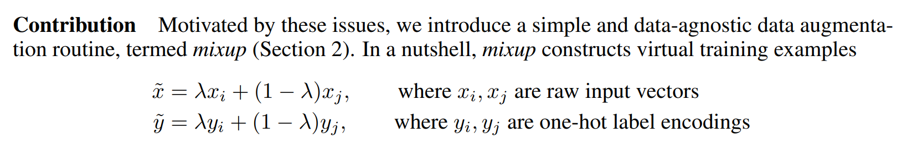
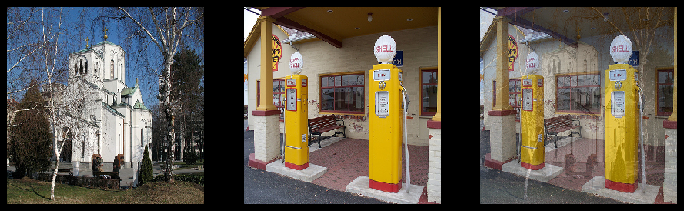

## FastAI 第7章学习笔记 - Training a State-of-the-Art Model

>先安装和加载必要的库  

```
!pip install -Uqq fastbook
import fastbook
fastbook.setup_book()

from fastbook import *
```

这章介绍了用于训练图像分类模型并获得最新结果的更高级技术.  介绍归一化(normalization), 一种称为Mixup的强大数据增强技术, 渐进式调整大小方法, 以及测试时数据增强技术. 首先会用到一个叫做Imagenette的ImageNet子集, 从头开始训练 - 不使用迁移学习. 它包含ImageNet中10个差异很大的类别子集, 可以在我们进行实验时进行快速训练.

### Imagenette

在fast.ai开创之初, 人们用三个主要的数据集创建和测试计算机视觉模型:

- ImageNet:: 一百三十万张一千个种类,约500像素不同尺寸的图片,这些图片花了几天训练.
- MNIST:: 50,000张28×28像素的灰度手写数字.
- CIFAR10:: 60,000 张32×32像素的不同种类彩色图片

​    这里有个问题, 较小的数据集不能有效地概括庞大的ImageNet数据集. 对ImageNet有效的的方法, 一般必须在ImageNet的基础上开发和训练. 这使得很多人相信, 只有那些拥有海量算力资源的研究员才能有效地为开发图像识别算法做贡献.

我们认为很可能不是这样的. 没有研究表明只有ImageNet 正好是合适的大小, 而不能创建其他数据集来提供有效参考. 所以我们想创建一个新的数据集, 让研究人员能用来高效率低成本的测试他们的算法, 但也将提供可能适用于整个ImageNet数据集的参考.

大约3个小时候, 创建了Imagenette. 这是从完整的ImageNet中选出10个相互差别非常大的种类. 如期望的一样, 我们能够快速而廉价地创建能够识别这些类别的分类器. 然后尝试了一些算法微调,看看它们如何影响Imagenette. 结果发现有些效果相当不错, 然后在ImageNet 上也做了测试, 然后很高兴地发现在ImageNet上这些调整也非常有效.

你拿到的数据集并不一定是你想要. 尤其不太可能是你要在其中进行开发和原型制作的数据集. 这时你应该致力于不超过几分钟的时间进行迭代尝试,也就是说能够训练模型并在几分钟之内查看其运行情况. 如果花太长时间做实验, 就该考虑裁剪数据集, 或简化模型来提高试验速度. 尝试试验越多越好.

看看Imagenette：

```
from fastai.vision.all import *
path = untar_data(RULs.IMAGENETTE)
```

首先吧dataset 搞到`DataLoaders`对象里, 并用presizing. 在之前宠物品种分类章节提到过, item_tfms是在CPU上将图片大小对齐为统一尺寸, batch_tfms是在GPU(如果启用了GPU的话)上将图片进行统一变换.

```
dblock = DataBlock(blocks=(ImageBlock(), CategoryBlock)),
                           get_items=get_image_files,
                           get_y=parent_label,
                           item_tfms=Resize(460),
                           batch_tfms=aug_transforms(size=224, min_scale = 0.75)
dls = dblock.dataloaders(path, bs=64)
```

做一次训练作为基准:

```
model = xresnet50(n_out_dls.c)
learn = Learn(dls, model, loss_func=CrossEntropyLossFlat), metrics=accuracy)
learn.fit_one_cycle(5, 3e-3)
```
>| epoch | train_loss | valid_loss | accuracy | time  |
| ----- | ---------- | ---------- | -------- | ----- |
| 0     | 1.583403   | 2.064317   | 0.401792 | 01:03 |
| 1     | 1.208877   | 1.260106   | 0.601568 | 01:02 |
| 2     | 0.925265   | 1.036154   | 0.664302 | 01:03 |
| 3     | 0.730190   | 0.700906   | 0.777819 | 01:03 |
| 4     | 0.585707   | 0.541810   | 0.825243 | 01:03 |

这是个不错的基线, 因为没有预训练模型, 但是可以做到更好. 当一个模型是从头开始训练, 或者针对另一个和之前预训练的区别很大的数据集fine-tune(微调)时, 有一些附加的技术非常重要. 第一个就是 *归一化* (Normalizating)数据.

### Normalization

训练模型时, 如果输入数据被归一化 - 即平均值为0, 标准偏差为1, 会很有用. 但是大多数图像和计算机图形库使用的值是介于0到255之间或0到1之间的. 无论哪种情况, 数据都不会有平均值为1, 标准偏差为1的情况.

我们获取一批数据并通过平均除通道轴(即轴1)以外的所有轴来查看这些值:

```
x,y = dls.one_batch()
x.mean(dim=[0, 2, 3]), x.std(dim=[0, 2, 3])
```
>(TensorImage([0.4688, 0.4575, 0.4356], device='cuda:0'),  
 TensorImage([0.2882, 0.2813, 0.2926], device='cuda:0'))

看来, 平均值和标准偏差都和预期值相差甚远. 所幸的是, 在fastai中加入`Normalize`转换可以很容易实现归一化. 它在整个小批量一次性进行的, 所以可以在数据块建立时将它加到`batch_tfms`部分. 我们需要将要使用的均值和标准差传递给此变换; fastai附带了已经定义的标准ImageNet均值和标准差 (如果您没有将任何统计信息传递给Normalize转换, fastai将自动从单批数据中计算出它们).

我们添加这个转换(使用imagenet_stats, 因为Imagenette是ImageNet的子集), 现在看一批:

```
def get_dls(bs, size):
    block = DataBlock(blocks=(ImageBlock, CategoryBlock),
                              get_items=get_image_files,
                              get_y=parent_label,
                              item_tfms=Resize(460),
                              batch_tfms=[*aug_transforms(size=size, min_scale=0.75), Normalize.from_stats(*imagenet_stats)])
    return dblock.dataloaders(path, bs=bs)

```
```
dls = get_dls(64, 224)

x,y = dls.one_batch()
x.mean(dim=[0, 2, 3]), x.std(dim=[0, 2, 3])
```
>(TensorImage([-0.1637, -0.1425, -0.1583], device='cuda:0'),  
 TensorImage([1.2216, 1.2244, 1.2821], device='cuda:0'))

 看看这对模型训练起到了什么效果:

```
model = xresnet50(n_out=dls.c)
learn = Learn(dls, model, loss_func=CrossEntropyLossFlat(), metrics=accuracy)
learn.fit_one_cycle(5, 3e-3)
```
>| epoch | train_loss | valid_loss | accuracy | time  |
| ----- | ---------- | ---------- | -------- | ----- |
| 0     | 1.632865   | 2.250024   | 0.391337 | 01:02 |
| 1     | 1.294041   | 1.579932   | 0.517177 | 01:02 |
| 2     | 0.960535   | 1.069164   | 0.657207 | 01:04 |
| 3     | 0.730220   | 0.767433   | 0.771845 | 01:05 |
| 4     | 0.577889   | 0.550673   | 0.824496 | 01:06 |

虽然这里只起到一点作用, 但在使用预训练模型时, 归一化就变得尤为重要. 预先训练的模型仅知道如何处理以前见过的类型数据. 如果训练后的数据中平均像素值为0, 但数据中心像素最小可能值为0, 那么该模型将表现出非常不一样的东西.

这意味着, 在分发模型时, 还需要分发用于归一化的统计信息, 因为将其用于推理或转移学习的任何人都将需要使用相同的统计信息. 同样, 如果您使用的是其他人训练过的模型, 请确保找出他们使用的归一化统计信息并进行匹配.

在之前的章节不需要处理归一化, 因为通过`cnn_learner`使用预训练模型时, fastai 库会自动加入`Normalize`转换属性; 该模型已经通过Normalize中的某些统计信息进行了预训练(通常来自ImageNet数据集), 因此该库可以自动填充这些统计信息. 请注意, 这仅适用于预训练的模型, 这就是为什么从头开始训练时, 我们需要在此处手动添加此信息的原因. 

到目前为止, 我们所有的培训都已经在224号进行了. 在开始之前, 我们可以开始以较小的规模进行培训.  这称为渐进式调整大小. 

### Progress Resizing

当fast.ai及其学生团队在2018年赢得DAWNBench竞赛时, 最重要的创新之一就是非常简单的事情: 使用小图像开始训练, 然后使用大图像结束训练. 将大多数时期的训练花费在较小的图像上, 有助于更快地完成训练. 使用大图像完成训练会使最终精度更高. 我们称这种方法为渐进式调整大小.

之前看到, 卷积神经网络学习的各种特征与图片的大小无关 - 靠前的层发现像边缘和渐变之类的特征, 靠后的层可能会发现像鼻子或者日落这样的特征. 因此, 当我们在训练中途改变图片的尺寸, 不意味着我们必须为模型寻找完全不同的参数.

但是显然小图片和大图片之间会有些区别, 所以不应该指望在完全没有改变的情况下模型能同样继续完全正常工作.  这让我们想起了迁移学习! 先尝试让模型学习一些和之前学习过的有少许不一样的东西. 这样, 我们应该就可以在调整图像大小后使用`fine_tune`方法.

渐变式调整图片大小, 有一个额外的好处: 这是另外一种形式的数据扩充. 因此, 应该可以预见使用逐步调整大小训练的模型会有更好的表现.

要实现渐进式大小调整, 最方便的做法是, 首先创建一个`get_dls`函数, 该函数需要一个图像大小和一个批处理大小, 就像我们在上一节中所做的那样, 然后返回你的`DataLoaders`:

```
dls = get_dls(128, 128)
lean = Learn(dls, xresnet50(n_out=dls.c), loss_func=CrossEntropyLossFlat(), metrics=accuracy)

learn.fit_one_cycle(4, 3e-3)
```

>
>| epoch | train_loss | valid_loss | accuracy | time  |
>| ----- | ---------- | ---------- | -------- | ----- |
>| 0     | 1.902943   | 2.447006   | 0.401419 | 00:30 |
>| 1     | 1.315203   | 1.572992   | 0.525765 | 00:30 |
>| 2     | 1.001199   | 0.767886   | 0.759149 | 00:30 |
>| 3     | 0.765864   | 0.665562   | 0.797984 | 00:30 |

然后替换`Learner`中的`DataLoaders`, 然后微调.

```
learn.dls = get_dls(64, 224)
learn.fine_tune(5, 1e-3)
```

>| epoch | train_loss | valid_loss | accuracy | time  |
>| ----- | ---------- | ---------- | -------- | ----- |
>| 0     | 0.985213   | 1.654063   | 0.565721 | 01:06 |
>
>| epoch | train_loss | valid_loss | accuracy | time  |
>| ----- | ---------- | ---------- | -------- | ----- |
>| 0     | 0.706869   | 0.689622   | 0.784541 | 01:07 |
>| 1     | 0.739217   | 0.928541   | 0.712472 | 01:07 |
>| 2     | 0.629462   | 0.788906   | 0.764003 | 01:07 |
>| 3     | 0.491912   | 0.502622   | 0.836445 | 01:06 |
>| 4     | 0.414880   | 0.431332   | 0.863331 | 01:06 |

看得出来, 性能提升很大, 并且在小尺寸图像上的训练在每个epoch上快很多.

您可以重复增加大小和训练更多时期的过程, 以获得所需的最大图像, 但是, 当然，使用大于硬盘上图像尺寸的图像不会有任何好处.

注意, 对迁移学习来说, 渐变式调整图像大小实际可能会降低性能.  如果预训练模型与转移学习任务和数据集非常相似, 并且在相似大小的图像上进行训练, 则最有可能发生这种情况, 因此权重不需要太多更改. 在这种情况下, 在较小的图像上进行训练可能会损坏预训练的权重.

另一方面, 如果迁移学习任务要使用的图像尺寸形状或样式与预训练任务中使用的图像有较大不同, 则逐步调整大小可能会有所帮助. 试试就知道.

另一个可能的尝试是在验证集上进行数据扩充. 到目前为止, 我们只在训练集上这么做过; 验证集一直是用的相同的图像.  不过也许我们可以尝试对验证集的一些增强版本进行预测并取平均值, 下面看看这种方法. 

### Test Time Augmentation

我们使用过随机裁剪的方法, 有效地进行了数据扩充, 这在训练数据较少的情况下,带来了更好的泛化和结果.

当我们使用随机裁剪时, fastai 会自动地对验证集数据进行中心裁剪 - 也就是说它会选择裁剪出图像中心最大的正方形, 去掉图像其他边缘的部分.

这经常会有个问题. 比如, 有时在多标签数据集中, 有些小的对象会在一个图像的边缘位置, 中心裁剪就会将它们裁掉. 甚至在宠物分类这种问题中, 有可能一些对正确识别起关键作用的特征会被裁剪掉, 比如鼻子的颜色. 

这个问题的一种解决方法是完全不使用随机裁剪.  而是简单地将长方形图像压缩或拉伸成正方形图像. 但这样我们错过了非常有用的数据增强功能, 并且使模型的图像识别更加困难, 因为模型必须学习如何识别压缩和压缩的图像, 而不仅仅是正确比例的图像. 

另一种方案是对验证集不仅仅做中心裁剪, 而是在原来的长方形中选几个区域进行裁剪, 然后把它们每个部分送到模型, 然后取预测的平均值.  实际上, 我们不仅可以对裁剪做这样的操作, 对测试时各种不同的参数扩充都可以. 这被称作 *test time augmentation*  (TTA - 测试时扩充)

> 术语：测试时间增强（TTA）：在推理或验证期间，使用数据增强为每个图像创建多个版本，然后对图像的每个增强版本获取预测的平均值或最大值。

根据数据集的不同, 测试时扩充, 可以使准确率显著提高. 这不会改变训练所需的时间, 但会随着传给模型的测试时扩充图像的数量增加推理或验证所需的时间. 默认情况下, fastai 会使用未增强的中心裁剪图像以及4个随机增强图像. 

我们可以传任意的`Ddataloader` 给fastai 的`tta`方法. 默认地, 它会使用验证集. 

```
preds, targs = learn.tta()
accuracy(preds, targs).item()
```
>0.8737863898277283

可见, 用TTA 不用额外的训练就能显著提升性能. 但这减慢了推理速度 - 如果TTA 用的5个图像的平均值, 推导会慢5倍. 

### Mixup

还有一种数据扩充技术叫Mixup, 这是张弘毅等人在2017年的一篇论文["*mixup*: Beyond Empirical Risk Minimization"](https://arxiv.org/abs/1710.09412) 中提出来的. 这个技术非常强大, 能显著提高识别的准确率,  尤其是在没有足够的数据, 并且没有用相似数据集训练过的预训练模型时. 文章中提到, 虽然数据扩充可以持续提高泛化能力, 但该过程与数据集相关, 因此, 需要一些专业知识.  例如图像翻转是数据增强的一种常见方式, 但是我们是应该水平翻转, 还是同时也需要垂直翻转? 答案是取决于数据集本身. 另外, 如果翻转不能提供足够的数据扩充, 我们再怎么翻转都没用.  拥有数据增强数据很有用, 我们可以在其中“调大”或“调小”更改量, 来查看最合适的更改. 

 Mixup原理如下, 对每个图像:

1. 随机选择数据集中的另一张图像.
2. 随机取个权重.
3. 用第2步中的权重对所选图像取加权平均值, 这个将会作为因变量. 
4. 使用相同的权重对所选的图像的标签取加权平均值, 这个将会作为从变量. 

下面用伪代码实现(其中`t`是权重):

```
image2, target2 = dataset[randint(0, len(dataset)]
t = random_float(0.5, 1.0)
new_image = t * image1 + (1 - t) * image2
new_target = t* target1 + (1 - t) *target2
```

这个要有效的话, targets需要是独热编码. 论文等效的描述中 `λ` 就是这里的`t` 

> 

下面看看像Mixup方法一样, 使用图像的线性组合是什么效果.
```
#hide_input
#id mixup_example
#caption Mixing a church and a gas station
#alt An image of a church, a gas station and the two mixed up.
church = PILImage.create(get_image_files_sorted(path/'train'/'n03028079')[0])
gas = PILImage.create(get_image_files_sorted(path/'train'/'n03425413')[0])
church = church.resize((256,256))
gas = gas.resize((256,256))
tchurch = tensor(church).float() / 255.
tgas = tensor(gas).float() / 255.

_,axs = plt.subplots(1, 3, figsize=(12,4))
show_image(tchurch, ax=axs[0]);
show_image(tgas, ax=axs[1]);
show_image((0.3*tchurch + 0.7*tgas), ax=axs[2]);
```

>


第三张图像是第一张乘以0.3加上第二张乘以0.7 得到的. 这个例子中, 模型是该预测这是“教堂”还是“加油站” ? 正确答案应该是30%的教堂和70%的加油站, 因为这是我们把两个targets 按独热编码形式线性结合得到的. 具体的例子, 假设, 我们有10个种类, 索引的第2个(索引从0开始)代表“教堂”, 第7个位置代表加油站, 独热编码表示就是:

```
[0, 0, 1, 0, 0, 0, 0, 0, 0, 0] and [0, 0, 0, 0, 0, 0, 0, 1, 0, 0]
```

最终的targets应该是

```
[0, 0, 0.3, 0, 0, 0, 0, 0.7, 0, 0]
```

fastai已经实现了方法, 以回调函数作为参数传给`Learner`.  回调函数允许用户在训练循环中(例如学习计划或混合精度预测 )注入自定义函数实现到fastai 内部. 看看怎么用Mixup训练一个模型:

```
model = xresnet50(n_out=dls.c)
learn = Learn(dls, model, loss_func=CrossEntropyLossFlat(),
              metrics=accuracy, cbs=Mixup())
lean.fit_one_cycle(5, 3e-3)
```

很明显, 用“混合”的数据对模型训练显会变得更困难, 因为这更难看清每个图像中是什么. 并且模型必须预测每个图像的两个标签, 同时还要指出每个的权重.  但是过拟合应该不再是问题了, 因为在每个epoch 不是同一图像, 而是两个图像的随机组合(两次组合到同样的图像概率非常低). 

相比其他的扩充方法, 混合法要获得更好的准确率, 需要的epoch 会多很多. 可以用 [fastai 仓库](https://github.com/fastai/fastai)中*examples/train_imagenette.py* 脚本使用Mixup和不使用Mixup跑得试试. 

Mixup有一点值得一提 - 还能应用于图片之外的其他数据.  实际上, 已经有人在他们的模型中的激活值用Mixup收到了很好的效果, 不只是用于输入值, 这就使得Mixup也可以用于NLP 和其他数据类型. 

Mixup 也解决了另外一个不易察觉的问题, 之前的模型不可能得到完美的损失值.  问题原因在于, 我们的标签是一些1和0, 但是输出的softmax和sigmoid值永远不可能等于1或0.  这意味着训练模型会使我们的激活值越来越接近这些值. 我们训练的epoch越多, 我们的激活值就变得越极端. 

使用Mixup就不再有这个问题, 因为当我们正好与另外一个具有相同种类的图片混合时, 我们的标签只会是1或0. 其他的情况则会是一个线性组合, 例如前面的提到的教堂和加油站的0.7和0.3 .

但与有个与此相关的问题, Mixup是“碰巧”使标签大于0或小于1. 也就是说, 我们没有明确告诉模型要以这种方式更改标签. 因此, 如果要使标签更接近或远离0和1, 我们必须更改Mixup的数量 - 这也将更改数据扩充的数量, 这可能不是我们想要的. 不过有一种方法可以直接处理这个问题, 即标签平滑处理. 

### Label Smoothing

在损失值的理论表达式中, 对于分类问题, 我们的目标值使用的是独热编码(在实践中, 为了节省内存, 更倾向于避免这样, 但计算出的损失值, 与使用独热编码的损失值相同).  这意味着, 训练的模型, 除了训练让其返回1之外的所以种类, 都会返回0. 即使0.9999 已经足够好, 模型还是会计算梯度, 然后学习预测更高概率的激活. 这会导致有过拟合的倾向, 并会得出一个推导中的模型, 这个模型得不出有意义的概率: 即使不是非常确定, 它也总是会预测为1, 因为模型就是以这种方式训练的. 

如果数据不是完美的标记, 这将会非常有害.  在第二章熊的分类器中, 可以看到有些图像被错误的标记了或包含了两种熊. 一般情况下, 你的数据不会是完美的. 即使是认为标记的, 人们也可能犯错, 或对图像产生歧义. 

我们可以将所有的1用一个稍微比1小的数字代替, 把0用一个稍微比0 大的数字代替,  然后在训练. 这就叫做平滑标记. 平滑标记通过使得模型减少一点信任度, 使你的训练更具有鲁棒性 - 容错性更好. 结果将是一个可以更好地推广的模型. 

标签平滑实际原理:  先创建独热编码标签, 然后把0替换成 `ϵ/N` (分子是希腊字母 epsilon,  [paper that introduced label smoothing](https://arxiv.org/abs/1512.00567) ), 分母N 是种类的总数,  `ϵ` 是一个参数(通常是0.1, 也就是说让标签减少10%的信任. ) 为了使所有的标签和为1, 所以用`1−ϵ+ϵ/N` 替换1.  这样就不会鼓励模型过于自信地预测.  在imagenette的例子中, 有10个种类, 目标值就变成这样(这里目标对应的索引序号是3)

```
[0.01, 0.01, 0.01, 0.91, 0.01, 0.01, 0.01, 0.01, 0.01, 0.01]
```
在实践中, 一半不想用独热编码标记, 不过好在我们不需要(使用独热编码, 只是为了方便解释什么是标签平滑, 并且更直观)

在实际应用中, 只需要在调用`Learner`时换个损失函数即可:

```
model = xresnet50(n_out=dls.c)
learn = Learn(dls, model, loss_func=LabelSmoothingCrossEntropy(),
                          metrics=accuracy)
learn.fit_one_cycle(5, 3e-3)
```
和用Mixup类似, 刚开始使用标签平滑时, 一般不会看到明显的提升, 直到训练很多个周期以后. 


## Conclusion

You have now seen everything you need to train a state-of-the-art model in computer vision, whether from scratch or using transfer learning. Now all you have to do is experiment on your own problems! See if training longer with Mixup and/or label smoothing avoids overfitting and gives you better results. Try progressive resizing, and test time augmentation.

Most importantly, remember that if your dataset is big, there is no point prototyping on the whole thing. Find a small subset that is representative of the whole, like we did with Imagenette, and experiment on it.

In the next three chapters, we will look at the other applications directly supported by fastai: collaborative filtering, tabular modeling and working with text. We will go back to computer vision in the next section of the book, with a deep dive into convolutional neural networks in

## Questionnaire

1. What is the difference between ImageNet and Imagenette? When is it better to experiment on one versus the other?

1. What is normalization?

1. Why didn't we have to care about normalization when using a pretrained model?

1. What is progressive resizing?

1. Implement progressive resizing in your own project. Did it help?

1. What is test time augmentation? How do you use it in fastai?

1. Is using TTA at inference slower or faster than regular inference? Why?

1. What is Mixup? How do you use it in fastai?

1. Why does Mixup prevent the model from being too confident?

1. Why does training with Mixup for five epochs end up worse than training without Mixup?

1. What is the idea behind label smoothing?

1. What problems in your data can label smoothing help with?

1. When using label smoothing with five categories, what is the target associated with the index 1?

1. What is the first step to take when you want to prototype quick experiments on a new dataset?


[Back to contents page](index.md)