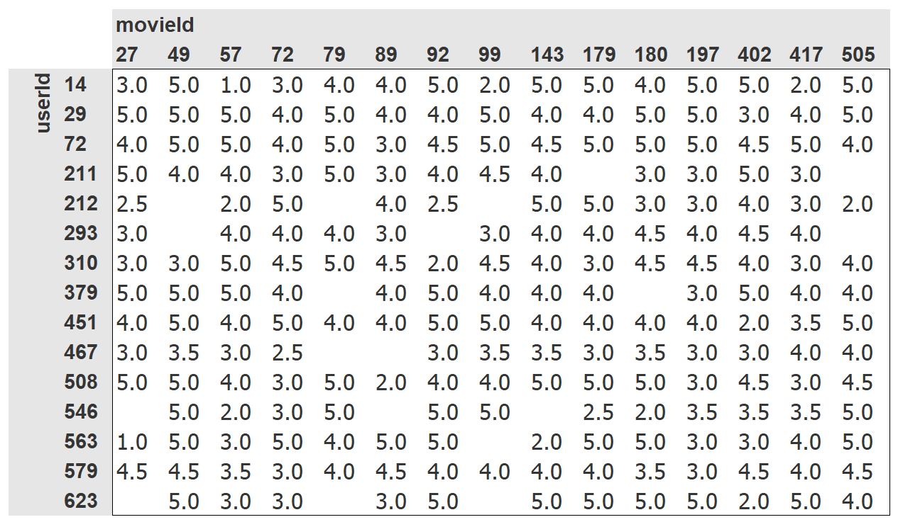
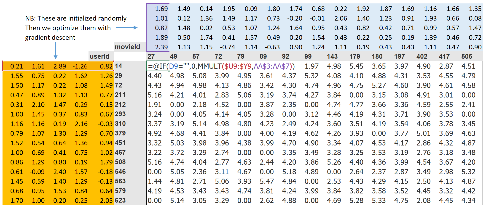
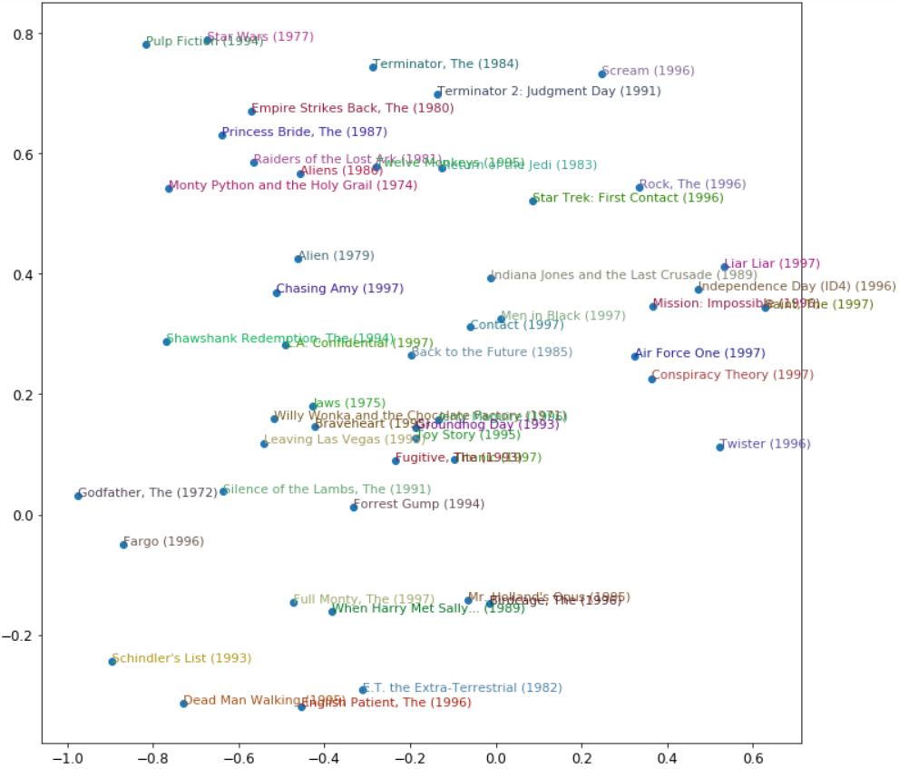

## FastAI 第8章 - Collaborative Filtering Deep Dive

>先安装和加载必要的库  

```
!pip install -Uqq fastbook
import fastbook
fastbook.setup_book()

from fastbook import *
```

这章讲的是协同过滤.  例如推荐奈飞上的电影, 要举出一个用户的主页上突出显示的电影是什么; 在社交媒体上提供显示哪些故事等等. 这类问题有一个通用的解决方案, 叫做协同过滤 - *collaborative filtering* , 它的工作原理是, 观察目前用户用过或者喜欢的产品, 查找其他用户用过或喜欢的相似的产品, 然后推荐被人用过或喜欢的其他产品. 

举个例子, 在奈飞上你可能看过很多科幻动作片, 并且都是1970年代的拍的. 奈飞也许不知道这些你看过的电影的特定属性, 但是它可以知道其他看过相同电影的人还倾向于哪些其他1970年代的科幻动作电影.  换句话说, 用这种方法, 我们不必知道关于电影的任何信息, 除了谁会喜欢看. 

这种方法实际上可以解决一类更一般化的问题, 不一定涉及用户和产品. 诚然, 对于协同过滤, 我们更通常是指项目而不是产品. 项目可以是人们单击的链接, 也可以是为患者选择的诊断等等.

关键的基本思路是 _潜在因素_ . 在Netflix的例子中, 我们假设你喜欢动感十足的老科幻电影. 但是你从来没有实际告诉Netflix, 你喜欢这类电影. 并且Netflix也从来不需要把这些列加到它的电影目录, 说明哪些电影是这一类的.  尽管如此, 任然必须有一些科幻, 动作和电影年代的基本概念, 并且这些概念必须至少与某些人的电影观看决策相关.

### A Fist Look at the Data

Netflix的数据集和观看记录, 我们没办法访问, 但是有一个很不错的数据集[MovieLens](https://grouplens.org/datasets/movielens/) 可以. 这个数据集包含几千万的电影排名(电影ID, 用户ID和数字评级的组合), 虽然我们只会用其中10万个作为子集. 如果有兴趣, 它将是一个很好的学习项目, 可以尝试在完整的2500万推荐数据集中再使用这种方法, 这个数据集可以从它们网站上获取到.

这个数据集可以通过fastai常用的方法获取到：

```python
from fastai.collab import *
from fastai.tabular.all import *
path = untar_data(URLs.ML_100k)
```

根据自述文档, 主表位于文件u.data中. 它是制表分隔的, 列分别是用户, 电影, 评级和时间戳. 由于这些名称未编码, 所以用Pandas读取这个文件时需要指出它们. 下面是打开表并查看的一种方式:

```
ratings = pd.read_csv(path/'u.data', delimiter='\t', header= None, names=['user', 'movie', 'rating', 'timestamp'])
ratings.head()
```

|      | user | movie | rating | timestamp |
| ---: | ---: | ----: | -----: | --------: |
|    0 |  196 |   242 |      3 | 881250949 |
|    1 |  186 |   302 |      3 | 891717742 |
|    2 |   22 |   377 |      1 | 878887116 |
|    3 |  244 |    51 |      2 | 880606923 |
|    4 |  166 |   346 |      1 | 886397596 |

虽然它包含所有我们需要的信息, 但是可读性不强. 下面是一个人性化的交叉表,展现相同的数据.



我们只选择了一部分最受欢迎的, 观众观看最多的作为交叉表例子. 表中的空格子是我们的模型需要学习填充的. 那些观众没有看过的电影, 假设是因为他们还没观看过. 对每个用户来说, 我们想预测出那些他们可能最喜欢看的电影.

如果我们知道每个用户喜欢的电影在多大程度上可能落入每个重要的类别, 日例如类型, 年龄, 首选导线和演员等等, 并且我们都知道关于每部电影的相同信息, 那么一个填写此表的简单的方式是, 将此信息乘以每部电影并使用组合. 例如, 假设这些因素落在-1到+1之间的系数, 正数表示具有较强的匹配, 负数表示较弱的匹配, 而这些类别分别是科幻片, 动作片和老电影, 我们可以将 _The Last Skywalker_ 表示为:

```python
last_skywalker = np.array([0.98, 0.9, -0.9])
```

这里例子里面, 我们给_科幻程度_打分为0.98, _动作程度_打分为0.9, 但是电影_非常不老_,打分-0.9. 我们可以这样表示一个用户喜欢现代科幻动作片:

```python
user1 = np.array([0.9, 0.8, -0.6])
```

这样我们就可以计算这个组合的匹配程度:

```python
(user1*last_skywalker).sum()
```

> 2.1420000000000003

这里将两个向量相乘然后把结果加起来, 这个叫做_点乘_ (或点积), 这在机器学习中应用非常广泛,  并构成了矩阵乘法的基础. 

另一方面, 我们可能将 _Casablanca_ 表示为:

```python
casablanca = np.array([-0.99, -0.3, 0.8])
```

那么user1 和Casablanca 的匹配度为：

```python
(user1*casablanca).sum()
```

> -1.611

由于我们不知道实际的潜在因素是什么, 我们也不知道怎样去对每个用户和电影进行(潜在因素)评分, 所以我们需要学习它们.

### Learning the latent Factors

指定模型结构之间的差异很小, 我们在上一节中做的那样, 学习一个模型, 因为我们可以仅用我们一般的梯度下降方法.

第1步是随机生成一些参数. 这些参数会作为用户和电影的一系列潜在因素. 我们需要确定会用到几个. 后面不久会讨论这一点, 但为了说明目的, 目前使用5. 因为每个用户会有这样一系列要素, 每个电影也会有这些要素, 我们可以在Crosstab中显示用户和电影旁边的这些随机初始化的值, 然后可以在中间填入每个这些组合的点积. 如下表, 用Excel列出了用公式展示了这个例子.



第2步是计算我们的预测值. 像前面谈到的一样, 我们可以简单的对每个电影和每个用户做点积运算.  如果, 例如第一个潜在的用户因子代表用户喜欢动作片的程度, 第一个潜在的电影因子表示电影是否包含很多动作, 如果用户喜欢动作片的程度很高, 电影也包含很多动作, 或者, 用户很不喜欢动作片, 电影也不包含很多动作, 则它们的乘积会很大. 另一方面, 如果有一个不匹配, 则乘积将会很低.

第3步是计算损失. 我们可以任意使用损失函数; 这里, 我们就选择均方差, 因为表示预测的精度, 用这个比较合理.

通过这种方式, 我们可以使用随机梯度下降来优化我们的参数(即潜在因子), 例如最小化损失. 在每个步骤中, 随机梯度下降优化器将使用点积计算每部电影和每个用户之间的匹配, 并将其与每个用户给每个电影的实际评级进行比较. 然后它会计算该值的导数, 并通过将其乘以学习率来步进权重. 在重复这个很多次之后, 损失会变得越来越好, 推荐也会变得越来越精准.

要用到一般的`Learner.fit`方法, 我们需要把数据放到`DataLoaders`.

### Creating the DataLoaders

展现数据时, 我们更多会看电影的标题, 而不是电影的ID. `u.item`包含ID和标题的对应关系:

```
movies = pd.read_csv(path/'u.item', delimiter='|', encoding='latin-1', usecols=(0,1), names=('movie', 'title'), header=None)

movie.head()
```
>
|      | movie |             title |
| ---: | ----: | ----------------: |
|    0 |     1 |  Toy Story (1995) |
|    1 |     2 |  GoldenEye (1995) |
|    2 |     3 | Four Rooms (1995) |
|    3 |     4 | Get Shorty (1995) |
|    4 |     5 |    Copycat (1995) |

这个表可以按照title和前面的`ratings`表合并.

```
ratings = ratings.merge(movies)
ratings.head()
```
>
| user | movie | rating | timestamp |     title |              |
| ---: | ----: | -----: | --------: | --------: | ------------ |
|    0 |   196 |    242 |         3 | 881250949 | Kolya (1996) |
|    1 |    63 |    242 |         3 | 875747190 | Kolya (1996) |
|    2 |   226 |    242 |         5 | 883888671 | Kolya (1996) |
|    3 |   154 |    242 |         3 | 879138235 | Kolya (1996) |
|    4 |   306 |    242 |         5 | 876503793 | Kolya (1996) |

通过这个表可以创建一个`DataLoaders`对象. 默认地, 第一栏表示用户, 第二栏表示项目(这里指的是电源), 第三栏, 用于评分. 这个例子中, 我们需要要修改`item_name`的值来用电影标题代替ID:

```
dls =  CollabDataLoaders.from_df(ratings, item_name='title', bs=64)
dls.show_batch()
```
>
|      | user | title                             | rating |
| ---- | ---- | --------------------------------- | ------ |
| 0    | 542  | My Left Foot (1989)               | 4      |
| 1    | 422  | Event Horizon (1997)              | 3      |
| 2    | 311  | African Queen, The (1951)         | 4      |
| 3    | 595  | Face/Off (1997)                   | 4      |
| 4    | 617  | Evil Dead II (1987)               | 1      |
| 5    | 158  | Jurassic Park (1993)              | 5      |
| 6    | 836  | Chasing Amy (1997)                | 3      |
| 7    | 474  | Emma (1996)                       | 3      |
| 8    | 466  | Jackie Chan's First Strike (1996) | 3      |
| 9    | 554  | Scream (1996)                     | 3      |

要在PyTorch中用到协同过滤, 我们不能只用交叉报表直接表示, 尤其当我们想让它适用于我们深度学习框架时. 我们可以将电影和用户潜在因子表用简单矩阵表示:

```
dls.classes
```

> {'user': (#944) ['#na#',1,2,3,4,5,6,7,8,9...], 'title': (#1635) ['#na#',"'Til There Was You (1997)",'1-900 (1994)','101 Dalmatians (1996)','12 Angry Men (1957)','187 (1997)','2 Days in the Valley (1996)','20,000 Leagues Under the Sea (1954)','2001: A Space Odyssey (1968)','3 Ninjas: High Noon At Mega Mountain (1998)'...]}

```
n_users = len(dls.classes['user'])
n_movies = len(dls.classes['title'])
n_factors = 5

user_factors = torch.randn(n_users, n_factors)
movie_factors = torch.randn(n_movies, n_factors)
```

要计算特定的电影和用户的组合, 我们必须在我们的电影潜在因子矩阵中查找电影的索引以及我们的用户潜在因子矩阵的用户索引; 然后对两个潜在因子向量做点积.但是深度学习模型不会查询索引操作.它们会做矩阵乘法和激活函数.

好在, 我们可以使用矩阵乘法来实现查找索引. 技巧在于用独热编码的向量代替索引. 这里举个例子看看, 用一个独热编码向量乘以一个向量来表示索引3是怎样的:

```
one_hot_3 = one_hot(3, n_users).float()
```

```
users_factors.t() @ one_hot_3
```

> tensor([-0.4586, -0.9915, -0.4052, -0.3621, -0.5908])

得到了和使用矩阵的索引3一样的向量.

```
user_factors[3]
```

> tensor([-0.4586, -0.9915, -0.4052, -0.3621, -0.5908])

如果我们一次处理这样几个, 我们会有一个独热向量的矩阵, 那么这个操作将会是矩阵的乘法. 这将是使用这种架构构建模型的完全可接受的方式, 除了它将使用更多的内存和时间而不是必需的时间. 我们知道, 存储独热编码向量, 或搜索其中数字1的出现, 并没有真正底层的原因 - 我们可以直接通过一个整数来直接索引到一个序列. 因此大部分深度学习库, 包括PyTorch, 包含了一个特殊层来处理这个; 用一个整数索引到一个向量, 但是, 它的衍生品以这样的方式计算, 即它和用了独热编码的向量做矩阵乘法是相同的. 这被称为嵌入.

> 术语, 嵌入：用一个独热编码矩阵相乘, 使用计算快照, 这种快照可以是由简单直接索引实现的. 概念很简单,用词很花哨. 你用来与独热矩阵相乘(或使用计算快照, 直接索引)的东西就叫嵌入矩阵.

在计算机视觉中, 通过每个像素的RGB值有个非常简单方式可以获取到它们的所有信息: 彩色图片的每个像素用3个值表示. 这三个值给出了红色值, 绿色值和蓝色值, 有了这些值, 就足够使我们的模型开展后续工作.

对应现在手头的问题, 我们没有同样的简单方法来描述一个用户或一个电源的特征. 可能与流派有关系: 如果给定的一个用户喜欢浪漫, 他们可能给浪漫电源给更高的分数. 其他的因子可能是, 电影是更多的面向动作的还是重在对白的, 或者由一个用户可能特别喜欢的特定演员出演的.

我们不需要自己确定这些特征的数值. 模型可以_学习_ 它们. 通过分析现有的用户和电影的关系, 我们的模型可以自己指出似乎重要特征.

这就是嵌入. 我们将对每个用户和每个电影用一个特定长度(这里`n_factors=5`)的随机向量标注属性,  然后产生那些可以学习的参数. 这意味着, 每当我们通过比较预测值和目标值来计算损失时, 我们将通过这些嵌入向量的损失渐变来计算，并通过SGD(或其他优化器)的规则更新它们.

在开始时, 这些随机选择的数字没什么意义, 但是训练后, 他们就有意义了. 通过学习有关用户和电影关系的已知数据, 而不需要其他信息, 我们任可以获取到一些重要特性, 然后区分出独立电影和大片, 区分出浪漫片和动作片等等.

我们现在可以从头开始创建我们的整个模型.

### Collaborative Filtering from Scratch

在用PyTorch写一个模型之前, 我们需要有基本的面向对象和Python 的知识. 

面向对象编程的关键思想是_类_ . 我们在这本书中已经用过很多类,如`Dataloader`, `string` 和`Learner`. Python中也可以很容易的创建自己的类.

```
class Example:
	   def __init__(self, a): self.a = a
	   def say(self,x) : return f'Hello {self.a}, {x}.'
```

这段代码最重要的一段是一个叫`__init__`的方法(读作dunder init). 在Python中, 任何像这样前后加了双下划线的方法会被看做一种特殊的方法. 它表示会有一些与这些方法名有联系的额外的操作. 在这里`__init__`的例子中, 当你创建对象时, Python会自动调用这个方法. 因此, 在这里你可以在创建对象时做任何初始化. 当用户构造类的实例时, 包含的任何参数将被传给`__init__`方法作为参数. 注意, 所有类中定义的任何方法的第一个参数是`self`, 因此, 你可以用这个参数来设置或获取你需要的任何属性:

```
ex = Example('Sylvain')
ex.say('nice to meet you')
```

> 'Hello, Sylvain, nice to meet you. '

另外需要注意的是, 创建一个新的PyTorch模型需要从`Module`继承. _继承_ 是面向对象的另一个重要概念, 简单说, 它意味着我们可以给一个现有的类增加其他的行为. PyTorch已经提供了一个`Module`类, 它提供了一些我们需要建立的一些基础设施. 因此, 如下面的例子, 我们在定义的类的名称之后添加这个_superclass(父类)_的名称. 创建一个新的PyTorch模型最后一个需要掌握的是, 当你你的模型被调用的时候, PyTorch 会调用一个叫`forward`的方法, 然后传递任何参数需要的. 这里定义一个点积模型的类.

```
class DotProduct(Module):
        def __init__(self, n_users, n_movies, n_factors):
                self.user_factors = Embedding(n_users, n_factors)
                self.movie_factors = Embedding(n_movies, n_factors)
                
        def forward(self, x):
                users = self.user_factors(x[:,0])
                movies = self.user_factors(x[:,1])
                return (users * movies).sum(dim=1)
```

注意, 模型的输入是一个形状为`batch_size * 2`的张量, 第一列(x[: , 0])包含用户ID, 第二列(x[:, 1])包含电影ID. 我们用嵌入层来表示我们的用户和电影潜在因子的矩阵:

```
x,y = dls.one_batch()
x.shape
```

> torch.Size([64, 2])

既然我们已经定义了架构并创建了我们的参数矩阵, 我们需要创建一个`Leaner`来优化我们的模型. 在之前我们用过特殊的函数, 如`cnn_learner`, 它在特定的应用中帮我们做好了所有设置. 由于我们现在是从头开始, 我们就用普通的`Learner`类:

```
model = DotProduct(n_users, n_movies, 50)
learn = Learner(dls, model, loss_func=MSELossFlat())
```

现在我们准备好了调整模型:

```
learn.fit_one_cycle(5, 5e-3)
```

>
| epoch | train_loss | valid_loss | time  |
| ----- | ---------- | ---------- | ----- |
| 0     | 0.993168   | 0.990168   | 00:12 |
| 1     | 0.884821   | 0.911269   | 00:12 |
| 2     | 0.671865   | 0.875679   | 00:12 |
| 3     | 0.471727   | 0.878200   | 00:11 |
| 4     | 0.361314   | 0.884209   | 00:12 |

对这个模型第一个可以优化的地方是强制使预测值介于0到5之间. 要做到这一点, 只需要使用如下代码中的`sigmoid_range`. 经验发现, 范围稍大于5会更好一点, 所以我们用`(0,5.5)`:

```
class DotProduct(Module):
        def __init__(self, n_users, n_movies, n_factors, y_range=(0, 5.5)):
                self.user_factors = Embedding(n_users, n_factors)
                self.movie_factors = Embedding(n_movies, n_factors)

        def forward(self, x):
                users = self.user_factors(x[:, 0])
                movies = self.movie_factors(x[:, 1])
                return sigmoid_range((users * movies).sum(dim=1), *self.y_range)
```

```
model = DotProduct(n_users, n_movies, 50)
learn = Learner(dls, model, loss_func=MSELossFlat())
learn.fit_one_cycle(5, 5e-3)
```
>
| epoch | train_loss | valid_loss | time  |
| ----- | ---------- | ---------- | ----- |
| 0     | 0.973745   | 0.993206   | 00:12 |
| 1     | 0.869132   | 0.914323   | 00:12 |
| 2     | 0.676553   | 0.870192   | 00:12 |
| 3     | 0.485377   | 0.873865   | 00:12 |
| 4     | 0.377866   | 0.877610   | 00:11 |

这是个合理的开头, 不过可以做到更好.  有个很明显的遗漏, 一些用户在其推荐中比其他用户更正面或更负面, 而一些电影正好比其他电影更好或更糟. 但在我们的点积表示中, 我们没法用编码表示这两种情况. 例如当你谈到一部电影时, 可能会说它很科幻, 充满动作, 并且很新, 但是真的没办法说是否大多数人喜欢.

因为这时只有权重weights, 没有偏差bias. 如果我们为每个用户提供单个数字, 并添加到我们的评分中, 然后对每个电影这样做, 那将能很好地处理这个遗漏的部分. 我们先调整我们的模型架构:

```
class DotProductBias(Module):
        def __init__(self, n_users, n_movies, n_factors, y_range=（0, 5.5)):
              self.user_factors = Embedding(n_users, n_factors)
              self.user_bias = Embedding(n_users, 1)
              self.movie_factors = Embedding(n_movies, n_factors)
              self.movie_bias = Embedding(n_movies, 1)
              self.y_range = y_range
              
         def forward(self, x):
              users = self.user_factors(x[: 0])
              movies = self.movie_factors(x[: 1])
              res = (users * movies).sum(dim=1, keepdim=True)
              res += self.user_bias(x[:, 0]) + self.movie_bias(x[:,1])
              return sigmoid_range(res, *self.y_range)
```

 跑的试试:

```
model = DoProductBias(n_users, n_movies, 50)
learn = Learner(dls, model, loss_func=MSELossFlat())
learn.fit_one_cycle(5, 5e-3)
```
>
| epoch | train_loss | valid_loss | time  |
| ----- | ---------- | ---------- | ----- |
| 0     | 0.929161   | 0.936303   | 00:13 |
| 1     | 0.820444   | 0.861306   | 00:13 |
| 2     | 0.621612   | 0.865306   | 00:14 |
| 3     | 0.404648   | 0.886448   | 00:13 |
| 4     | 0.292948   | 0.892580   | 00:13 |

没变好, 而是变差了(至少在训练最后是这样). 为什么会这样呢, 如果仔细看这两次训练, 我们会发现, 验证损失在中途不再变好, 而是开始变差. 很明显, 这个意味着过拟合. 在这个例子中, 我们没办法使用数据增强, 所以我们需要用到另一种正则化的技术. 一种有效的方法是_weight decay权重衰减_.

#### Weight Decay

权重衰减, 或叫L2范式,包含在会求所有的权重的平方和的损失函数中. 这是因为当我们计算梯度时, 它将加强这样一个作用, 使权重尽可能小.

为什么这么做可以防止过拟合? 原因是系数越大, 我们损失函数中会具有更尖的波谷. 举个抛物线的基本例子, `y=a*(x**2)`, `a`越大, 抛物线就会越窄.

```
#hide_input
#id parabolas
x = np.linspace(-2,2,100)
a_s = [1,2,5,10,50] 
ys = [a * x**2 for a in a_s]
_,ax = plt.subplots(figsize=(8,6))
for a,y in zip(a_s,ys): ax.plot(x,y, label=f'a={a}')
ax.set_ylim([0,5])
ax.legend();
```

> 

因此, 让我们的模型学习高参数可能导致它适应训练集中所有数据点, 它有着急剧变化的超复杂的函数, 会导致过拟合.

限制权重增长过多意味着阻碍模型的训练, 但它能产生一个更优的归纳状态. 简单回顾这个概念, 权重衰减(简称wd)是一个参数, 它控制我们添加到损失函数的平方和(这里`参数paramets`是所有参数的一个张量.)

```python
loss_with_wd = loss + wd * (parameters**2).sum()
```

虽然在实际应用中, 求这么大的和并把它加到损失中很不高效. 但是如果记得一点高中数学, 我们知道`p**2`对`p`求导的结果是`2*p`, 所以将这个很大的和加到我们的损失中实际等效为:

```
parameters.grad += wd * 2 * parameter
```

在实际应用中, 由于`wd` 是我们自己选的参数, 我们可以使其两倍大, 因此我们甚至不需要这个等式中的`* 2`. 在FastAi中使用权重衰减, 只需传入`wd`给`fit`或`fit_one_cycle`即可:

```
model = DotProductBias(n_users, n_movies, 50)
learn = Learner(dls, model, loss_func_MSELossFlat())
learn.fit_one_cycle(5, 5e-3, wd=0.1)
```

>
| epoch | train_loss | valid_loss | time  |
| ----- | ---------- | ---------- | ----- |
| 0     | 0.972090   | 0.962366   | 00:13 |
| 1     | 0.875591   | 0.885106   | 00:13 |
| 2     | 0.723798   | 0.839880   | 00:13 |
| 3     | 0.586002   | 0.823225   | 00:13 |
| 4     | 0.490980   | 0.823060   | 00:13 |


## Interpreting Embeddings and Biases

我们的模型已经很有用了, 利用这个我们可以给我们的用户提供电影建议 - 但是看看它发掘了怎样的参数也会很有意思. 最容易详细分析的是偏差bias. 这里看看偏差向量的几个最低值:

```python
movie_bias = learn.model.movie_bias.squeeze()
idxs = movie_bias.argsort()[:5]
[dls.classes['title'][i] for i in idxs]
```

> ['Children of the Corn: The Gathering (1996)',
>  'Lawnmower Man 2: Beyond Cyberspace (1996)',
>  'Beautician and the Beast, The (1997)', 
>  'Crow: City of Angels, The (1996)', 
>  'Home Alone 3 (1997)']

这意味着什么. 这表示对于每个电影, 即使某个用户很好地匹配到了它的潜在因子(很快会看到, 通常表示像动作程度, 电影年代等), 他们仍旧一般不喜欢. 我们可以简单地将这些电影按它们的平均评分排名, 但是观察学习偏差, 我们看到一些更有意思的东西.  它告不仅告诉我们一部电影是否是那种人们不喜欢看的类型, 还告诉我们, 即使这个电影是人们喜欢的类型, 但实际观众也并不喜欢. 通过同样的表达, 这里列出最高的偏差:

```python
idxs = movies_bias.argsort(descending=True)[:5]
[dls.classes['title'][i] for i in idxs]
```

> ['L.A. Confidential (1997)', 
> 'Titanic (1997)', 
> 'Silence of the Lambs, The (1991)', 
> 'Shawshank Redemption, The (1994)', 
> 'Star Wars (1977)']

例如, 即使你一般不喜欢看侦探类型电影, 但你也许会喜欢 _LA Confidential_ !

直接解释嵌入矩阵并不容易. 人们要关注太多因素. 不过有一种技术可以在这种矩阵中抽出最重要的几个底层趋向(directions), 这种技术叫做_主要成分分析(principal component analysis)(PCA)_. 这本书没有详细讲, 不过在[Computational Linear Algebra for Coders](https://github.com/fastai/numerical-linear-algebra)有详细讲解.下图显示了基于两个最强的主要成分分析组件的电影的样子.

```
#hide_input
#id img_pca_movie
#caption Representation of movies based on two strongest PCA components
#alt Representation of movies based on two strongest PCA components
g = ratings.groupby('title')['rating'].count()
top_movies = g.sort_values(ascending=False).index.values[:1000]
top_idxs = tensor([learn.dls.classes['title'].o2i[m] for m in top_movies])
movie_w = learn.model.movie_factors[top_idxs].cpu().detach()
movie_pca = movie_w.pca(3)
fac0,fac1,fac2 = movie_pca.t()
idxs = list(range(50))
X = fac0[idxs]
Y = fac2[idxs]
plt.figure(figsize=(12,12))
plt.scatter(X, Y)
for i, x, y in zip(top_movies[idxs], X, Y):
    plt.text(x,y,i, color=np.random.rand(3)*0.7, fontsize=11)
plt.show()
```

> 

我们可以在这里看到模型似乎已经发现了经典与流行音乐文化电影的概念, 


[Back to contents page](index.md)

